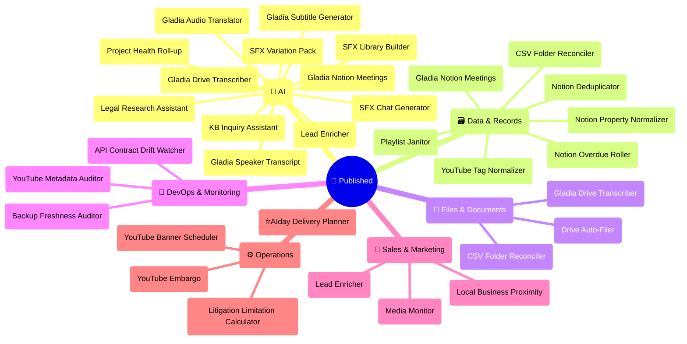

# n8n Templates

A collection of n8n workflow templates I have built, organized by their status in the n8n template library.

## Published

**28 templates** are live in the n8n template library right now, grouped by area in the mindmap below. Hover a template name for a one-line summary of what it does, or hit **View** to open its listing on n8n.io.

<table>
<tr>
<td valign="top">
<a href="published/n8n-kb-inquiry-assistant/" title="A retrieval-augmented generation (RAG) assistant that drafts grounded replies to inbound support email from a Notion knowledge base, using Cohere embeddings and reranking plus Groq, and saves each as a Gmail draft for a human to review.">KB Inquiry Assistant (RAG)</a> &middot; <a href="https://n8n.io/workflows/16813-draft-grounded-gmail-support-replies-from-a-notion-kb-with-groq-and-cohere/">View</a> 
<code>🤖 AI</code> <code>RAG</code> <code>Notion</code> <code>Cohere</code> <code>Groq</code> <code>Gmail</code>
</td>
<td valign="top">
<a href="published/n8n-legal-research-assistant/" title="Answers a legal question using only authorities retrieved from CourtListener or CanLII, and verifies every citation against the retrieved sources so invented case law never reaches the reader.">Legal Research Assistant</a> &middot; <a href="https://n8n.io/workflows/16814-answer-legal-questions-with-groq-using-canlii-and-courtlistener/">View</a> 
<code>🤖 AI</code> <code>Groq</code> <code>CanLII</code> <code>CourtListener</code>
</td>
</tr>
<tr>
<td valign="top">
<a href="published/n8n-sfx-chat-generator/" title="Turns a plain-language chat message into a sound effect: a Groq director rewrites it into a literal ElevenLabs prompt, generates the audio, saves it to Google Drive, and replies in chat with the link.">SFX Chat Generator</a> &middot; <a href="https://n8n.io/workflows/16881-generate-sound-effects-from-chat-with-groq-elevenlabs-and-google-drive/">View</a> 
<code>🤖 AI</code> <code>Groq</code> <code>ElevenLabs</code> <code>Google Drive</code>
</td>
<td valign="top">
<a href="published/n8n-sfx-variation-pack/" title="Turns one written sound brief into several ElevenLabs takes and saves them to a dated Google Drive folder to choose from.">SFX Variation Pack</a> &middot; <a href="https://n8n.io/workflows/16954-generate-sound-effect-variation-packs-with-elevenlabs-and-google-drive/">View</a> 
<code>🤖 AI</code> <code>ElevenLabs</code> <code>Google Drive</code>
</td>
</tr>
<tr>
<td valign="top">
<a href="published/n8n-sfx-library-builder/" title="Batch-generates ElevenLabs sound effects from a Google Sheet, saving each MP3 to Google Drive and writing the status and link back to each row.">SFX Library Builder</a> &middot; <a href="https://n8n.io/workflows/16956-build-a-sound-effect-library-with-google-sheets-elevenlabs-google-drive-and-slack/">View</a> 
<code>🤖 AI</code> <code>ElevenLabs</code> <code>Google Sheets</code> <code>Google Drive</code> <code>Slack</code>
</td>
<td valign="top">
<a href="published/n8n-gladia-drive-transcriber/" title="Transcribes new audio and video files dropped into a Google Drive folder with Gladia, saves the transcript back to Drive as a Markdown file, and logs every run to a Google Sheet.">Gladia Drive Transcriber</a> &middot; <a href="https://n8n.io/workflows/16955-transcribe-google-drive-audio-to-markdown-with-gladia-and-google-sheets/">View</a> 
<code>🤖 AI</code> <code>📁 Files &amp; Documents</code> <code>Gladia</code> <code>Google Drive</code> <code>Google Sheets</code>
</td>
</tr>
<tr>
<td valign="top">
<a href="published/n8n-gladia-notion-meetings/" title="Transcribes a meeting recording added to a Notion database with Gladia, then writes the summary and full transcript back onto the same Notion page. Self-hosted only, uses the n8n-nodes-gladia community node.">Gladia Notion Meetings</a> &middot; <a href="https://n8n.io/workflows/16957-transcribe-and-summarize-notion-meeting-recordings-with-gladia/">View</a> 
<code>🤖 AI</code> <code>🗃️ Data &amp; Records</code> <code>Gladia</code> <code>Notion</code>
</td>
<td valign="top">
<a href="published/n8n-notion-deduplicator/" title="Removes duplicate rows from a Notion database on a schedule, keeping the newest or most complete record in each group, archiving the rest to the Notion trash, and logging a recap of every run.">Notion Deduplicator</a> &middot; <a href="https://n8n.io/workflows/16801-deduplicate-and-archive-notion-database-rows-daily-with-an-audit-log/">View</a> 
<code>🗃️ Data &amp; Records</code> <code>Notion</code>
</td>
</tr>
<tr>
<td valign="top">
<a href="published/n8n-notion-overdue-roller/" title="Rolls overdue Notion tasks forward in place on a schedule, incrementing a per-task roll counter and setting a Stale flag once a task has been pushed too many times, without sending any reminder.">Notion Overdue Roller</a> &middot; <a href="https://n8n.io/workflows/16802-roll-overdue-notion-tasks-forward-and-flag-stale-ones-on-a-schedule/">View</a> 
<code>🗃️ Data &amp; Records</code> <code>Notion</code>
</td>
<td valign="top">
<a href="published/n8n-notion-property-normalizer/" title="Cleans up one Notion database on a schedule with no AI: backfills a missing Status default, canonicalizes inconsistent Status spellings, derives a slug key and a created-week stamp, and writes only the rows that actually change.">Notion Property Normalizer</a> &middot; <a href="https://n8n.io/workflows/16800-normalize-and-backfill-notion-database-properties-with-rules-and-logging/">View</a> 
<code>🗃️ Data &amp; Records</code> <code>Notion</code>
</td>
</tr>
<tr>
<td valign="top">
<a href="published/n8n-csv-folder-reconciler/" title="Merges the daily CSV exports in a Google Drive folder into one deduped master, quarantines every bad row to a dated reject file with a reason, and posts a rows in, merged, quarantined, duplicates recap to Slack.">CSV Folder Reconciler</a> &middot; <a href="https://n8n.io/workflows/16700-reconcile-daily-google-drive-csv-exports-into-a-master-file-and-send-a-slack-recap/">View</a> 
<code>📁 Files &amp; Documents</code> <code>🗃️ Data &amp; Records</code> <code>Google Drive</code> <code>Slack</code>
</td>
<td valign="top">
<a href="published/n8n-drive-auto-filer/" title="Sorts new Google Drive inbox files into a dated Year/Month/Type folder tree by filename rules, and logs every move to a Google Sheet.">Drive Auto-Filer</a> &middot; <a href="https://n8n.io/workflows/16812-file-google-drive-inbox-documents-into-dated-folders-with-a-google-sheets-audit-log/">View</a> 
<code>📁 Files &amp; Documents</code> <code>Google Drive</code> <code>Google Sheets</code>
</td>
</tr>
<tr>
<td valign="top">
<a href="published/n8n-api-contract-drift-watcher/" title="Polls a JSON or OpenAPI endpoint on a schedule, snapshots its response schema in a Data Table, and posts a severity-tagged Slack alert only when the contract breaks, ignoring ordinary value churn.">API Contract Drift Watcher</a> &middot; <a href="https://n8n.io/workflows/16699-alert-on-api-contract-drift-using-data-tables-and-slack/">View</a> 
<code>📡 DevOps &amp; Monitoring</code> <code>Data Tables</code> <code>Slack</code>
</td>
<td valign="top">
<a href="published/n8n-backup-freshness-auditor/" title="Audits a Google Drive folder of externally produced backups against a per-source SLA table in Sheets, flags stale, missing, or shrunken dumps, logs a scorecard, and alerts Slack only on failures.">Backup Freshness Auditor</a> &middot; <a href="https://n8n.io/workflows/16701-audit-google-drive-backup-freshness-with-google-sheets-and-slack/">View</a> 
<code>📡 DevOps &amp; Monitoring</code> <code>Google Drive</code> <code>Google Sheets</code> <code>Slack</code>
</td>
</tr>
<tr>
<td valign="top">
<a href="published/n8n-lead-enricher/" title="Researches an inbound company with You.com, writes a profile and fit score with Groq, alerts Slack for hot leads, and logs every lead to Notion.">Lead Enricher</a> &middot; <a href="https://n8n.io/workflows/16504-enrich-and-route-inbound-leads-using-youcom-groq-notion-and-slack/">View</a> 
<code>📣 Sales &amp; Marketing</code> <code>🤖 AI</code> <code>You.com</code> <code>Groq</code> <code>Notion</code> <code>Slack</code>
</td>
<td valign="top">
<a href="published/n8n-media-monitor/" title="Watches RSS feeds, scores each article for relevance, sentiment, and entities, and emails a digest grouped by topic.">Media Monitor</a> &middot; <a href="https://n8n.io/workflows/16296-send-scored-media-monitoring-digests-from-rss-feeds-via-smtp-email/">View</a> 
<code>📣 Sales &amp; Marketing</code> <code>RSS</code> <code>Email</code>
</td>
</tr>
<tr>
<td valign="top">
<a href="published/n8n-frAIday-delivery-planner/" title="Batches food delivery orders into Saturday and Sunday route plans, geocoded via OpenStreetMap, emailed every Friday.">frAIday Delivery Planner</a> &middot; <a href="https://n8n.io/workflows/16154-plan-delivery-routes-from-notion-orders-with-nominatim-and-email/">View</a> 
<code>⚙️ Operations</code> <code>Notion</code> <code>Nominatim</code> <code>Email</code>
</td>
<td valign="top">
<a href="published/n8n-local-business-proximity/" title="Looks up businesses near a location from OpenStreetMap by category, flags which ones list a website, and appends the results to a Google Sheet.">Local Business Proximity</a> &middot; <a href="https://n8n.io/workflows/16997-log-nearby-businesses-from-openstreetmap-to-google-sheets-by-proximity/">View</a> 
<code>📣 Sales &amp; Marketing</code> <code>OpenStreetMap</code> <code>Google Sheets</code>
</td>
</tr>
<tr>
<td valign="top">
<a href="published/n8n-litigation-limitation-calculator/" title="Calculates the limitation and procedural deadlines for a Canadian litigation matter across nine jurisdictions, then writes them to Google Calendar, logs them to Google Sheets, and summarizes them to Slack and Gmail.">Litigation Limitation Calculator</a> &middot; <a href="https://n8n.io/workflows/16993-calculate-litigation-deadlines-from-intake-forms-with-google-calendar-sheets-slack-and-gmail/">View</a> 
<code>⚙️ Operations</code> <code>Google Calendar</code> <code>Google Sheets</code> <code>Slack</code> <code>Gmail</code>
</td>
<td valign="top">
<a href="published/n8n-gladia-subtitle-generator/" title="Generates ready-to-use SRT and VTT subtitle files from a public audio or video URL with Gladia, and saves both to Google Drive with the download links shown on the form.">Gladia Subtitle Generator</a> &middot; <a href="https://n8n.io/workflows/16994-generate-srt-and-vtt-subtitles-from-media-urls-with-gladia-and-google-drive/">View</a> 
<code>🤖 AI</code> <code>Gladia</code> <code>Google Drive</code>
</td>
</tr>
<tr>
<td valign="top">
<a href="published/n8n-project-health-rollup/" title="Reads active projects from Notion each morning, scores each Red, Yellow, or Green with Groq, leads with what changed overnight, and posts one standup to Slack.">Project Health Roll-up</a> &middot; <a href="https://n8n.io/workflows/16996-post-a-daily-project-health-standup-to-slack-with-notion-and-groq/">View</a> 
<code>🤖 AI</code> <code>Notion</code> <code>Groq</code> <code>Slack</code>
</td>
<td valign="top">
<a href="published/n8n-youtube-tag-normalizer/" title="Enforces a controlled tag vocabulary from Google Sheets across a channel by mapping aliases, stripping banned tags, adding required ones, and updating only the videos whose tags actually changed.">YouTube Tag Normalizer</a> &middot; <a href="https://n8n.io/workflows/17071-normalize-youtube-video-tags-using-google-sheets-vocabulary-rules/">View</a> 
<code>🗃️ Data &amp; Records</code> <code>YouTube</code> <code>Google Sheets</code>
</td>
</tr>
<tr>
<td valign="top">
<a href="published/n8n-youtube-metadata-auditor/" title="Snapshots every video title, description, tag set, and privacy status daily, diffs the library against the previous snapshot, logs each change to Google Sheets, and alerts Slack when something changed.">YouTube Metadata Auditor</a> &middot; <a href="https://n8n.io/workflows/17072-audit-youtube-video-metadata-changes-with-google-sheets-and-slack/">View</a> 
<code>📡 DevOps &amp; Monitoring</code> <code>YouTube</code> <code>Google Sheets</code> <code>Slack</code>
</td>
<td valign="top">
<a href="published/n8n-youtube-embargo/" title="Reads a Google Sheet of videos with unpublish dates, sets each one back to private or unlisted once its date passes, marks the row Expired, and posts a Slack recap.">YouTube Embargo</a> &middot; <a href="https://n8n.io/workflows/17091-unpublish-expired-youtube-videos-using-google-sheets-and-slack/">View</a> 
<code>⚙️ Operations</code> <code>YouTube</code> <code>Google Sheets</code> <code>Slack</code>
</td>
</tr>
<tr>
<td valign="top">
<a href="published/n8n-youtube-banner-scheduler/" title="Rotates your YouTube channel banner on a schedule from a Google Sheets plan: downloads each dated banner from Drive, sets it live with the native uploadBanner operation, catches up on any missed day, and preserves the rest of your channel branding.">YouTube Banner Scheduler</a> &middot; <a href="https://n8n.io/workflows/17137-rotate-youtube-channel-banners-on-a-schedule-with-google-sheets-and-drive/">View</a> 
<code>⚙️ Operations</code> <code>YouTube</code> <code>Google Sheets</code> <code>Google Drive</code>
</td>
<td valign="top">
<a href="published/n8n-playlist-janitor/" title="Scans a YouTube playlist every week for duplicate entries and dead videos, posts a cleanup summary to Slack, and prunes the flagged items once dry run is switched off.">Playlist Janitor</a> &middot; <a href="https://n8n.io/workflows/17092-clean-duplicate-and-dead-youtube-playlist-videos-with-slack-reports/">View</a> 
<code>🗃️ Data &amp; Records</code> <code>YouTube</code> <code>Slack</code>
</td>
</tr>
<tr>
<td valign="top">
<a href="published/n8n-gladia-speaker-transcript/" title="Transcribes a public call or interview recording into a clean speaker-labeled transcript with Gladia diarization, saves it to Google Drive as Markdown, and posts the link to Slack.">Gladia Speaker Transcript</a> &middot; <a href="https://n8n.io/workflows/17138-transcribe-speaker-labeled-recordings-with-gladia-google-drive-and-slack/">View</a> 
<code>🤖 AI</code> <code>Gladia</code> <code>Google Drive</code> <code>Slack</code>
</td>
<td valign="top">
<a href="published/n8n-gladia-audio-translator/" title="Translates a foreign-language audio or video recording into a target language with Gladia in a single call, saving both the original transcript and the translation to Google Drive as a Markdown file and logging every run to a Google Sheet.">Gladia Audio Translator</a> &middot; <a href="https://n8n.io/workflows/17139-translate-audio-transcripts-with-gladia-google-drive-and-google-sheets/">View</a> 
<code>🤖 AI</code> <code>Gladia</code> <code>Google Drive</code> <code>Google Sheets</code>
</td>
</tr>
</table>

## Pending review

Submitted to the n8n Creator hub and awaiting approval. Templates move up to `published/` once they are live in the library.

| Template | What it does |
|---|---|
| [Asana Hygiene Auditor](pending-review/n8n-asana-hygiene-auditor/) | Scans one Asana project each week for open tasks missing an assignee or due date, logs each flagged task to Google Sheets with reason codes, and posts a field-completeness scorecard to Slack. |

## Pending submission

Built and tested but not yet submitted to the Creator hub. Templates move to `pending-review/` once submitted.

| Template | What it does |
|---|---|
| [Grounded Support Drafter](pending-submission/n8n-grounded-support-drafter/) | Answers a support question about a public source, a third-party API, a public standard, or a help or regulatory page, by researching the live web with You.com, then saves the cited reply as a Gmail draft for a support agent to review and send. |
| [Asana Status Digest](pending-submission/n8n-asana-status-digest/) | Reads one Asana project every weekday morning and posts a Slack digest of overdue, due-today, due-this-week, unassigned, and just-completed tasks, plus per-assignee open load, with no AI in the delivery path. |
| [Open Questions Researcher](pending-submission/n8n-open-questions-researcher/) | Picks up each new question dropped into a Notion database, researches it with You.com, and writes a cited answer and its sources back into the same row before flipping the status to Answered. |
| [Asana Calendar Sync](pending-submission/n8n-asana-calendar-sync/) | Mirrors the due dates of one Asana project into a Google Calendar on a timer, creating, moving, and deleting events as tasks change, with the task GID kept in each event description so re-runs never duplicate. |
| [Asana Sheet Mirror](pending-submission/n8n-asana-sheet-mirror/) | Reads every task in one Asana project on a schedule and upserts it into a Google Sheet keyed by task GID, flagging rows whose task is gone as no longer present instead of deleting them. |

## License

MIT. See [LICENSE](LICENSE).

Built by Kevin Yu ([exekyute](https://github.com/exekyute)). Find my templates on n8n at [@exekyute](https://n8n.io/creators/exekyute/).
