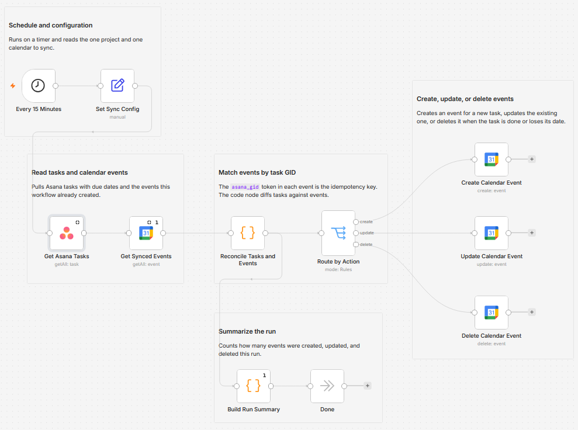

# Sync Asana task due dates to Google Calendar

I wanted my Asana due dates to show up in the calendar I actually look at, without keeping two lists by hand. This workflow reads one Asana project on a timer and mirrors every dated task into a Google Calendar: new tasks become events, changed dates move the event, and a task that is completed or loses its date has its event removed. It is one-way, so the calendar follows Asana and never writes back.

Built with n8n, plus Asana and Google Calendar.

## How it works

A schedule triggers the run. The workflow reads the project's tasks, reads the events it has already created, and a Code node compares the two sets to decide what to create, update, or delete. A switch sends each decision to the matching Google Calendar node.

| Stage | What happens |
|---|---|
| Every 15 Minutes | A schedule fires on the interval you set |
| Set Sync Config | Holds the Asana project GID, the target calendar ID, and the length of a timed event in one place |
| Get Asana Tasks | Reads the project's tasks with their due date, completion state, assignee, and permalink |
| Get Synced Events | Lists the calendar events this workflow created, found by searching for the `asana_gid:` token |
| Reconcile Tasks and Events | Diffs tasks against events and marks each one create, update, or delete |
| Route by Action | Sends each decision down its own branch |
| Create Calendar Event | Adds an event for a task that does not have one yet |
| Update Calendar Event | Moves or retitles the existing event when the task changes |
| Delete Calendar Event | Removes the event when the task is completed, loses its date, or leaves the project |
| Build Run Summary | Counts what the run created, updated, and deleted |
| Done | A no-op that keeps the summary so each run is inspectable |

## Why the GID lives in the event description

The Google Calendar node does not expose the `extendedProperties` field that Google normally uses for private metadata, so there is nowhere hidden to stash the task ID. Instead each event description ends with an `asana_gid:<GID>` line, and the workflow finds its own events by searching the calendar for that token. That line is the idempotency key: keep it and a task keeps updating the same event, delete it and the next run creates a duplicate.

The reconcile step also sweeps up orphans. An event carrying a GID that no longer appears anywhere in the project gets deleted, so tasks removed from Asana do not leave stray events behind.

## Setup

1. Import `workflow.json` into n8n. It imports inactive, so configure it before activating.
2. Add an Asana credential (Personal Access Token) and select it on "Get Asana Tasks".
3. Add a Google Calendar credential and select it on the four calendar nodes: "Get Synced Events", "Create Calendar Event", "Update Calendar Event", and "Delete Calendar Event".
4. Open "Set Sync Config" and set `asanaProjectGid` (the number in your Asana project URL) and `calendarId` (the calendar ID from Google Calendar settings, which is an address like `you@gmail.com` for your default calendar).
5. In "Every 15 Minutes", set how often to sync.
6. Run it once to backfill the calendar, then activate.

Point it at a dedicated calendar rather than your main one. Then the synced events sit in their own layer you can toggle off, and a misconfigured run never touches your real appointments.

## How a task becomes an event

| Task in Asana | Event in the calendar |
|---|---|
| Due date only (`due_on`) | An all-day event on that date |
| Due date and time (`due_at`) | A timed event starting then, lasting `timedEventMinutes` (30 by default) |
| No due date | No event at all |
| Completed | The event is deleted |
| Removed from the project | The orphaned event is deleted |

The event title is the task name. The description holds a link back to the task, the assignee, and the `asana_gid` line.

## First run and empty calendars

Both read nodes have "Always Output Data" on. Without it, a first run against an empty calendar returns zero items, the chain halts, and nothing is ever created. The reconcile code ignores those empty placeholder items, so the bootstrap run works the same as every run after it.

The run summary branches off the reconcile step rather than the write nodes. The three write branches converge, so a summary placed after them would fire once per branch. Reading from reconcile means one summary per run.

## What is in this folder

| File | What it is |
|---|---|
| `README.md` | This overview |
| `TEMPLATE-DESCRIPTION.md` | The n8n Creator hub listing text |
| `workflow.json` | The importable n8n workflow |
| `images/workflow.png` | The workflow on the n8n canvas |

---

All sample data is fictional. No real credentials, IDs, or endpoints are included.

Part of the [n8n-exekyute-templates](../../README.md) collection. MIT licensed.
