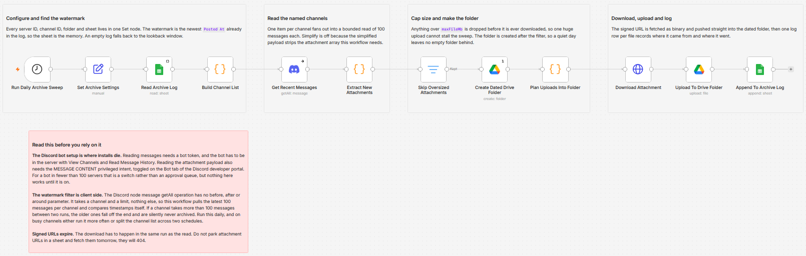

# Archive Discord attachments to Google Drive with a Google Sheets log

Sweep named Discord channels once a day, pull every new attachment into a dated Google Drive folder, and write one log row per file with its poster, channel, size and a jump link back to the original message. Discord signs attachment URLs with `ex`, `is` and `hm` parameters that expire, so the download has to happen inside the same run as the read. That single constraint is the whole reason a saved link in your scrollback is not an archive.

Built with n8n, plus Discord, Google Drive, and Google Sheets.

## Use it when

- Your community posts reference material, artwork or build files in Discord, and six months later the links are dead and nobody kept a copy.
- A channel is doing the job of a shared drive by accident, and you want the shared drive to actually have the files in it.
- You need the files somewhere searchable and backed up, but you do not want to sit there right-clicking and saving them one at a time.

## How it works

A daily schedule starts the sweep. The archive log itself is the memory: the newest `Posted At` already recorded becomes the watermark, and an empty log falls back to a configurable lookback. One item per named channel fans out into a bounded read, attachments newer than the watermark are extracted with a jump link each, and anything over the size cap is dropped before it costs a download. One dated folder is created per sweep, each file is fetched from its signed URL as binary and pushed straight into that folder, and a row lands in the log.

| Stage | What happens |
|---|---|
| Run Daily Archive Sweep | Fires once a day |
| Set Archive Settings | Server, channel list, Drive parent folder, log sheet and size cap in one node |
| Read Archive Log | Pulls the existing log rows |
| Build Channel List | Reduces the log to one watermark and emits one item per channel |
| Get Recent Messages | Reads up to 100 messages per channel with Simplify off |
| Extract New Attachments | Keeps messages newer than the watermark that carry files |
| Skip Oversized Attachments | Drops anything over `maxFileMb` before it is downloaded |
| Create Dated Drive Folder | One folder per sweep, named for the run date |
| Plan Uploads Into Folder | Re-expands the file list and builds a collision-safe name |
| Download Attachment | Fetches the signed URL as binary |
| Upload To Drive Folder | Writes the file into the dated folder |
| Append To Archive Log | One row per file, with both links |

The folder node sits after the size filter on purpose. Put it before, and a quiet day leaves an empty dated folder behind every single morning.

## Requirements

- A Discord server where you can add a bot with View Channels and Read Message History on the channels you want swept.
- The MESSAGE CONTENT privileged intent switched on. Attachments ride on the message payload, so the read comes back empty without it.
- A Google account with a Drive folder to hold the dated archives and a spreadsheet for the log.
- n8n (cloud or self-hosted) with Discord Bot API, Google Drive and Google Sheets credentials.

## Setup

1. Import `workflow.json` into n8n. It imports inactive; configure before activating.
2. Create a Discord application, add a bot, and invite it with View Channels and Read Message History. Paste the token into a Discord Bot API credential and assign it to `Get Recent Messages`.
3. In the Discord developer portal, Bot tab, switch on MESSAGE CONTENT INTENT. Under 100 servers it is a toggle, not an approval queue.
4. Connect your Google Drive and Google Sheets credentials.
5. Create the log sheet with these headers in row 1: `Posted At`, `Channel ID`, `Posted By`, `File Name`, `File Size KB`, `Content Type`, `Message Link`, `Drive File ID`, `Drive Link`, `Archived At`.
6. Fill `Set Archive Settings`: guild ID, comma separated channel IDs, Drive parent folder ID, log sheet URL, tab name and the size cap.
7. Run it once by hand against one quiet channel, check the dated folder and the log rows, then activate.

## What the log is for

The sheet is not a report, it is the workflow's memory. `Build Channel List` reads the newest `Posted At` out of it and uses that as the watermark for the next sweep, which is why the log has to stay intact and why nothing is written to it until a file has actually landed in Drive.

Two consequences worth knowing before you rely on it:

- The watermark is **one timestamp for the whole sweep**, not one per channel. Add a channel later and it starts from the same point as the rest rather than backfilling its history.
- The Discord message list has no before, after or around cursor, so this reads the newest 100 messages per channel and compares timestamps itself. A channel taking more than 100 messages between two runs loses the oldest ones. Run it daily, and on busy channels either run it more often or split the channel list across two schedules.

## Customize

- **Size cap.** `maxFileMb` is checked before the download, so raising it costs run time and Drive quota rather than just disk.
- **First run reach.** `firstRunLookbackDays` decides how far back the very first sweep goes while the log is still empty.
- **Channel list.** `channelIds` is comma separated and can change at any time, subject to the shared watermark above.
- **Folder naming.** `Create Dated Drive Folder` names the folder from the run date. Change that expression for a different grouping, weekly for example.

## What is in this folder

| File | What it is |
|---|---|
| `README.md` | This overview |
| `TEMPLATE-DESCRIPTION.md` | The n8n Creator hub listing text |
| `workflow.json` | The importable n8n workflow |
| `images/workflow.png` | The workflow on the n8n canvas |

---

All sample data is fictional. No real credentials, IDs, or endpoints are included.

Part of the [n8n-exekyute-templates](../../README.md) collection. MIT licensed.
