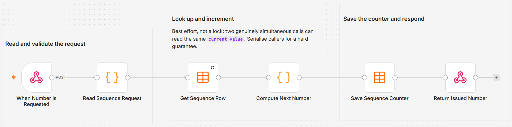

# Issue gapless sequential invoice and ticket numbers from a Data Table

POST to a webhook and get back the next number in a named sequence, formatted with your prefix and zero padding. The counter lives in an n8n Data Table, so several workflows can draw from the same sequence without each keeping its own count. Ask for `invoice` and you get `INV-000042`; ask again and you get `INV-000043`.

Built with n8n, plus n8n Data Tables.

## Use it when

- You are generating invoices from a workflow and the accountant needs them numbered consecutively, not by timestamp and not by record ID.
- Two workflows both create tickets and you want one shared run of numbers across both, rather than two sequences that collide.
- You need a number that reads like a document reference to a human, with a prefix and fixed width, not a UUID.

## How it works

A POST webhook accepts a `sequence_key` with an optional `prefix` and zero-pad width. A Code node validates the request against a character allowlist and falls back to safe defaults, so a malformed call still returns a usable number instead of failing. The Data Table row for that key is read, a second Code node adds one, and the counter is written back with an upsert before the formatted number is returned.

| Stage | What happens |
|---|---|
| When Number Is Requested | POST webhook at `next-number`, responds through the Respond node |
| Read Sequence Request | Validates `sequence_key`, `prefix` and `pad` against allowlists, applying defaults |
| Get Sequence Row | Reads the row for that key, with `alwaysOutputData` so an unused key still flows |
| Compute Next Number | Adds one, starting at 1 when the key has never been used, and formats the string |
| Save Sequence Counter | Upserts the counter on `sequence_key` |
| Return Issued Number | Returns the key, the formatted number, the raw value and a timestamp |

The read and the write are two separate operations, so this is a best-effort sequence rather than a lock. I would rather say that plainly in the response path than imply a guarantee the storage layer cannot make; see the concurrency section below.

## Requirements

- n8n with Data Tables available on your instance.
- No third-party accounts, API keys or credentials of any kind.

## Setup

1. Import `workflow.json` into n8n. It imports inactive; configure before activating.
2. Create a Data Table named `number_sequences` with the columns `sequence_key` (string), `current_value` (number), `prefix` (string) and `updated_at` (string).
3. Confirm that table is selected on both "Get Sequence Row" and "Save Sequence Counter".
4. Set the workflow to a single concurrent execution before you rely on the numbering.
5. Activate, then POST `{"sequence_key": "invoice"}` to the production URL and check the response.

## The request and the response

Send any of these in the JSON body or the query string. Only `sequence_key` matters, and even that has a default.

| Field | Default | What it does |
|---|---|---|
| `sequence_key` | `invoice` | Which counter to draw from. Lowercase letters, digits, hyphen and underscore, up to 50 characters. |
| `prefix` | the stored prefix | Prepended to the padded digits. Up to 12 characters. Omit it to reuse whatever the row already has. |
| `pad` | `6` | Zero-pad width, clamped between 1 and 12. |

A call with `{"sequence_key": "invoice", "prefix": "INV-"}` comes back as `{"sequence_key": "invoice", "number": "INV-000042", "current_value": 42, "issued_at": "..."}`. Every field is validated against an allowlist rather than rejected outright, so a bad `pad` becomes the default instead of an error the caller has to handle.

## What gapless does and does not mean

Numbers are consecutive with no holes, which is the property tax and audit rules usually care about. What it is not is atomic. Data Tables give no compare-and-swap, so the read and the write are separate steps, and two genuinely simultaneous requests can read the same `current_value` and issue the same number.

Two ways to close that gap, in order of preference:

- Set the workflow to one concurrent execution. Requests queue, the sequence holds, and this is the whole fix for almost every real caller.
- Serialise upstream. If several workflows call this, have them go through a queue rather than firing in parallel.

## Customize

- **Default width.** Change the `pad` fallback in "Read Sequence Request" if six digits is the wrong shape for your documents.
- **More sequences.** Nothing needs configuring. A new `sequence_key` creates its row on first use and starts at 1.
- **Private issuer.** Turn on Header Auth on the webhook so only your own workflows can draw numbers.
- **Starting value.** Set `current_value` on the row by hand to continue an existing run of numbers rather than starting from 1.

## What is in this folder

| File | What it is |
|---|---|
| `README.md` | This overview |
| `TEMPLATE-DESCRIPTION.md` | The n8n Creator hub listing text |
| `workflow.json` | The importable n8n workflow |
| `images/workflow.png` | The workflow on the n8n canvas |

---

All sample data is fictional. No real credentials, IDs, or endpoints are included.

Part of the [n8n-exekyute-templates](../../README.md) collection. MIT licensed.
