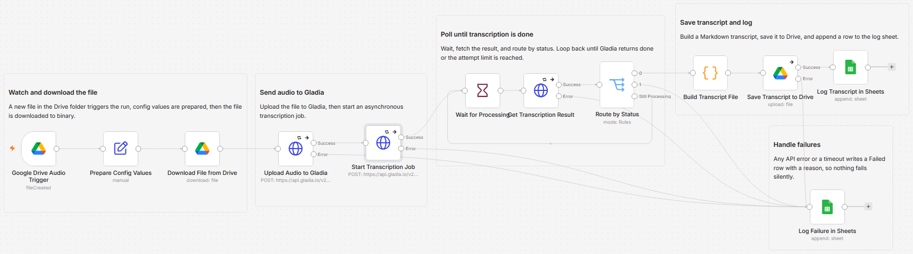

# Transcribe new audio files from Google Drive using Gladia and Google Sheets

Drop an audio or video file into a Google Drive folder and get a clean text transcript back in Drive, with every run logged to a sheet. I built this so a folder can quietly turn recordings into searchable transcripts without me clicking anything.

Built with n8n, plus Gladia, Google Drive, and Google Sheets.

## How it works

A new file in the watched Drive folder starts the run. The file is uploaded to Gladia, transcribed asynchronously, then saved back to Drive as a Markdown file and logged to a sheet.

| Stage | What happens |
|---|---|
| Drive trigger | A new audio or video file in the watched folder starts the run. |
| Download | The file is downloaded from Drive into binary so it can be uploaded. |
| Upload to Gladia | The bytes are posted to the Gladia upload endpoint, which returns a private audio URL. A Drive file is not public, so it has to be uploaded rather than linked. |
| Transcribe | Gladia starts an asynchronous pre-recorded transcription job and returns a job id. |
| Poll | The workflow waits, fetches the job, and routes on status. It loops until Gladia returns done, or stops after a set number of attempts. |
| Save and log | A Code node builds a Markdown transcript, saves it to a Drive folder, and appends a row to the log sheet. |
| Failures | Any API error or a timeout writes a Failed row with a reason, so nothing is lost silently. |

The async poll is the point. Gladia transcribes in the background, so the workflow checks back on a timer instead of blocking, and a central config node holds the poll interval and the attempt limit.

## Setup

1. Import `workflow.json` into n8n. It imports inactive, so configure it before turning it on.
2. Create a Header Auth credential named `Gladia` with header name `x-gladia-key` and your Gladia API key. It is used by the three Gladia HTTP nodes.
3. Connect a Google Drive credential. Set the watched folder on "Google Drive Audio Trigger" and the destination folder on "Save Transcript to Drive".
4. Connect a Google Sheets credential and pick the spreadsheet and tab for the log on both "Log Transcript in Sheets" and "Log Failure in Sheets".
5. Open "Prepare Config Values" if you want to change `wait_seconds` or `max_attempts`.

## The config node

Everything you tune lives in one Set node, "Prepare Config Values":

| Field | What it controls |
|---|---|
| `wait_seconds` | How long to wait between each poll of the Gladia job. |
| `max_attempts` | How many polls before the run gives up and logs a timeout. The default 15 seconds times 40 attempts is a 10 minute ceiling. |

Longer recordings take longer to transcribe, so raise `max_attempts` if you work with long files.

## The log sheet

Both the success and failure paths append to the same sheet, so it doubles as an audit trail. The columns are Timestamp, Source File, Duration (s), Status, Transcript Link, and Detail. A successful run writes Transcribed with a link to the transcript file, and a failed run writes Failed with the reason.

## What is in this folder

| File | What it is |
|---|---|
| `README.md` | This overview |
| `TEMPLATE-DESCRIPTION.md` | The n8n Creator hub listing text |
| `workflow.json` | The importable n8n workflow |
| `images/` | The workflow overview image |

---

All sample data is fictional. No real credentials, IDs, or endpoints are included.

Part of the [n8n-exekyute-templates](../../) collection. MIT licensed.
