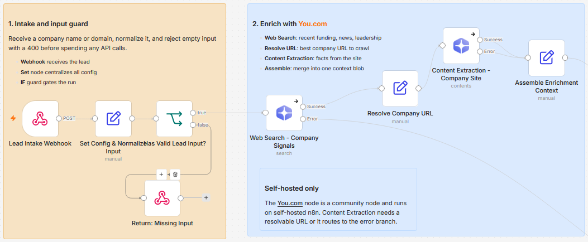

# Enrich and route inbound leads with You.com, Groq, Notion and Slack

Turn a raw company name or domain into a qualified, one-page lead profile before a human ever opens it. The workflow researches the company, writes a profile and a fit score, alerts the team on Slack for hot leads, and logs every lead to Notion.

Built with n8n, plus You.com, Groq, Notion, and Slack.

> Self-hosted n8n only. This template uses the You.com community node `@youdotcom-oss/n8n-nodes-youdotcom`, which can only be installed on a self-hosted instance.

## How it works

A lead is POSTed to the webhook, normalized, and checked. You.com gathers signals and site content, Groq turns that into a profile and a score, and the result is routed by how hot the lead is.

| Stage | What happens |
|---|---|
| Receive lead | A webhook takes a company name or domain, and a Set node normalizes it and holds all the config in one place |
| Guard input | An IF rejects empty input with a clean `400` before any API call is spent |
| Enrich with You.com | Web Search pulls recent signals (funding, news, leadership), the best company URL is resolved, and Content Extraction reads the site, all merged into one context blob |
| Profile and score | A Groq chain writes a one-page profile, then a second Groq chain scores fit against your criteria and returns structured JSON (score, tier, reasons, action) |
| Route and log | Hot leads ping Slack with an `@mention`, every lead is logged to Notion, and the profile is returned on the webhook |

Every external call has its own error branch, so one failed search or a bad URL returns a clean `502` instead of taking down the whole run.

*Groq builds the profile and scores fit, then the score gates the Slack alert, the Notion log, and the webhook response.*

*Failures from any external step land here and return a standardized `502`.*

## Setup

1. Import `workflow.json` into n8n. It imports inactive, so configure it before activating.
2. Install the You.com community node `@youdotcom-oss/n8n-nodes-youdotcom` under Settings, Community Nodes. This only works on self-hosted n8n.
3. Add credentials for You.com, Groq, Notion, and Slack, and select them on their nodes.
4. Open "Set Config & Normalize Input" to set your fit criteria, the hot-score threshold, and the Slack member ID to mention.
5. In "Alert Sales - Hot Lead" pick the Slack channel, and in "Log Lead to Notion" select a database with Fit Score (number), Tier (select), and Summary (rich text) properties.
6. Activate the workflow and POST a lead to the webhook.

## Configuration

Set these in the "Set Config & Normalize Input" node:

| Field | What it controls |
|---|---|
| `hotScoreThreshold` | The score at or above which a lead is hot and pages Slack |
| `slackMentionId` | The Slack member ID that gets `@mentioned` on a hot lead |
| `fitCriteria` | The ideal customer profile text the scoring model judges against |
| `searchFreshness` | The recency window for the You.com search (for example `month`) |

## Customize

- Edit the scoring prompt and `fitCriteria` to match your ICP.
- Raise or lower `hotScoreThreshold` to control how many leads page the team.
- Route Warm and Cold tiers to different Slack channels, or skip the alert below a tier.
- Extend the Notion mapping to store the key reasons and recommended action.
- Swap the Groq model on the two model nodes without touching the rest of the flow.

## Requirements

- Self-hosted n8n with the `@youdotcom-oss/n8n-nodes-youdotcom` community node
- A You.com API key (you.com/platform)
- A Groq API key (console.groq.com)
- A Notion integration and a target database
- A Slack app with `chat:write`

## What is in this folder

| File | What it is |
|---|---|
| `README.md` | This overview |
| `TEMPLATE-DESCRIPTION.md` | The n8n Creator hub listing text |
| `workflow.json` | The importable n8n workflow |
| `images/workflow.png` | Intake and You.com enrichment on the canvas |
| `images/workflow-profile-routing.png` | Profile, score, and routing on the canvas |
| `images/workflow-error-handling.png` | The error handling lane |

---

All sample data is fictional. No real credentials, IDs, or endpoints are included.

Part of the [n8n-exekyute-templates](../../) collection. MIT licensed.
