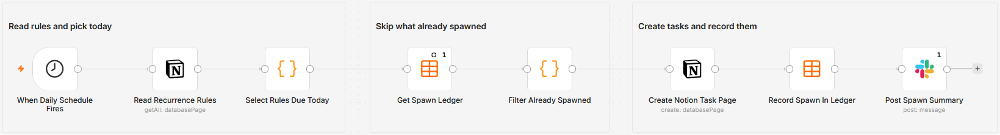

# Spawn recurring Notion tasks from a rules database on a schedule

Read a Notion database where every row describes one recurring to-do, work out which rules are due today, and create a Notion task page for each. A Data Table ledger records what was already created, so running the workflow twice on the same day makes nothing the second time. Four recurrence patterns are supported, including the nth weekday of the month and the last one.

Built with n8n, plus Notion, Slack, and n8n Data Tables.

## Use it when

- Your recurring work lives in someone's head and a reminder they snooze, and you want it in the same Notion database as everything else.
- Notion's own repeating templates cannot express the cadence you need, like the last Friday of the month.
- You want one place to edit every recurrence, rather than opening a dozen individual tasks to change when they fire.

## How it works

A daily schedule reads the rules database. A Code node tests each rule against today's date in a configurable timezone and keeps the ones that match. The ledger is read once, any rule already stamped with today's date is dropped, and Notion creates one page per surviving rule with the due date set to today. The ledger is upserted on `rule_id` and Slack gets a one-line summary of what was created.

| Stage | What happens |
|---|---|
| When Daily Schedule Fires | Runs once a day at the hour you set |
| Read Recurrence Rules | Reads every row of the Notion rules database |
| Select Rules Due Today | Tests each rule against today in the configured timezone |
| Get Spawn Ledger | Reads the Data Table once, listing what has already been created |
| Filter Already Spawned | Drops any rule whose ledger stamp is today |
| Create Notion Task Page | Creates one page per due rule, due date set to today |
| Record Spawn In Ledger | Upserts `rule_id` with today's date |
| Post Spawn Summary | Posts one Slack line naming the tasks created |

The ledger is checked against the spawn date rather than a run counter, so a retry, a manual run and a catch-up after downtime all converge on the same answer: one task per rule per day.

## Requirements

- A Notion workspace with two databases: one holding the rules, one receiving the tasks.
- A Slack workspace with a channel for the summary.
- n8n (cloud or self-hosted) with Notion and Slack credentials, and Data Tables available.

## Setup

1. Import `workflow.json` into n8n. It imports inactive; configure before activating.
2. Give the rules database the properties `rule_id`, `task_title`, `frequency`, `interval_days`, `anchor_date`, `weekdays`, `day_of_month`, `nth`, `nth_weekday` and `active`.
3. Give the tasks database a date property named `Due`.
4. Create a Data Table named `cadence_last_spawned` with the columns `rule_id`, `last_spawned_on` and `rule_title`.
5. Add your Notion credential to "Read Recurrence Rules" and "Create Notion Task Page", replacing both database ID placeholders, and your Slack credential and channel to "Post Spawn Summary".
6. Set `TIMEZONE` at the top of "Select Rules Due Today" to the zone your day boundary should follow, then run once by hand before activating.

## The rules database

One row per recurring task. `frequency` decides which of the other columns matter.

| `frequency` | Columns it reads | Fires on |
|---|---|---|
| `every_n_days` | `interval_days`, `anchor_date` | Every N days counting from the anchor |
| `weekly` | `weekdays` | The listed weekdays, as `mon,wed,fri` |
| `monthly_day` | `day_of_month` | That day each month, clamped to the last day in shorter months |
| `monthly_nth_weekday` | `nth`, `nth_weekday` | The nth weekday of the month, with `-1` meaning the last one |

Set `active` to false to pause a rule without deleting it. A row missing `rule_id` or `task_title` is skipped.

The clamp on `monthly_day` is the detail worth knowing: a rule set to the 31st fires on the 30th in April and on the 28th or 29th in February, rather than skipping those months entirely.

## Customize

- **Timezone.** `TIMEZONE` at the top of "Select Rules Due Today" decides when a day starts. Everything else follows from it.
- **Time of day.** Change the hour on the schedule trigger. The ledger keys on the date, so moving the hour does not double-create.
- **More properties.** "Create Notion Task Page" sets the title and the due date. Add assignee, project or priority there and add the matching columns to the rules database.
- **A new pattern.** Add a branch to the frequency test in "Select Rules Due Today". Each pattern is a self-contained block returning a hit or a miss.
- **Quieter Slack.** The summary node runs once per execution. Remove it, or put an IF in front so it only posts when something was created.

## What is in this folder

| File | What it is |
|---|---|
| `README.md` | This overview |
| `TEMPLATE-DESCRIPTION.md` | The n8n Creator hub listing text |
| `workflow.json` | The importable n8n workflow |
| `images/workflow.png` | The workflow on the n8n canvas |

---

All sample data is fictional. No real credentials, IDs, or endpoints are included.

Part of the [n8n-exekyute-templates](../../README.md) collection. MIT licensed.
