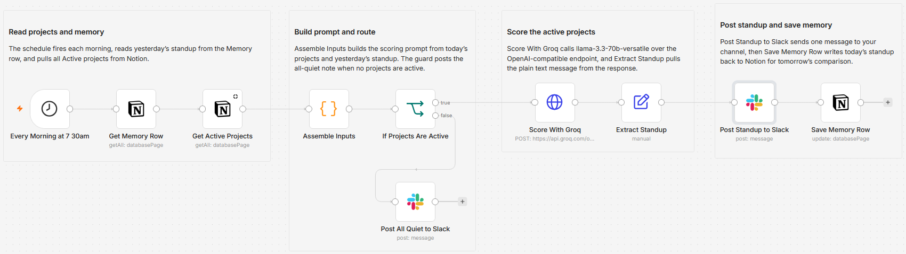

# Post a daily project health standup to Slack using Notion and Groq

A no-code automation that reads my active projects from Notion every morning, scores each one Green, Yellow, or Red with an LLM, highlights what changed since yesterday, and posts a single standup to Slack.

Built with n8n, Notion, Groq, and Slack.



## Why I built it

Project status usually lives scattered across notes and deadlines, and nobody re-reads it. I wanted one glanceable message each morning that says where to look first, and more importantly what moved overnight, without opening anything.

## What it does

Every morning it:

1. Pulls all Active projects from a Notion database.
2. Sends them to Groq, which scores each project's health and writes a short, blunt reason.
3. Compares today's scores against yesterday's and surfaces any changes at the top.
4. Posts the finished standup to Slack as a single message.

Example output:

```
Morning standup - Jun 2, 2026

⚡ CHANGED OVERNIGHT
- Vendor portal migration: Red -> Green (blocker cleared)
- Onboarding kit v2: Green -> Red (milestone in 2 days)

🔴 RED
- Henley pitch deck: milestone in 2 days, slides half done
- Onboarding kit v2: milestone in 2 days, reviewer out

🟡 YELLOW
- Q3 budget review: milestone within a week, awaiting replies

🟢 GREEN (2): Vendor portal migration, Newsletter relaunch
```

## How it works

A scheduled, AI-scored automation with one twist: it remembers its own previous output, so it can report deltas instead of a flat list.

```
Every Morning at 7 30am (Schedule)
  -> Get Memory Row        Notion: yesterday's standup from a single-row Memory database
  -> Get Active Projects   Notion: every project with Status = Active
  -> Assemble Inputs       Code: builds the prompt from today's projects and yesterday's standup
  -> If Projects Are Active
       true  -> Score With Groq -> Extract Standup -> Post Standup to Slack -> Save Memory Row
       false -> Post All Quiet to Slack
```

| Stage | Node | What happens |
|---|---|---|
| Schedule | Every Morning at 7 30am | Fires once every morning |
| Read memory | Get Memory Row (Notion) | Loads yesterday's standup from the Memory row |
| Read data | Get Active Projects (Notion) | Fetches all Active projects |
| Assemble | Assemble Inputs (Code) | Builds the prompt with today's projects and yesterday's standup |
| Guard | If Projects Are Active | If nothing is Active, posts an all-quiet note and stops |
| Score and compare | Score With Groq (HTTP) | The LLM rates each project and diffs against yesterday |
| Notify | Post Standup to Slack | Posts the standup as a single message |
| Save memory | Save Memory Row (Notion) | Stores today's standup for tomorrow's comparison |

The read-memory and save-memory stages are what let the standup lead with CHANGED OVERNIGHT. A plain scheduled automation has no sense of yesterday; this one does.

### Memory: why a Notion row, not workflow storage

n8n's built-in `getWorkflowStaticData` only persists reliably when the workflow is active and runs from its trigger, not on manual test runs. To make change detection testable and inspectable, this build stores the previous standup in a dedicated single-row Notion Memory database instead. It survives manual runs and workflow edits, and you can read it with your own eyes.

### Safety guards

- Empty run: if no Active projects are found, the workflow posts a short all-quiet note instead of a broken empty standup.
- Error ping: the companion `workflow-error-alert.json` posts to Slack if any step fails, so a silent morning is never a mystery. Set it as this workflow's Error Workflow in n8n.

## The data model

Two Notion databases drive everything.

Projects (the source data; upkeep is about two minutes a week: jot a short progress note, set a date, and the automation handles the rest).

| Field | Type | Purpose |
|---|---|---|
| Project | Title | Name |
| Status | Select | Active / On hold / Done (only Active is scored) |
| Update notes | Text | Short progress note the LLM reads |
| Last update | Date | Staleness signal |
| Next milestone | Date | Urgency signal |
| Health | Select | Optional, for manual or formula-based color in Notion |
| Why | Text | Optional notes field |

Memory (a single row the workflow reads and overwrites each run).

| Field | Type | Purpose |
|---|---|---|
| Key | Title | Fixed value `last-standup` |
| Digest | Text | The last standup the workflow produced |
| Updated | Date | When it was last written |

The automation reads project fields and posts the result to Slack. It does not write back to the Projects database. The color and reason appear in the Slack standup.

## Scoring logic

- Red: a milestone within 3 days and not on track, a named blocker, or no update in over 14 days.
- Yellow: no update in 7 to 14 days, or a milestone within a week with unclear progress.
- Green: a recent update and no near-term risk.

The exact wording lives in [`ai-prompt.md`](ai-prompt.md).

## Setup

1. Import `workflow.json` into n8n. It imports inactive; configure before activating.
2. Notion: confirm the Projects database, create the single-row Memory database, and share both with a Notion internal integration. Pick each database on the two Notion read nodes and on Save Memory Row.
3. Groq: create a free API key at https://console.groq.com/keys, add it as a Header Auth credential (Name `Authorization`, Value `Bearer your-key`), and select it on Score With Groq.
4. Slack: add a Slack credential and choose the channel on both Slack nodes.
5. Optional: import `workflow-error-alert.json` and set it as this workflow's Error Workflow.
6. Test with the synthetic data in [`synthetic-data.md`](synthetic-data.md).

## Requirements

- An n8n instance, cloud or self-hosted.
- A Notion account with a Projects database and a single-row Memory database.
- A Groq API key, free at console.groq.com/keys, used as a Header Auth credential.
- A Slack workspace and a channel to post to.

## Customizing

- Change the trigger time on the schedule node.
- Edit the Red, Yellow, and Green thresholds in the prompt (`ai-prompt.md`).
- Swap Groq for any OpenAI-compatible chat endpoint (the default model is `llama-3.3-70b-versatile`).
- Point the Slack nodes at a different channel.

## What is in this folder

| File | What it is |
|---|---|
| `README.md` | This overview |
| `TEMPLATE-DESCRIPTION.md` | The n8n Creator hub listing text |
| `workflow.json` | The main n8n workflow (placeholders only) |
| `workflow-error-alert.json` | The companion error-alert workflow |
| `ai-prompt.md` | The AI scoring and change-detection prompt |
| `synthetic-data.md` | Two-day test dataset and expected standups |
| `projects-day1.csv` | The same sample data, ready to import into Notion |

---

All sample data is fictional. No real credentials, IDs, or endpoints are included.

Part of the [n8n-exekyute-templates](../../README.md) collection. MIT licensed.
