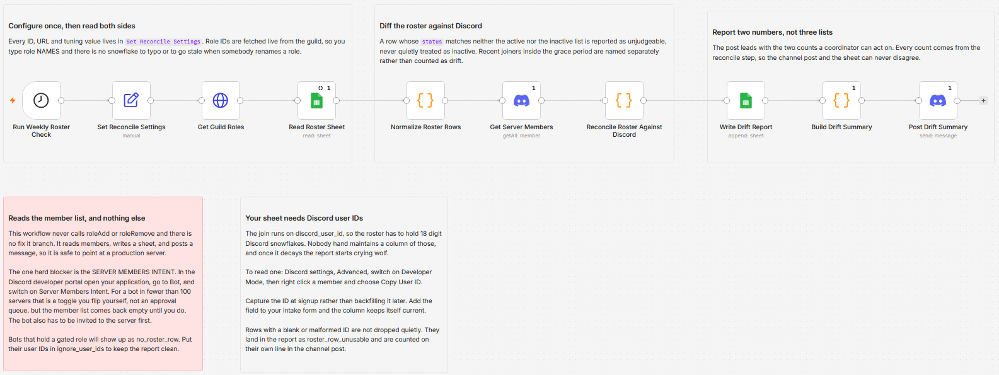

# Reconcile a Google Sheets roster against Discord roles and report the drift

Read a roster from a Google Sheet, read the members of a Discord server, and report every place the two disagree: people holding a gated role with no roster row, and people on the roster missing the role they are entitled to. It never calls roleAdd or roleRemove and has no fix-it branch, so it is safe to point at a live server. Role IDs are fetched from the guild at run time, which means you configure role names and never copy a snowflake.

Built with n8n, plus Discord and Google Sheets.

## Use it when

- Your volunteer list, course cohort or paying membership lives in a spreadsheet, and the Discord roles wandered off it within a week.
- Somebody left the club three months ago and still has the members-only role, and nobody can tell you how many others are in the same position.
- You want to know what the drift is before you decide whether to automate fixing it, and you are not willing to let a workflow strip roles on a live server to find out.

## How it works

A weekly schedule fires, and one Set node supplies every ID, URL and tuning value. The guild's roles are fetched live so `gated_roles` can be plain names. The roster is read and normalized, with any row that cannot be judged flagged rather than guessed at. Members are pulled with their role IDs, the two sides are joined on `discord_user_id`, and every mismatch is sorted into a named bucket. One row per mismatch goes to the report tab, then two headline counts go to a channel.

| Stage | What happens |
|---|---|
| Run Weekly Roster Check | Fires once a week |
| Set Reconcile Settings | Every ID, URL and tuning value in one node |
| Get Guild Roles | Fetches the server's roles so names resolve to IDs at run time |
| Read Roster Sheet | Pulls the roster tab |
| Normalize Roster Rows | Validates each row and names the ones that cannot be judged |
| Get Server Members | Pulls every member with their role IDs, paginating natively |
| Reconcile Roster Against Discord | Joins both sides and buckets every mismatch |
| Write Drift Report | One row per mismatch |
| Build Drift Summary | Counts and examples, from the reconcile step |
| Post Drift Summary | Two headline numbers to a channel |

Fetching roles live rather than storing a name-to-ID map is the change that makes this installable. Setup goes from copying 18 digit snowflakes into JSON to typing `Volunteer,Committee`, it survives somebody renaming a role, and a name that does not exist is reported as a configuration problem instead of silently matching nothing.

## Requirements

- A Discord server where you can add a bot and invite it. It needs no role permissions, because it never changes a role.
- The SERVER MEMBERS privileged intent switched on. The member list comes back empty without it.
- A Google account with a roster tab and a tab to write the report to. They can be the same file.
- n8n (cloud or self-hosted) with Discord Bot API and Google Sheets credentials.

## Setup

1. Import `workflow.json` into n8n. It imports inactive; configure before activating.
2. Create a Discord application, add a bot to it, and invite that bot to your server.
3. In the Discord developer portal, Bot tab, switch on SERVER MEMBERS INTENT. Under 100 servers it is a toggle you flip yourself, not an approval queue.
4. Paste the token into a Discord Bot API credential and assign it to both Discord nodes and to `Get Guild Roles`.
5. Fill `Set Reconcile Settings`: server ID, report channel ID, roster sheet URL, report sheet URL, and `gated_roles` as role names spelled exactly as they appear in Server Settings.
6. Give the roster tab the columns `discord_user_id`, `display_name`, `entitled_role`, and optionally `status`.
7. Give the report tab the header row `checked_at`, `run_id`, `bucket`, `discord_user_id`, `display_name`, `discord_username`, `role`, `note`.
8. Run it once by hand and read the drift report before you trust the counts.

## The drift buckets

Every mismatch lands in exactly one bucket, and the bucket is a column in the report.

| Bucket | What it means |
|---|---|
| `no_roster_row` | Holds a gated role with no roster row at all |
| `missing_role` | On the roster, active, and does not hold the entitled role |
| `unexpected_role` | Holds a role the roster does not currently grant |
| `roster_row_unusable` | The row could not be judged and is excluded from every count |
| `in_grace_period` | Joined recently, named separately, not counted as drift |
| `gated_role_not_found` | A name in `gated_roles` does not exist in this server |
| `roster_empty` | The roster tab returned no rows |

The unusable bucket is the important one. A `status` value matching neither the active nor the inactive list is reported rather than assumed inactive, because assuming would mean telling a coordinator to strip roles from members who are paid up. The channel post calls that count out in bold and says the numbers above it cannot be trusted until those rows are fixed.

## Customize

- **Status vocabulary.** `active_status_values` and `inactive_status_values` are comma separated. Anything in neither list is reported, so add your own wording rather than working around it.
- **Grace period.** `grace_period_days` stops flagging people who joined before anyone had a chance to give them their role.
- **Ignore list.** `ignore_user_ids` keeps bots and service accounts out of the report.
- **Cadence.** Weekly suits most rosters. A cohort that changes daily wants a daily schedule and a shorter grace period.

## What is in this folder

| File | What it is |
|---|---|
| `README.md` | This overview |
| `TEMPLATE-DESCRIPTION.md` | The n8n Creator hub listing text |
| `workflow.json` | The importable n8n workflow |
| `images/workflow.png` | The workflow on the n8n canvas |

---

All sample data is fictional. No real credentials, IDs, or endpoints are included.

Part of the [n8n-exekyute-templates](../../README.md) collection. MIT licensed.
