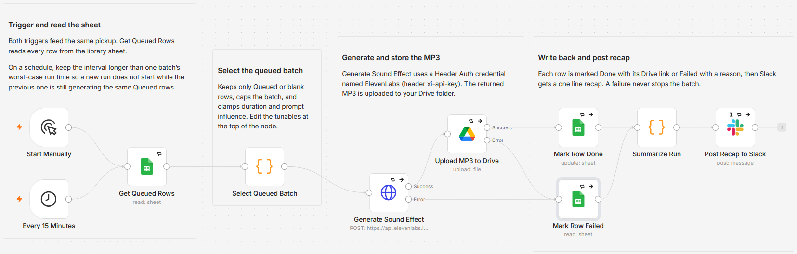

# Build a sound effect library from a Google Sheet with ElevenLabs

Keep one row per sound in a Google Sheet, and this workflow generates each one with ElevenLabs, saves the MP3 to Google Drive, and writes the link and status back to the row. No AI decisioning, fully rule based and idempotent, so a Done or Failed row is never regenerated.

Built with n8n, plus ElevenLabs, Google Sheets, Google Drive, and Slack.

## How it works

You fill a sheet with the sounds you want, the workflow works through the queue, and each row ends as Done or Failed. Four stages:

### 1. Trigger and read the sheet

A manual run or the 15 minute schedule starts the run, and Get Queued Rows reads every row from the library sheet.

### 2. Select the queued batch

A Code node keeps only rows whose Status is Queued or blank, caps the run to a safe batch (10 by default), and builds the ElevenLabs request for each. The Description becomes the prompt, DurationSeconds is clamped to 0.5 to 30 (blank lets ElevenLabs choose the length), and PromptInfluence is clamped to 0 to 1.

### 3. Generate and store the MP3

Generate Sound Effect posts to the ElevenLabs sound-generation API through the core HTTP Request node and returns an MP3. Upload MP3 to Drive saves that file to your target folder. Both steps retry on a transient error before giving up.

### 4. Write back and post recap

On success the row is marked Done with its Drive link and a timestamp. On a generation or upload error the row is marked Failed with the reason, so no row is ever left stuck on Queued. Slack then receives a one line generated and failed recap. An empty run does nothing and stays quiet.

## The library sheet

One row per sound. Create these headers in row 1:

| Column | Holds |
|---|---|
| Description | The sound-effect prompt (you fill this) |
| DurationSeconds | Optional, 0.5 to 30, blank lets ElevenLabs choose |
| PromptInfluence | Optional, 0 to 1, default 0.3 |
| Status | Queued or blank to generate; the workflow sets Done or Failed |
| Link | The Drive link, written on success |
| Notes | The error reason, written on failure |
| GeneratedAt | Timestamp of the last attempt |

## Setup

1. Import `workflow.json` into n8n. It imports inactive, so configure it before activating.
2. Create a Header Auth credential named ElevenLabs with header name `xi-api-key` and your key as the value, then select it on Generate Sound Effect. The key is never stored in the workflow.
3. Assign a Google Sheets credential to Get Queued Rows, Mark Row Done, and Mark Row Failed, and pick your spreadsheet and tab.
4. Assign a Google Drive credential to Upload MP3 to Drive and pick the target folder.
5. Assign a Slack credential to Post Recap to Slack and pick the channel.
6. Add the header row above to your sheet, fill a few Description rows, run once, then activate.

## Customize

- Change the batch size, default prompt influence, and duration clamps at the top of the "Select Queued Batch" node.
- Change the 15 minute schedule to any cadence, or run it only by hand. If you run it on a schedule, keep the interval longer than one batch's worst-case run time so a new run does not start while the previous one is still generating the same queued rows.
- Point the recap at a different channel, or remove the Slack step if you do not want a recap.

## Requirements

- n8n.
- An ElevenLabs API key, used through the core HTTP Request node, so no community node is needed and it runs on n8n Cloud too.
- Google Sheets and Google Drive OAuth2 credentials (the same Google account can back both).
- A Slack credential for the recap (optional).

## What is in this folder

| File | What it is |
|---|---|
| `README.md` | This overview |
| `TEMPLATE-DESCRIPTION.md` | The n8n Creator hub listing text |
| `workflow.json` | The importable n8n workflow |
| `images/` | The canvas screenshot used above |

---

All sample data is fictional. No real credentials, IDs, or endpoints are included.

Part of the [n8n-exekyute-templates](../../) collection. MIT licensed. Copyright Kevin Yu (github.com/exekyute).
