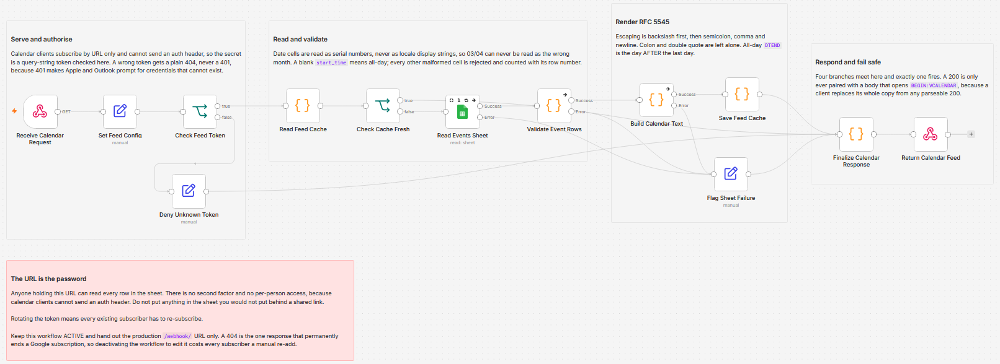

# Publish a Google Sheet as a live calendar feed for Google Calendar, Apple Calendar and Outlook

Serve a tab of events as an RFC 5545 iCalendar feed at a stable URL, so anyone can subscribe once and see edits arrive on their own calendar. The sheet stays the source of truth: change a row and the event changes for every subscriber, delete the row and it disappears. Nothing is written back to the sheet, and a malformed cell is rejected with its row number rather than guessed at.

Built with n8n, plus Google Sheets.

## Use it when

- You keep a rota, roster or timetable in a spreadsheet, and the way people find out about it is a Slack message you re-pin every Monday.
- Someone asks you to "send a calendar invite" for a schedule that changes every few weeks, and you know the invite will be stale before anyone accepts it.
- You already tried a sheet-to-calendar workflow that creates events, and discovered it duplicates every one of them on the next run.

## How it works

A calendar client fetches the feed URL. The token in the query string is compared against the config node, and a miss ends the run with a plain 404. On a hit the workflow checks its own TTL cache first and answers from memory when the cached body is young enough, so a dozen clients refreshing does not become a dozen Google Sheets reads. On a miss it reads the events tab, validates every row, serializes the survivors to iCalendar text, writes the result back to the cache, and responds as `text/calendar`.

| Stage | What happens |
|---|---|
| Receive Calendar Request | GET webhook, responds through the Respond node rather than on receipt |
| Set Feed Config | Every user setting in one node: token, namespace, timezone, cache TTL, window |
| Check Feed Token | Compares the query token, and refuses to serve while the shipped placeholders are unchanged |
| Deny Unknown Token | Builds a plain 404, never echoing the token that was supplied |
| Read Feed Cache | Reads the TTL slot and the separate last-good slot from workflow static data |
| Check Cache Fresh | A fresh cache short-circuits straight to the responder |
| Read Events Sheet | Reads the tab with date cells as serial numbers, with its error output wired |
| Validate Event Rows | Rejects and counts every malformed cell with its row number |
| Build Calendar Text | Serializes to RFC 5545: CRLF, 75-octet folding, correct escaping, exclusive all-day end |
| Save Feed Cache | Writes both the TTL slot and the last-good slot, size capped |
| Flag Sheet Read Failure | Catches the Sheets, validation and render error outputs |
| Finalize Calendar Response | Four branches meet here, exactly one fires, and the status code is decided |
| Return Calendar Feed | Responds as `text/calendar` with the headers built upstream |

A 200 is only ever paired with a body that opens `BEGIN:VCALENDAR` and closes `END:VCALENDAR`. That check is the most important line in the workflow: a subscribed client replaces its entire copy of the calendar from any parseable 200, so answering a backend failure with an empty-but-valid calendar would wipe the schedule off every subscriber's phone.

## Requirements

- A Google account with a spreadsheet the workflow can read. Read-only access is enough.
- A calendar client that subscribes by URL. Google Calendar, Apple Calendar and Outlook all do.
- n8n (cloud or self-hosted) with a Google Sheets credential.

## Setup

1. Import `workflow.json` into n8n. It imports inactive; configure before activating.
2. Create a tab named `events` with these headers, spelled exactly: `uid`, `title`, `start_date`, `start_time`, `end_date`, `end_time`, `location`, `description`, `status`, `updated_at`.
3. Add a Google Sheets credential to "Read Events Sheet" and pick your document.
4. Open "Set Feed Config" and replace `feed_token` with 32 or more random characters and `feed_namespace` with something you own, for example `acme-ops.example`. Set `timezone` to match File > Settings > Time zone in the spreadsheet.
5. Activate, then fetch the production `/webhook/` URL with `?token=` and your token, and confirm the body starts with `BEGIN:VCALENDAR`.
6. Subscribe. Google Calendar: Other calendars > From URL. Apple: File > New Calendar Subscription. Outlook: Add calendar > Subscribe from web.

## The events tab

Three columns are required. Everything else is optional.

| Column | Required | What goes in it |
|---|---|---|
| `uid` | yes | A short label you invent once and never change: `shift-001`, `freeze-aug`. This is the event's identity across refreshes. |
| `title` | yes | What shows on the calendar. Any punctuation is safe, including colons, quotes, commas and semicolons. |
| `start_date` | yes | The date. Type it normally or use the date picker. |
| `start_time` | no | Blank means all-day. Otherwise `09:00`, 24-hour. |
| `end_date` | no | Blank means the same day. For a multi-day all-day block, the last day people should see. |
| `end_time` | no | Blank means start plus `default_duration_minutes`. |
| `location` | no | Free text. |
| `description` | no | Free text. Alt+Enter line breaks survive to the calendar. |
| `status` | no | Blank, `tentative` or `cancelled`. |
| `updated_at` | no | Almost always blank. Fill it to give one event its own DTSTAMP. |

Whether `start_time` is blank is the only signal for all-day. There is no `all_day` column, because a flag plus a filled `end_time` is a contradiction that then needs its own rule.

## What the subscriber sees, and when

The sheet is authoritative the moment you save it. Each client picks the change up on its own schedule, and none of them are fast. Apple honours a refresh interval you set per subscription. Outlook respects the TTL hints down to roughly an hour. Google polls on its own schedule, measured in hours, with no manual refresh and no way to force one. Set expectations accordingly: this is a schedule people subscribe to, not a notification channel.

## Customize

- **Timezone.** `timezone` in the config node must match the spreadsheet's own zone. It is echoed back inside the diagnostic event so a mismatch is visible from inside the calendar rather than as a silent hour-wide offset.
- **Cache TTL.** Raise `cache_ttl_seconds` to cut Sheets reads further, lower it to shorten the gap between a save and the next fetch seeing it.
- **Window.** `window_future_days` trims far-future events to keep the feed small. Leave `window_past_days` at 0 unless you accept that trimming the past removes history from every subscriber's calendar.
- **Diagnostics.** Set `health_event` to false once you trust the feed and no longer want the status entry on the calendar.
- **Recurring events.** Not supported on purpose. Enter one row per occurrence; a `rrule` column is rejected with a message saying so.

## What is in this folder

| File | What it is |
|---|---|
| `README.md` | This overview |
| `TEMPLATE-DESCRIPTION.md` | The n8n Creator hub listing text |
| `workflow.json` | The importable n8n workflow |
| `images/workflow.png` | The workflow on the n8n canvas |

---

All sample data is fictional. No real credentials, IDs, or endpoints are included.

Part of the [n8n-exekyute-templates](../../README.md) collection. MIT licensed.
