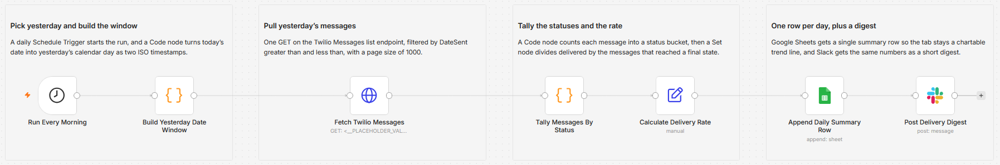

# Summarize yesterday's Twilio message delivery rates to Google Sheets and Slack

I kept opening the Twilio console to eyeball whether yesterday's texts actually landed, which is a bad way to spot a trend. This runs every morning, counts yesterday's messages by status, works out a delivery rate, and leaves one row in a Sheet plus a short digest in Slack. It only reads. It never sends a message, so it cannot cost me anything.

Built with n8n, plus Twilio, Google Sheets, and Slack.

## How it works

A Schedule Trigger fires each morning. A Code node turns the current date into yesterday's calendar day and returns two ISO timestamps for the start and end of that day. An HTTP Request node calls the Twilio Messages list endpoint with those timestamps as `DateSent>` and `DateSent<` filters, authenticated with the built-in Twilio credential. A second Code node walks the returned messages and counts each one into a status bucket. A Set node divides delivered by the messages that reached a final state and rounds the result to a percent. Google Sheets appends that single summary as one row, and Slack posts the same numbers as a digest.

| Stage | What happens |
|---|---|
| Run Every Morning | Schedule Trigger, fires once a day at 07:15 |
| Build Yesterday Date Window | Code node returns `report_date` plus start and end ISO timestamps for the previous calendar day |
| Fetch Twilio Messages | GET on the Twilio Messages list endpoint, filtered by `DateSent>` and `DateSent<`, `PageSize` 1000, built-in Twilio credential |
| Tally Messages By Status | Code node counts each message into queued, sent, delivered, failed, undelivered, or other, and totals the volume |
| Calculate Delivery Rate | Set node computes `delivery_rate_pct` from delivered, failed, and undelivered |
| Append Daily Summary Row | Google Sheets append, one row per day |
| Post Delivery Digest | Slack message with the date, the counts, and the rate |

One row per day instead of one row per message is the whole point: the Sheet stays a trend line you can chart directly, rather than a log you have to pivot before it tells you anything.

## Setup

1. Import `workflow.json` into n8n. It imports inactive, so configure it before activating.
2. Add three credentials. Create a Twilio credential (Account SID and Auth Token) and assign it to **Fetch Twilio Messages**, which authenticates with n8n's built-in Twilio credential type. Assign your Google Sheets OAuth2 credential to **Append Daily Summary Row** and your Slack credential to **Post Delivery Digest**.
3. Replace `REPLACE_WITH_YOUR_ACCOUNT_SID` in the **Fetch Twilio Messages** URL with the same Account SID. Pick your spreadsheet and tab in **Append Daily Summary Row**, and set the channel in **Post Delivery Digest**. Adjust the trigger hour if 07:15 is not when you want it.
4. Run it once with Execute Workflow, check the Sheet row and the Slack message, then activate.

## Testing on a Twilio trial

The rollup is read-only and spend-free: it never creates or sends a message, so a trial account is enough to prove it works. Seed three or four messages on the trial first (the trial's pre-defined body is fine, since custom bodies are not supported there), point the date window at that day, and run it.

| Check | What good looks like |
|---|---|
| Tally | The bucket counts add up to `total`, and `total` matches how many messages you seeded |
| Rate math | `delivery_rate_pct` equals delivered divided by delivered plus failed plus undelivered |
| Sheet | Exactly one new row, not one row per message |
| Slack | The digest numbers match the Sheet row |

To test a fixed day instead of yesterday, temporarily hard-code `reportDate` in **Build Yesterday Date Window** to the day you seeded, then put the original line back.

The header row in the Sheet must be `date`, `total`, `delivered`, `failed`, `undelivered`, `delivery_rate_pct`.

## What is in this folder

| File | What it is |
|---|---|
| `README.md` | This overview |
| `TEMPLATE-DESCRIPTION.md` | The n8n Creator hub listing text |
| `workflow.json` | The importable n8n workflow |
| `images/workflow.png` | The workflow on the n8n canvas |

---

All sample data is fictional. No real credentials, IDs, or endpoints are included.

Part of the [n8n-exekyute-templates](../../README.md) collection. MIT licensed.
