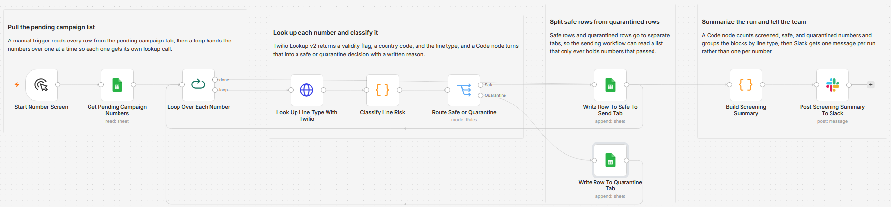

# Screen a campaign number list for high-risk lines with Twilio Lookup

I got tired of finding out a campaign list was full of landlines and VoIP numbers after the send. Bad numbers cost money, they inflate the failure rate, and premium-rate VoIP lines are the thing SMS pumping fraud is built on. So I put a gate in front of the send: every number gets looked up first, and only the ones that pass land in the tab the sender reads.

Built with n8n, plus Twilio Lookup, Google Sheets, and Slack.

## How it works

A manual run pulls the pending campaign tab from Google Sheets and feeds it into a loop that takes one number at a time. Each number goes to the Twilio Lookup v2 endpoint with the Line Type Intelligence field requested, and the response comes back with a validity flag, a country code, and the line type. A Code node turns that into a decision: mobile in an allowed country is safe, anything else is quarantined with a written reason. A Switch sends safe rows to one sheet tab and quarantined rows to another. When the loop finishes, a second Code node counts the results and Slack gets a short summary with a breakdown of what was blocked.

| Stage | What happens |
|---|---|
| Start Number Screen | Manual trigger. Swap it for a Schedule Trigger if you want the screen to run on its own. |
| Get Pending Campaign Numbers | Reads every row from the pending campaign tab. |
| Loop Over Each Number | Batch size 1, so each number gets its own lookup call. |
| Look Up Line Type With Twilio | GET to `lookups.twilio.com/v2/PhoneNumbers/{number}` with `Fields=line_type_intelligence`, using the built-in Twilio credential. Full response and never-error are on so a bad number does not kill the run. |
| Classify Line Risk | Reads the status code, validity flag, line type, and country. Sets `decision` to safe or quarantine and writes a reason. |
| Route Safe or Quarantine | Switch. Output 1 is safe, the fallback output is quarantine. |
| Write Row To Safe To Send Tab | Appends the clean row, using the E.164 number Twilio returned. |
| Write Row To Quarantine Tab | Appends the blocked row plus the reason it was blocked. |
| Build Screening Summary | Counts screened, safe, and quarantined, and groups the blocks by line type and country. |
| Post Screening Summary To Slack | One message per run, not one per number. |

The key choice is that safe and quarantined rows go to separate tabs rather than one tab with a status column, so the sending workflow reads a list that only ever contains numbers that passed.

## Setup

1. Import `workflow.json` into n8n. It imports inactive, so configure it before activating.
2. Create a Twilio credential (Account SID and Auth Token) and assign it to **Look Up Line Type With Twilio**, which authenticates with n8n's built-in Twilio credential type. Add a Google Sheets credential to the three Sheets nodes and a Slack credential to **Post Screening Summary To Slack**.
3. Pick your spreadsheet in the three Sheets nodes and set the tab names. The template expects `Pending Campaign` with `campaign_id`, `contact_name`, and `phone_number`, plus a `Safe To Send` tab and a `Quarantine` tab. Set your Slack channel. Enable Line Type Intelligence in the Twilio console under Lookup.
4. Run it once against a short list, confirm both tabs fill correctly, then activate it or switch the trigger to a schedule.

## Testing on a Twilio trial

Lookup is a data API, so it ignores the trial verified-caller list and works across borders. Nothing is sent, so a trial account with no verified numbers can still exercise the whole thing.

Seed the pending tab with five rows and run it:

| Test number | Expected result |
|---|---|
| A real mobile in Canada or the US | safe, `line_type` mobile |
| A landline (a business main line works) | quarantine, line type not allowed |
| A VoIP number (a softphone or conferencing line) | quarantine, line type not allowed |
| A non-Canadian mobile, for example a UK number | quarantine, country outside the allowed list |
| An invalid string like `+1555` | quarantine, lookup failed or not valid |

Check that each lookup returns a line type and a country, that the Switch puts only the first row in Safe To Send, and that the Slack message reports four quarantined with the breakdown. Basic Lookup validation is free. Line Type Intelligence is a billable add-on, around $0.008 per lookup, which trial credit covers for a test list this size.

## What is in this folder

| File | What it is |
|---|---|
| `README.md` | This overview |
| `TEMPLATE-DESCRIPTION.md` | The n8n Creator hub listing text |
| `workflow.json` | The importable n8n workflow |
| `images/workflow.png` | The workflow on the n8n canvas |

---

All sample data is fictional. No real credentials, IDs, or endpoints are included.

Part of the [n8n-exekyute-templates](../../README.md) collection. MIT licensed.
