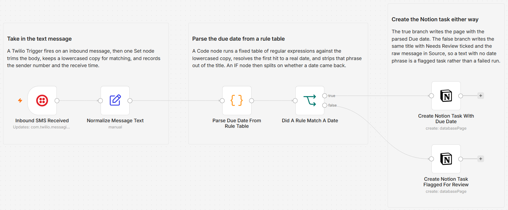

# Turn inbound SMS into Notion tasks with deterministic due-date parsing

Text a task to a Twilio number and it becomes a Notion page with a due date parsed straight out of the message. The parsing is a fixed rule table in a Code node, not a model, so the same wording always produces the same date and the rules are there to read instead of guess at. A message with no date phrase still becomes a page, with Needs Review ticked and the raw text stored, so nothing is dropped.

Built with n8n, plus Twilio and Notion.

## Use it when

- A task occurs to you nowhere near a laptop, and by the time you are back at one it is gone.
- You keep tasks in a Notion database and want a capture path that works from any phone that can send a text.
- You need `file taxes by friday` to resolve to the same date every time, with a rule you can point at when it surprises you.

## How it works

A Twilio Trigger fires when the number receives a message. A Set node pulls the body and the sender into predictable fields and makes a lowercased copy for matching. A Code node runs a short list of regular expressions against that copy, resolves the first match to a real date with Luxon in one declared timezone, and strips the matched phrase out of the title. An IF node splits on whether a date came back: one Notion node creates the page with Due filled in, the other creates it with Needs Review ticked and the raw message stored.

| Stage | What happens |
|---|---|
| Inbound SMS Received | Twilio Trigger fires on an inbound message and exposes `Body` and `From` |
| Normalize Message Text | Trims the body, makes a lowercased copy for matching, and captures the sender number and receive time |
| Parse Due Date From Rule Table | Runs the rule table against the lowercased copy, resolves the first match to an ISO date, and returns the title with the date phrase removed |
| Did A Rule Match A Date | Splits on whether `dueIso` came back non-empty |
| Create Notion Task With Due Date | Creates the page with the cleaned title and the parsed Due date |
| Create Notion Task Flagged For Review | Creates the page with the original text, ticks Needs Review, and leaves Due blank |

I keep the parser in a plain rule table because the mapping from text to date should be something you can read, test, and change in one place.

## Requirements

- A Twilio account with an SMS-capable number. A free trial is enough; see the trial section below.
- A Notion task database with a title property, a date property named `Due`, a checkbox named `Needs Review`, and a text property named `Source`.
- n8n (cloud or self-hosted) that Twilio can reach from the internet, with Twilio and Notion credentials.

## Setup

1. Import `workflow.json` into n8n. It imports inactive; configure before activating.
2. Add a Twilio credential (Account SID and Auth Token) and assign it to "Inbound SMS Received". Add a Notion credential and assign it to both Notion nodes.
3. In the Twilio console, open your phone number and point the "A message comes in" webhook at the trigger's production URL, method POST.
4. Open both Notion nodes and pick your task database. It needs the four properties listed under Requirements.
5. Open "Parse Due Date From Rule Table" and set `TIMEZONE` on the first line to the zone your due dates should be read in. It ships as `America/Halifax`.
6. Run it once with a test text, check the Notion page, then activate.

## The rule table

The parser tries these in order and stops at the first hit. Matching is case-insensitive because the Set node lowercases the text first.

| Phrase | Resolves to |
|---|---|
| `in N days` | Today plus N days, N up to 3 digits |
| `next <weekday>` | The soonest upcoming occurrence of that weekday after today |
| `by <weekday>` | The same as `next`, the soonest upcoming occurrence after today |
| `on <month> <day>` | That date this year, rolled to next year if it has already passed |
| `tomorrow` | Today plus one day |
| `today` | Today |

Weekdays accept short forms (`mon`, `tues`, `thurs`), and months accept short forms (`jan`, `sept`). The matched phrase is cut out of the title, so `call vendor tomorrow` becomes a task called `call vendor` due tomorrow. If nothing matches, `dueIso` comes back empty and the false branch handles it.

## Testing on a Twilio trial

You can exercise all of this on a trial without spending a single free message or burning a verified-number slot. The trial's restrictions are on what you send out, and this workflow sends nothing: inbound receiving is unrestricted. Point the number's inbound webhook at the trigger, then text it from your own phone with a bare task, `call vendor tomorrow`, `file taxes by friday`, and `ship it in 3 days`. Confirm each one lands in Notion with the date you expect, and that the bare task arrives with Needs Review ticked rather than failing the run.

## Customize

- Add rules to the `RULES` array in the Code node. They are tried top down, and each entry is a pattern plus a resolver returning a Luxon DateTime.
- Change `TIMEZONE` at the top of the same node to move every resolved date into another zone.
- Add a priority or project field by adding a `propertyValues` entry on the Notion nodes.
- Route unmatched messages elsewhere by pointing the false branch at Slack or email instead of the review page.

## What is in this folder

| File | What it is |
|---|---|
| `README.md` | This overview |
| `TEMPLATE-DESCRIPTION.md` | The n8n Creator hub listing text |
| `workflow.json` | The importable n8n workflow |
| `images/workflow.png` | The workflow on the n8n canvas |

---

All sample data is fictional. No real credentials, IDs, or endpoints are included.

Part of the [n8n-exekyute-templates](../../README.md) collection. MIT licensed.
