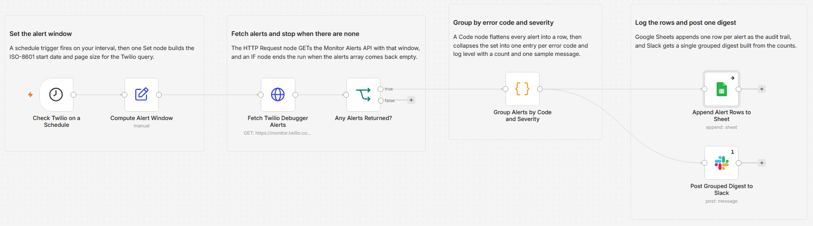

# Monitor Twilio debugger alerts and post a grouped Slack digest

Every Twilio workflow I had built used Twilio to send something. None of them told me when Twilio itself was unhappy. Failed webhooks and rejected sends land in the Twilio debugger, which nobody opens until a customer complains. This one polls the Monitor Alerts API on a schedule, collapses the alerts into groups, logs each one to a Sheet, and posts a single Slack digest per run.

Built with n8n, plus Twilio, Google Sheets, and Slack.

## How it works

A schedule fires, a Set node computes the ISO-8601 start of the lookback window, and an HTTP Request node calls the Twilio Monitor Alerts API with that window and a page size. An IF node checks whether anything came back. If the array is empty the run stops there, so a quiet hour produces no Slack message at all. If there are alerts, a Code node flattens each one into a row and collapses the set into groups keyed on error code plus log level, counting each group and keeping one sample message. From there the run splits: Google Sheets appends one row per alert as the audit trail, and Slack gets one digest built from the grouped counts.

| Stage | What happens |
|---|---|
| Check Twilio on a Schedule | Fires on the interval you set, hourly by default |
| Compute Alert Window | Builds the `StartDate` as now minus the lookback minutes, plus the page size |
| Fetch Twilio Debugger Alerts | GETs `monitor.twilio.com/v1/Alerts` using the built-in Twilio credential, filtered to the window |
| Any Alerts Returned? | Checks the `alerts` array and ends the run when it is empty |
| Group Alerts by Code and Severity | Flattens every alert to a row, then groups by error code and log level with counts and one sample message per group |
| Append Alert Rows to Sheet | Writes one row per alert so you keep the raw history |
| Post Grouped Digest to Slack | Posts a single message with the total, the severity split, and the top error codes |

Grouping is the whole point. One misconfigured webhook can raise the same error hundreds of times in an hour, and a per-alert notifier would bury the channel. Here that becomes one digest line with a count next to it.

## Setup

1. Import `workflow.json` into n8n. It imports inactive, so configure it before activating.
2. Add a Twilio credential (your Account SID, which starts with `AC`, and your Auth Token) and assign it to "Fetch Twilio Debugger Alerts". The HTTP Request node authenticates with n8n's built-in Twilio credential type, so there is no separate Basic Auth credential to build. Add a Google Sheets credential for "Append Alert Rows to Sheet" and a Slack credential for "Post Grouped Digest to Slack".
3. Pick the spreadsheet and tab on the Sheets node, and the channel on the Slack node. Give the tab this header row: `timestamp`, `error_code`, `log_level`, `resource_sid`, `request_url`, `alert_sid`.
4. Set the interval in "Check Twilio on a Schedule", then open "Compute Alert Window" and set `lookbackMinutes` and the matching number inside the `startDate` expression so the query window covers the gap between runs.
5. Run it once by hand, confirm the Sheet and the digest, then activate.

## Testing on a Twilio trial

You can exercise this end to end on a trial account with zero verified numbers and zero successful sends, because the Monitor Alerts API reads debugger events rather than sending anything.

| Step | What to do | What you should see |
|---|---|---|
| Generate alerts | Send an SMS to a number you have not verified | Twilio raises error `21608` and logs it to the debugger |
| Run the workflow | Execute it manually with a lookback that covers those attempts | The HTTP node returns your alerts in the `alerts` array |
| Check grouping | Open the Code node output | One group for `21608` at `error`, with a count matching your attempts |
| Check the Sheet | Look at the tab | One row per alert, not one row per group |
| Check Slack | Look at the channel | A single digest with the total, the severity split, and the top codes |
| Check the quiet path | Set the lookback to a few minutes and run again after a gap | The IF node ends the run and Slack stays silent |

Trial limits worth knowing: the trial lasts 30 days, sends only reach verified numbers, and custom SMS bodies are blocked. None of that matters here, because the failures the trial produces are exactly the input this workflow is built to read.

## What is in this folder

| File | What it is |
|---|---|
| `README.md` | This overview |
| `TEMPLATE-DESCRIPTION.md` | The n8n Creator hub listing text |
| `workflow.json` | The importable n8n workflow |
| `images/workflow.png` | The workflow on the n8n canvas |

---

All sample data is fictional. No real credentials, IDs, or endpoints are included.

Part of the [n8n-exekyute-templates](../../README.md) collection. MIT licensed.
