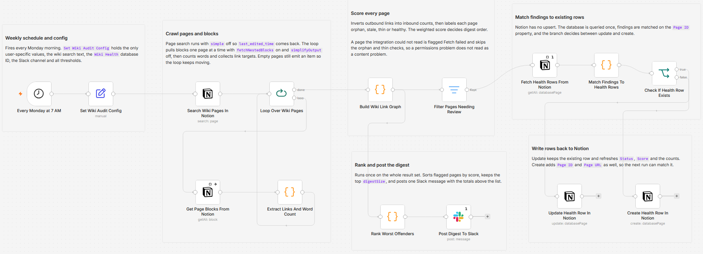

# Audit Notion wiki health for orphan, stale and thin pages using Notion and Slack

Sweep a Notion wiki once a week, build the internal link graph from the page content itself, and flag every page nobody links to, nobody has edited, or nobody has written. Findings are written back to a Notion database and a ranked digest goes to Slack. No model is involved anywhere: orphan, stale and thin are thresholds you set, so the same wiki produces the same answer every run.

Built with n8n, plus Notion and Slack.

## Use it when

- Your wiki has quietly doubled and nobody knows which pages still matter. Search returns six answers to the same question and three of them are two years old.
- A page exists but nothing links to it, so the only way anyone finds it is by already knowing it is there.
- You are about to do a cleanup sprint and want the list ranked by something defensible rather than by whoever complains loudest.

## How it works

A weekly schedule fires and one Set node supplies the search text, the target database, the Slack channel and every threshold. Notion page search runs with `simple` off so `last_edited_time` survives, then the workflow loops one page at a time and pulls its blocks recursively with `simplifyOutput` off, which keeps the page ids inside mentions intact. One Code node counts words and collects outbound links; a second inverts those edges into inbound counts and labels each page. Flagged pages are matched against existing rows and written back as an update or a create, and the ranked digest posts to Slack.

| Stage | What happens |
|---|---|
| Every Monday at 7 AM | Fires weekly |
| Set Wiki Audit Config | Search text, `Wiki Health` database id, Slack channel and every threshold and weight |
| Search Wiki Pages In Notion | Returns every page the integration can read, with `simple` off |
| Loop Over Wiki Pages | Hands the crawl one page at a time |
| Get Page Blocks From Notion | Pulls all blocks recursively with `simplifyOutput` off |
| Extract Links And Word Count | Counts words and collects outbound links from mentions, link-to-page blocks, child pages and pasted URLs |
| Build Wiki Link Graph | Inverts outbound edges into inbound counts, labels each page, and adds a weighted score |
| Filter Pages Needing Review | Keeps only the pages that tripped a rule |
| Fetch Health Rows From Notion, Match Findings To Health Rows, Check If Health Row Exists | Queries the database once and decides update or create per finding |
| Update Health Row In Notion, Create Health Row In Notion | Writes the finding back |
| Rank Worst Offenders, Post Digest To Slack | Sorts by score, keeps the top `digestSize`, posts one message |

A page the integration cannot read is labelled `Fetch failed` and skips the orphan and thin checks entirely. I kept that separate from the other labels because a permissions gap and an abandoned page look identical once you have collapsed them into one number, and only one of them is a content problem.

## Requirements

- A Notion workspace with an internal integration, shared with the wiki root page.
- A Notion database for the findings, described below.
- A Slack workspace with `chat:write` and the bot invited to the digest channel.
- n8n (cloud or self-hosted) with Notion and Slack credentials.

## Setup

1. Import `workflow.json` into n8n. It imports inactive; configure before activating.
2. Connect a Notion internal integration credential and share only the wiki root page with it, so page search returns the wiki and nothing else.
3. Connect a Slack credential and invite the bot to the digest channel.
4. Create the `Wiki Health` database with the properties listed below.
5. Fill `Set Wiki Audit Config`: the wiki search text, the `Wiki Health` database id and the Slack channel id.
6. Run it once by hand and read the digest before you activate the schedule.

## The Wiki Health database

The findings database is also the memory: matching happens on `Page ID`, so an existing row is refreshed rather than duplicated on the next run.

| Property | Type |
|---|---|
| `Page` | Title |
| `Page ID`, `Status` | Rich text |
| `Score`, `Word Count`, `Inbound Links`, `Broken Links` | Number |
| `Page URL` | URL |
| `Last Audited` | Date |

## Two settings that silently break this

Both are simplification toggles, both default the wrong way for this workflow, and neither fails loudly.

- `Get Page Blocks From Notion` must keep `simplifyOutput` off. Simplified output flattens rich text into a plain string and drops the mention page ids, so the link graph comes back empty and every page reads as an orphan.
- `Search Wiki Pages In Notion` must keep `simple` off. Simplified output returns only id, name and url, with no `last_edited_time`, so nothing is ever stale.

## Customize

- **Thresholds.** `staleAfterDays`, `thinWordCount` and `digestSize` decide what counts as a problem and how much of it reaches Slack.
- **Ranking.** `orphanWeight`, `staleWeight`, `thinWeight` and `brokenLinkWeight` set the digest order. Raise `orphanWeight` if unlinked pages are what your team cares about most.
- **Scope.** Leave the search text blank to audit every page the integration can read, or narrow it to match one section's titles.
- **Size.** The Notion API allows roughly three requests per second, so a wiki of 200 to 400 pages finishes comfortably. Point the integration at a narrower root above that.

## What is in this folder

| File | What it is |
|---|---|
| `README.md` | This overview |
| `TEMPLATE-DESCRIPTION.md` | The n8n Creator hub listing text |
| `workflow.json` | The importable n8n workflow |
| `images/workflow.png` | The workflow on the n8n canvas |

---

All sample data is fictional. No real credentials, IDs, or endpoints are included.

Part of the [n8n-exekyute-templates](../../README.md) collection. MIT licensed.
