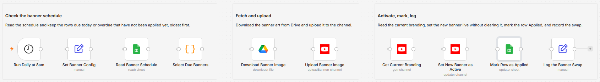

# Rotate YouTube channel banners on a schedule using Google Sheets and Drive

Built with n8n, the native YouTube node, Google Sheets, and Google Drive. A date-driven workflow that rotates your YouTube channel banner from a spreadsheet schedule, catching up on any day it missed and leaving the rest of your channel branding untouched.

## What it does

The workflow runs every morning and reads a Google Sheets schedule of planned banner swaps. A Code node keeps the rows that are due today or overdue and not yet applied, oldest first, so a missed run catches up on the next one and the newest due banner ends up live. For each due row it downloads the banner art from Google Drive, uploads it with the YouTube Channel: uploadBanner operation, reads the channel's current branding, then runs Channel: update to set the new banner active while re-sending your existing description, keywords, country, and trailer. It marks the sheet row Applied and records what changed.

Everything is deterministic and date-driven. There are no AI nodes.

## What is in this folder

| File | What it is |
| --- | --- |
| `workflow.json` | The n8n workflow, ready to import. Credentials are not included. |
| `TEMPLATE-DESCRIPTION.md` | The listing description for the template page. |
| `README.md` | This file. |
| `images/workflow.png` | Canvas screenshot. |

## Schedule sheet

The Google Sheet holds one row per planned swap, plus a Status column the workflow maintains:

| Column | Example | Notes |
| --- | --- | --- |
| `Swap Date` | `2026-07-15` | The date the banner should go live. Plain `yyyy-MM-dd` text or a real date cell both work. |
| `Banner Drive File ID` | `1AbCdEfGhIjKlMnOp` | The Google Drive file ID of the banner image. |
| `Label` | `Summer banner` | Optional. Recorded with the swap for reference. |
| `Status` | | Leave empty. The workflow writes `Applied` once a row's banner is live so it never repeats. |

## Setup and credentials

1. Import `workflow.json` into n8n.
2. Connect a YouTube (Google) OAuth2 credential on the three YouTube nodes.
3. Connect your Google Sheets and Google Drive credentials.
4. In `Set Banner Config`, set `channelId` to your YouTube channel ID.
5. Point both Google Sheets nodes at your schedule spreadsheet and tab.
6. Prepare banner art at 2048x1152 px and under 6 MB, upload it to Drive, and add the file ID to the sheet.
7. The workflow ships inactive. Activate it once the credentials and schedule are in place.

## Notes

- The due check is date-based and catches up: if the workflow does not run on a banner's date, the next run still applies it, and when several are overdue the newest wins.
- Activating a banner re-sends your existing channel description, keywords, country, and trailer, because the YouTube API clears any branding field the update leaves out.

## License

MIT (c) Kevin Yu ([github.com/exekyute](https://github.com/exekyute)). See [../../LICENSE](../../LICENSE).
