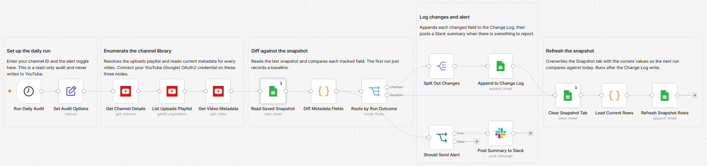

# Audit YouTube video metadata changes against a saved snapshot

Built with n8n, the native YouTube node, Google Sheets, and Slack. A daily, read-only watchdog that records every change to your video metadata and alerts you when something moves.

## What it does

Once a day the workflow reads your YouTube channel, lists every upload, and pulls each video's current title, description, tags, privacy status, and category. It compares those values against a snapshot saved on the previous run, writes any differences to a change log, refreshes the snapshot, and posts a summary to Slack. It never writes to YouTube.

- Enumerates the whole library from the channel's uploads playlist, so new and removed videos are caught too.
- Diffs five fields per video and records each change as an old value to new value pair with a timestamp.
- Writes the change log first, then overwrites the snapshot, so a mid-run failure never moves the baseline forward silently.
- Stays quiet on Slack when nothing changed, unless you flip `alwaysNotify` on.

## What is in this folder

| File | Purpose |
| --- | --- |
| `workflow.json` | The n8n workflow, ready to import. Credentials and IDs are placeholders. |
| `TEMPLATE-DESCRIPTION.md` | The listing description for the template page. |
| `images/workflow.png` | Canvas screenshot (add after import). |

## Setup and credentials

1. Import `workflow.json` into n8n.
2. Connect a YouTube (Google) OAuth2 credential on the three YouTube nodes.
3. Enter your channel ID in the `Set Audit Options` node.
4. Connect a Google Sheets credential and select your spreadsheet in all four Google Sheets nodes.
5. Add a tab named `Snapshot` and a tab named `Change Log` to that spreadsheet.
6. Connect a Slack credential and pick the alert channel in `Post Summary to Slack`.
7. Run once to record the baseline, then activate the schedule.

Header rows the workflow expects:

- `Snapshot`: `videoId`, `title`, `description`, `tags`, `privacyStatus`, `categoryId`
- `Change Log`: `checkedAt`, `videoId`, `videoTitle`, `field`, `oldValue`, `newValue`

## Customization

- Change the schedule interval on the trigger.
- Add or remove tracked fields in the `Diff Metadata Fields` node.
- Set `alwaysNotify` to true to post to Slack even on a no-change run.

## License

MIT (c) Kevin Yu (github.com/exekyute). See [../../LICENSE](../../LICENSE).
