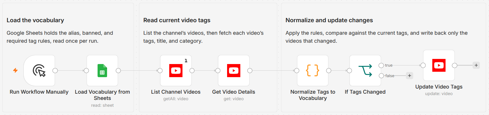

# Normalize YouTube video tags to a controlled vocabulary

Built with n8n, the native YouTube node, and Google Sheets. Deterministic, no AI.

## What it does

Keeps a channel's video tags consistent against a controlled vocabulary you maintain in Google Sheets. The vocabulary has three kinds of rows: alias rules that map a variant to its canonical tag (for example `js` to `javascript`), banned tags to strip, and required baseline tags that every video should carry.

For each video the workflow reads the current tags, then applies the rules in order: lowercase and trim, map aliases to canonical, drop banned tags, remove duplicates, add any missing required tags, and truncate to YouTube's tag-character budget. It compares the result to the current tags as an order-insensitive set and updates only the videos that actually changed. Existing title and category are sent back unchanged, which the YouTube update endpoint requires. Because unchanged videos are skipped, the workflow is idempotent and safe to re-run.

## What is in this folder

| File | Purpose |
| --- | --- |
| `workflow.json` | The n8n workflow, ready to import. Credentials are not included. |
| `README.md` | This file. |
| `TEMPLATE-DESCRIPTION.md` | The listing description for the n8n template page. |
| `images/workflow.png` | Canvas screenshot (add after import). |

## Setup and credentials

1. Import `workflow.json` into n8n.
2. Connect a YouTube (Google) OAuth2 credential on the three YouTube nodes (`List Channel Videos`, `Get Video Details`, `Update Video Tags`). The template ships without one.
3. Connect a Google Sheets credential on `Load Vocabulary from Sheets` and pick the spreadsheet and tab that hold your vocabulary.
4. In `List Channel Videos`, replace `YOUR_CHANNEL_ID` with your channel ID.
5. Build the vocabulary sheet with these columns:

| rule_type | tag | canonical |
| --- | --- | --- |
| alias | js | javascript |
| alias | ai | artificial intelligence |
| banned | clickbait | |
| required | tutorial | |

Run the workflow manually. To run on a cadence, swap the manual trigger for a Schedule Trigger.

## Notes

- The workflow uses no AI nodes. The vocabulary is hand-maintained and the transform is pure set operations.
- Tag comparison is order-insensitive, so re-ordering alone never triggers a write.
- Multi-word tags are supported. A tag cannot contain a comma, since tags are sent to YouTube as a comma-separated list.

---

License: MIT (c) Kevin Yu (github.com/exekyute). See [../../LICENSE](../../LICENSE).
