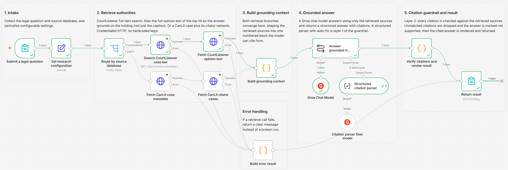
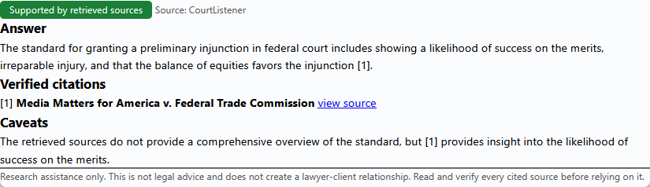

# Answer legal questions with grounded citations from CanLII and CourtListener

Ask a legal question and get an answer built only from authorities pulled live from a real legal database, with a verified citation behind every point. If the retrieved sources do not support an answer, the workflow says so instead of inventing case law.

Built with n8n, plus CourtListener, CanLII, and Groq.

## How it works

Submit a question through a form and pick a source. CourtListener runs a full-text search across US case law, then pulls the full opinion text of the top hit so the answer grounds on the holding, not just the case caption. CanLII pulls a specific Canadian authority plus the cases in its citator network. Both paths converge into one numbered source block, the model answers from that block only, and a code step checks every citation before anything reaches the reader.

| Stage | What happens |
|---|---|
| Submit a question | A form collects the legal question and the source database |
| Retrieve authorities | CourtListener full-text search plus the top opinion's full text, or a CanLII case plus its citator network |
| Build grounding context | Both branches converge into one numbered block, with the opinion text windowed to the passage that matches the question |
| Grounded answer | A Groq chat model answers using only those sources and returns a structured answer, a supported flag, and a citation list |
| Citation guardrail | Every citation is checked against the retrieved set, unmatched ones are dropped, and the answer is marked not supported when none survive |
| Return result | The answer, a supported or not-supported badge, the verified citations, and a disclaimer are shown |

Each displayed citation is rebuilt from the retrieved source record, not from the model output, so a citation the model invents never reaches the reader.

*Asking "What is the standard for granting a preliminary injunction in federal court?" in CourtListener mode returns a grounded answer with a verified citation.*

## Setup

1. Import `workflow.json` into n8n. It imports inactive, so configure it before activating.
2. Add your CourtListener token as an HTTP Header Auth credential (`Authorization` = `Token YOUR_TOKEN`) and select it on both CourtListener nodes: "Search CourtListener case law" and "Fetch CourtListener opinion text".
3. For CanLII mode, add your CanLII API key as an HTTP Query Auth credential (`api_key` = `YOUR_KEY`) and select it on both CanLII nodes.
4. Add a Groq credential and select it on the two model nodes.
5. Open "Set research configuration" to set result count, language, and citator direction.
6. Open the form trigger to copy the form URL, then submit a question. For example: "What is the standard for granting a preliminary injunction in federal court?"

## Configuration

Set these in the "Set research configuration" node:

| Field | What it controls |
|---|---|
| `resultCount` | How many retrieved sources are sent to the model |
| `canliiLanguage` | `en` or `fr` for the CanLII case lookup |
| `citatorDirection` | `citingCases` or `citedCases` for CanLII mode |
| `maxSnippetChars` | Fallback excerpt length for results without full text |
| `disclaimer` | The disclaimer line shown on every result |

## How the citation guardrail works

The anti-hallucination behaviour runs in two layers:

1. **Prompt grounding.** The model is told to answer only from the numbered sources, cite each point by source number, never output a citation absent from the source list, and set `supported: false` when the sources are insufficient. A structured output parser with auto-fix holds the response to a fixed shape.
2. **Deterministic verification.** The "Verify citations and render result" code node checks every citation the model returns against the sources that were actually retrieved. Each displayed citation is rebuilt from the source record rather than the model output, so a citation the model invents is dropped. When none survive, the answer is replaced with an explicit "not supported" message and no case law is asserted.

A hallucinated citation cannot reach the reader even if the model produces one.

## Customize

- Swap the Groq model node for any supported chat provider.
- Adjust `resultCount` to widen or narrow the sources sent to the model.
- Change `citatorDirection` between `citingCases` and `citedCases` for CanLII mode.
- Add a Slack or email step after "Verify citations and render result" to route the answer somewhere.

## Requirements

- A CourtListener API token, from your CourtListener profile.
- A CanLII API key, requested through the CanLII feedback form, for CanLII mode.
- A Groq credential. The model node can be swapped for another provider.

## Disclaimer

This workflow provides research assistance only. It is not legal advice and does not create a lawyer-client relationship. Always read and verify every cited source before relying on it.

## What is in this folder

| File | What it is |
|---|---|
| `README.md` | This overview |
| `TEMPLATE-DESCRIPTION.md` | The n8n Creator hub listing text |
| `workflow.json` | The importable n8n workflow |
| `images/workflow.png` | The workflow on the n8n canvas |
| `images/result.png` | An example answer with a verified citation |

---

All sample data is fictional. No real credentials, IDs, or endpoints are included.

Part of the [n8n-exekyute-templates](../../) collection. MIT licensed.
