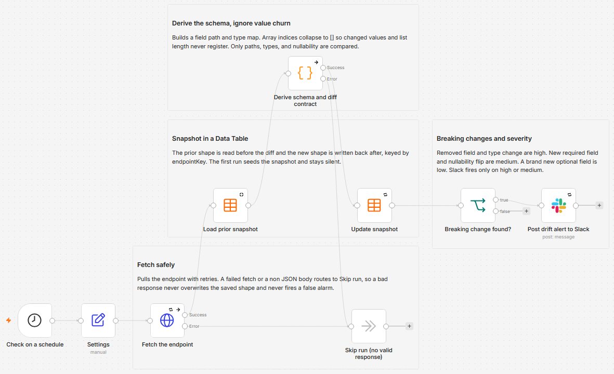

# Alert Slack when an API response changes structure

Polls a JSON or OpenAPI endpoint on a schedule, works out the shape of its response (every field path and its type), stores that shape in a Data Table, and posts a Slack alert only when the contract breaks. Ordinary value churn, a number that changed or an extra item in a list, is ignored. Only structural and type changes raise an alert.

Built with n8n, plus an HTTP endpoint and Slack.



## How it works

A schedule fires on an interval. The endpoint is fetched, a Code node derives the response schema and diffs it against the snapshot stored in a Data Table, and Slack is posted only when a breaking change is found. The snapshot is then refreshed, so the same change is never reported twice.

| Stage | What happens |
|---|---|
| Check on a schedule | A Schedule Trigger runs on the interval you set (every 6 hours by default) |
| Settings | One Edit Fields node holds the endpoint URL, a label for it, and the Slack channel |
| Fetch the endpoint | An HTTP Request pulls the endpoint, retries a transient failure, then skips the run on a hard failure |
| Load prior snapshot | A Data Table read pulls the last saved shape for this endpoint |
| Derive schema and diff contract | A Code node builds the new shape and classifies every breaking change by severity |
| Update snapshot | The Data Table row is upserted with the new shape |
| Breaking change found? | An IF gate lets only high or medium changes through |
| Post drift alert to Slack | One Slack message lists each change, its severity, and the exact field path |

The snapshot lives in a Data Table keyed by endpoint label, so the watcher compares each poll against the last good shape and reports a change once. A failed or non JSON fetch routes to a Skip node, so a bad response never overwrites the saved shape and never fires a false alarm.

Point it at a JSON data endpoint to watch the response shape, or at an OpenAPI JSON document to watch the spec's structure. Either way the tool reads the JSON it gets back and tracks its shape.

## What counts as a breaking change

The diff compares field paths, types, and nullability, never values. Array indices collapse to `[]`, so a changed number or an extra list item never registers. Each change is tagged by severity:

| Severity | Change | Example |
|---|---|---|
| High | Removed field | `data.user.email` disappears |
| High | Type change | `id` goes from number to string |
| Medium | New required field | a field that is now present in every record |
| Medium | Nullability flip | a field that was always set now returns null |
| Low | New optional field | a field that appears in only some records |

Slack fires only on high or medium. A new optional field is recorded in the snapshot but stays quiet, since adding a field rarely breaks a consumer. Required here means the field is present in every instance of its container: in every element of a list, or on a single object.

## Setup

1. Import the workflow JSON into n8n. It imports inactive, so configure it before activating.
2. Create a Data Table named `API Contract Snapshots` with two text columns: `endpointKey` and `schema_object`. Then select it in the Load prior snapshot and Update snapshot nodes.
3. Open Settings and set `endpointUrl` (the endpoint to watch), `endpointKey` (a stable label, used as the snapshot key), and `slackChannel` (the channel ID to post to).
4. Assign a Slack credential to the Post drift alert to Slack node.
5. Run the workflow once to seed the snapshot. The first run records the shape and stays silent.
6. Activate it.

The default points at `https://jsonplaceholder.typicode.com/users`, a free no-key JSON endpoint, so you can seed the snapshot and watch it work before pointing it at your own API.

## Watching a private API

The reference design polls a public, no-key endpoint. For a private API, open Fetch the endpoint, set Authentication to the type your API uses (Header Auth or Bearer, for example), and add your token as an n8n credential. Keep the token in the credential, never in a node field.

## Testing it

```
cd "C:\Users\jebo\Documents\Claude Code Projects\n8n-exekyute-templates\pending-submission\n8n-api-contract-drift-watcher"
```

1. Seed. With the default endpoint, run the workflow once. The Data Table now holds one row for `jsonplaceholder-users`, and no alert fires.
2. Quiet re-run. Run it again. The shape is identical, so no alert fires. This is value-churn suppression at work: the values differ but the shape does not.
3. Force a break. Open the Data Table row and edit `schema_object`, for example delete the `"email"` entry or change a field's `"type"`. Run again. Slack posts a high severity alert naming the changed path, and the snapshot is refreshed so the next run is quiet again.

## Customize

- Change the cron interval in Check on a schedule.
- Watch several endpoints by giving each its own `endpointKey` and running a copy per endpoint, all sharing one Data Table.
- Lower the alert bar to include low severity by editing the Breaking change found? gate.
- Optional paid upgrade: add a small model step (gpt-4o-mini or Claude Haiku, with Groq free as the primary) to turn the change list into a plain-English note on what might break. The base workflow does not use it and ships fully free.
- For a production-critical contract, send the alert to an on-call destination (Opsgenie, PagerDuty, or Twilio SMS) alongside Slack.

## Error handling

The endpoint fetch retries a few times on a transient error, then routes a hard failure to the Skip node instead of halting. A 200 response that is not JSON (an HTML login page, for example) is treated the same way. In both cases the saved shape is left untouched, so a bad fetch never overwrites a good snapshot or raises a false alarm. For unattended runs, set an n8n error workflow so a persistent outage still reaches you.

## Requirements

- n8n, a recent version that includes Data Tables.
- A Slack credential (OAuth2, or a bot token with `chat:write`).
- No paid services and no AI are required.

## What is in this folder

| File | What it is |
|---|---|
| `README.md` | This overview |
| `TEMPLATE-DESCRIPTION.md` | The n8n Creator hub listing text |
| `workflow.json` | The importable n8n workflow |

---

All sample data is fictional. No real credentials, IDs, or endpoints are included.

Part of the [n8n-exekyute-templates](../../) collection. MIT licensed.
