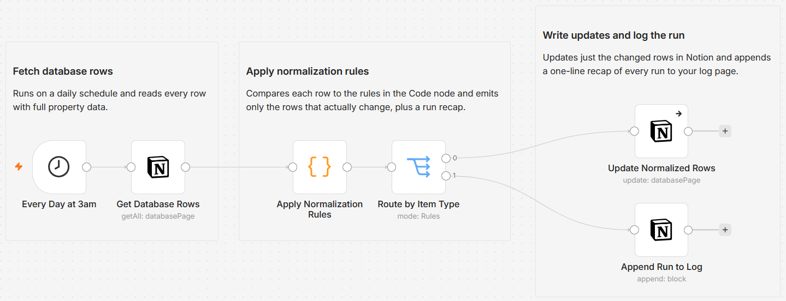

# Normalize and backfill Notion database properties from an editable rules table

Point this workflow at one Notion database and it keeps the properties tidy on a schedule: it fills a missing Status with a default, folds inconsistent Status spellings into one canonical value, derives a slug key and a created-week stamp from each row, and stamps a "Last normalized" time. No AI, fully rule based, so the same row always resolves the same way, and only rows that actually change are written.

Built with n8n and Notion.



## How it works

A Schedule trigger runs the workflow each day. A Notion node reads every row from the target database with full property data. A Code node applies an editable rules block to each row: it backfills an empty Status with a default, canonicalizes known Status variants (for example `wip`, `in progress`, and `In Progress` all resolve to `In Progress`), and computes a title slug and an ISO year-week stamp. It compares each result to what is already stored and marks a row changed only when something differs. A Switch sends changed rows to the update step and a run recap to the log. Each changed row is updated in place and stamped with a normalized time, while already-clean rows are skipped entirely.

| Stage | What happens |
|---|---|
| Read rows | A Notion node pulls every row from the target database with full property data |
| Apply rules | A Code node backfills, canonicalizes, and derives fields, then flags only the rows that change |
| Route | A Switch sends changed rows to the update step and the run recap to the log |
| Update | Each changed row is updated in place, and stamped with a Last normalized time |
| Log the run | A one-line recap is appended to your log page, on every run |

## The properties this workflow manages

The database needs these properties. Rename them in the Code node's CONFIG block and in the Update node's mappings if yours are named differently.

| Property | Type | What the workflow does with it |
|---|---|---|
| `Name` | Title | Read only. The source for the derived key. |
| `Status` | Select | Backfilled when empty, canonicalized when it matches a known variant, left alone when it is an unknown value. |
| `Key` | Rich text | Set to a slug of the title, for example `Acme Corp` becomes `acme-corp`. |
| `Created week` | Rich text | Set to an ISO year-week stamp from the row's created time, for example `2026-W25`. |
| `Last normalized` | Date | Stamped with the run time whenever the workflow changes a row. |

## Setup

1. Import `workflow.json` into n8n. It imports inactive, so configure it before activating.
2. Assign a Notion credential to the three Notion steps (Get Database Rows, Update Normalized Rows, Append Run to Log). Share the target database and the log page with the integration.
3. In "Get Database Rows", select the database to normalize.
4. Open "Apply Normalization Rules" and edit the CONFIG block: the property names, `DEFAULT_STATUS`, and the `CANONICAL_STATUS` map.
5. In "Update Normalized Rows", confirm the four mapped properties match your database.
6. In "Append Run to Log", paste the URL of the page that should receive the recap.
7. Run it once on a copy or a test database, then activate.

## The rules block

The rules live in a clearly marked block at the top of the "Apply Normalization Rules" node:

```js
const TITLE_PROP         = 'Name';            // title property; the source for the derived Key
const STATUS_PROP        = 'Status';          // a select property to canonicalize and backfill
const KEY_PROP           = 'Key';             // rich_text: a slug derived from the title
const WEEK_PROP          = 'Created week';    // rich_text: an ISO year-week stamp from created time
const NORMALIZED_AT_PROP = 'Last normalized'; // date: stamped on any row this run changes

const DEFAULT_STATUS = 'To Do';               // written to Status when it is empty

const CANONICAL_STATUS = {                    // messy spelling -> canonical value
  'to do': 'To Do', 'todo': 'To Do', 'not started': 'To Do', 'backlog': 'To Do',
  'in progress': 'In Progress', 'wip': 'In Progress', 'doing': 'In Progress',
  'done': 'Done', 'complete': 'Done', 'completed': 'Done', 'closed': 'Done',
};

const COMPUTE_KEY  = true;  // maintain KEY_PROP as a slug of the title
const COMPUTE_WEEK = true;  // maintain WEEK_PROP as the created-week stamp
```

Keys in `CANONICAL_STATUS` are matched with case and surrounding spaces ignored, so `  IN PROGRESS ` still resolves. Each canonical value also folds onto itself, so a value that is already correct is recognized and left as is. A present Status that matches no key is treated as intentional and never overwritten, and only an empty Status is backfilled to `DEFAULT_STATUS`.

## Why only changed rows are written

Every derived value is compared to what Notion already holds. A row is updated only when its Status, Key, or Created week would actually change, so a database that is already clean produces no writes at all. The "Last normalized" stamp is applied as a side effect of a real change, never on its own, so it does not make every row look dirty on the next run. This makes the workflow safe to run on a schedule.

## What gets logged

Every run appends one line to the log page, for example:

```
Normalize run 2026-07-01 03:00: scanned 240 rows, normalized 6 (2 status filled, 3 status canonicalized, 4 keys, 3 weeks), 234 already clean.
```

Clean runs are logged too, so the page holds a full history.

## Customize

- Add spellings to `CANONICAL_STATUS`, or point it at a different select property.
- Change `DEFAULT_STATUS` to whatever an empty row should become.
- Set `COMPUTE_KEY` or `COMPUTE_WEEK` to `false` to leave that derived field untouched.
- Adjust the schedule on the "Every Day at 3am" trigger.

## Requirements

- n8n.
- A Notion internal integration credential with access to the target database and the log page. No paid services and no AI are required.

## What is in this folder

| File | What it is |
|---|---|
| `README.md` | This overview |
| `TEMPLATE-DESCRIPTION.md` | The n8n Creator hub listing text |
| `workflow.json` | The importable n8n workflow |
| `images/workflow.png` | Canvas screenshot |

---

All sample data is fictional. No real credentials, IDs, or endpoints are included.

Part of the [n8n-exekyute-templates](../../) collection. MIT licensed.
