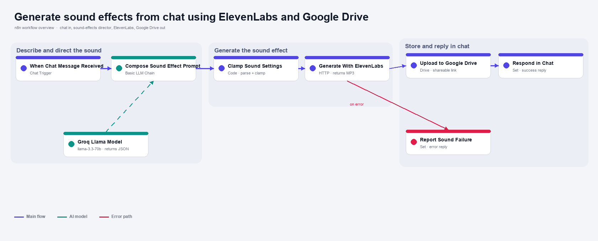

# Generate sound effects from chat using ElevenLabs and Google Drive

Describe a sound in a chat message and get back a ready to use audio clip. I built this so making a quick sound effect is as easy as typing "a heavy wooden door creaking open" and waiting a second for the link.

Built with n8n, plus Groq, ElevenLabs, and Google Drive.

## How it works

You send one message. A Groq model acts as a sound-effects director and rewrites your words into a literal, detailed prompt for the ElevenLabs sound-generation API, then the workflow generates the clip, stores it, and sends the link back.

| Stage | What happens |
|---|---|
| Chat trigger | You type a plain description of a sound. |
| Sound director | A Groq model (Basic LLM Chain) rewrites it into a literal ElevenLabs prompt and returns a small JSON object with the prompt, a duration, and a prompt influence. |
| Parse and clamp | A Code node parses that JSON, clamps duration to 0.5 to 30 seconds and prompt influence to 0 to 1, and falls back to your raw words if the reply is unclear. |
| Generate | An HTTP request calls the ElevenLabs sound-generation endpoint and gets back an MP3. It retries three times and has an error path. |
| Store and reply | The MP3 is uploaded to Google Drive, and the chat gets the link, the exact prompt, and the duration. On failure it sends a friendly message instead. |

The director step is the point. ElevenLabs gives better sound effects when the prompt is literal and descriptive, so I let the model do that rewrite instead of sending your casual words straight through.

## Setup

1. Import `workflow.json` into n8n. It imports inactive, so configure it before using it.
2. Create a Header Auth credential named `ElevenLabs` with header name `xi-api-key` and your ElevenLabs API key. Select it on "Generate Sound With ElevenLabs".
3. Select your Groq credential on "Groq Llama Model". The model is `llama-3.3-70b-versatile`.
4. Connect your Google Drive account on "Upload to Google Drive" and set the parent folder that should hold the clips.
5. Open the chat with the chat button on the canvas, and describe a sound.

## The sound director

The whole idea is turning casual words into a good ElevenLabs prompt. The director prompt lives in "Compose Sound Effect Prompt" and returns three fields:

| Field | What it controls |
|---|---|
| `sfx_prompt` | The literal, detailed sound description sent to ElevenLabs. |
| `duration_seconds` | Clip length, 0.5 to 30. Short impacts stay short, ambiences run longer. |
| `prompt_influence` | 0 to 1. Around 0.3 for natural sounds, higher for precise or mechanical ones. |

The model is asked to return only JSON. The Code node parses it, and if the reply is ever malformed or empty it falls back to your own words, so a bad value never reaches the API and every message still makes a sound. To change the style, edit the guidance in that node's prompt.

One sound is generated per message. ElevenLabs bills sound generation from your ElevenLabs plan (around 40 credits per second of audio), so the clamped duration is also the cost control.

## What is in this folder

| File | What it is |
|---|---|
| `README.md` | This overview |
| `TEMPLATE-DESCRIPTION.md` | The n8n Creator hub listing text |
| `workflow.json` | The importable n8n workflow |
| `images/` | The workflow overview image |

---

All sample data is fictional. No real credentials, IDs, or endpoints are included.

Part of the [n8n-exekyute-templates](../../) collection. MIT licensed.
