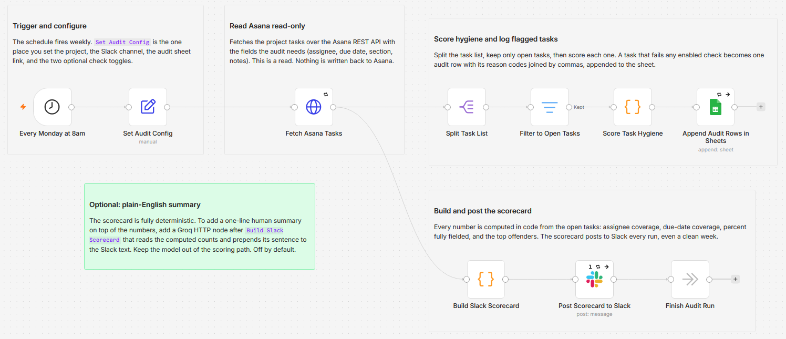

# Audit Asana task hygiene and log a weekly scorecard to Google Sheets and Slack

[Published n8n template](https://n8n.io/workflows/17268-audit-asana-task-hygiene-with-google-sheets-and-slack-scorecards/)

Scan one Asana project every week for open tasks that are missing an assignee or a due date, log each flagged task to a Google Sheet with its reason codes, and post a completeness scorecard to Slack. The audit is read-only against Asana: it pulls tasks over the REST API and never writes anything back. Every number in the scorecard is computed in plain code, so the result is deterministic.

Built with n8n, plus Asana, Google Sheets, and Slack.

## Use it when

- Tasks pile up on a board with no owner and no date, and nobody notices until a standup. This gives you one number each Monday and the exact list behind it.
- You want an audit trail, not just an alert. The sheet keeps one row per flagged task with its reason codes, so week over week you can see whether coverage is improving.
- You need a check that cannot break anything. The workflow only reads from Asana, so running it against a live project carries no risk to the tasks.

## How it works

The schedule fires weekly, the project's tasks are pulled read-only from the Asana API, and each open task is checked against a few completeness rules. A task that fails any check becomes one row in the audit sheet. The run always posts a scorecard, even on a clean week.

| Stage | What happens |
|---|---|
| Every Monday at 8am | A schedule trigger starts the run. Change the day and time on the node. |
| Set Audit Config | One Set node holds the project GID, the Slack channel, the audit sheet link, and two optional check toggles. |
| Fetch Asana Tasks | An HTTP request pulls the project's tasks with the fields the audit needs. This is a read. |
| Split Task List | The response is split into one item per task. |
| Filter to Open Tasks | The list narrows to open tasks so the audit covers live work. |
| Score Task Hygiene | Each open task is scored. A failing task becomes one audit row with its reason codes joined by commas. |
| Append Audit Rows in Sheets | Every flagged task is appended to the audit sheet, one row per task. |
| Build Slack Scorecard | A Code node counts the failures and computes the percent fully fielded and the top five offenders. |
| Post Scorecard to Slack | The scorecard posts to your channel with a link to the sheet. |
| Finish Audit Run | A No Op node closes the run, so the Slack branch has a clean end point. |

I feed the scorecard from the Asana fetch directly rather than from the flagged rows, so it posts every week, including the weeks when nothing is wrong.

## Requirements

- An Asana account with a Personal Access Token and the GID of the project to audit. Asana is reached over an HTTP Request node, not a dedicated Asana node.
- A Google account with a spreadsheet the workflow can append to.
- A Slack workspace with a channel for the scorecard.
- n8n (cloud or self-hosted) with Asana, Google Sheets, and Slack credentials.

## Setup

1. Import `workflow.json` into n8n. It imports inactive; configure before activating.
2. Add an Asana credential (a Personal Access Token) and select it on `Fetch Asana Tasks`, an HTTP Request node set to the predefined Asana credential type.
3. Open `Set Audit Config` and set `projectGid` (the number in your project URL), `slackChannel`, and `auditSheetUrl` (the sheet link shown in the Slack message).
4. Connect a Google Sheets credential and pick the spreadsheet and tab on `Append Audit Rows in Sheets`, then connect a Slack credential on `Post Scorecard to Slack`. The channel itself comes from the config node, not from the Slack node.
5. Add the header row from the audit sheet section below, run once by hand, then activate.

## The config node

Everything you tune lives in one Set node, `Set Audit Config`. Assignee and due date are always checked; section and description are opt in, so you decide how strict the audit is.

| Field | What it controls |
|---|---|
| `projectGid` | The Asana project to audit. It is the number in the project URL. |
| `slackChannel` | The Slack channel ID the scorecard posts to. |
| `auditSheetUrl` | The link to the audit sheet, shown at the bottom of the Slack scorecard. |
| `checkSection` | Off by default. Turn on to also flag tasks that sit in no section. |
| `checkDescription` | Off by default. Turn on to also flag tasks with an empty description. |

## The audit sheet

One row is appended per flagged task. Add these headers to row 1 of your audit tab: `audit_date`, `task_gid`, `task_name`, `assignee`, `section`, `due_on`, `reason_codes`, `permalink_url`.

`reason_codes` is a comma-joined list from this set: `no_assignee`, `no_due_date`, `no_section`, `empty_description`. The sheet is the audit trail, so week over week you can see whether coverage is improving.

## Customize

- **Cadence.** Change the day and time on `Every Monday at 8am` to any schedule.
- **Strictness.** Turn `checkSection` and `checkDescription` on in the config node.
- **Extra columns.** Add fields to the audit row in `Score Task Hygiene`, map them on the Sheets node, and add them to the sheet header.
- **Pagination.** The fetch pulls up to 100 tasks in one call, and the limit counts every task the project returns, not just the open ones. For a bigger project, add Asana API pagination on `Fetch Asana Tasks`.
- **Plain-English summary.** The optional Groq summary described on the canvas is off by default. Add a Groq node after `Build Slack Scorecard` and prepend its sentence to the Slack text, keeping the model out of the scoring path.

## What is in this folder

| File | What it is |
|---|---|
| `README.md` | This overview |
| `TEMPLATE-DESCRIPTION.md` | The n8n Creator hub listing text |
| `workflow.json` | The importable n8n workflow |
| `images/workflow.png` | The workflow on the n8n canvas |

---

All sample data is fictional. No real credentials, IDs, or endpoints are included.

Part of the [n8n-exekyute-templates](../../README.md) collection. MIT licensed.
