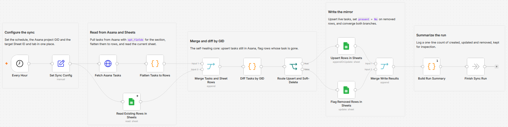

# Sync Asana project tasks to a Google Sheet mirror

[Published n8n template](https://n8n.io/workflows/17306-sync-asana-project-tasks-with-a-mirrored-google-sheets-tab/)

I wanted a Google Sheet that always reflects one Asana project without babysitting it. On a schedule this workflow reads every task in the project and upserts it into the sheet keyed by task GID, so status, assignee, due date, and section stay current. When a task disappears from Asana the row is not deleted, it is flagged `present` = `No`, so the sheet stays a self-healing backup you can pivot and filter.

Built with n8n, plus Asana and Google Sheets.

## How it works

A schedule triggers the run. An HTTP Request reads the project's tasks from the Asana REST API with the exact `opt_fields` the mirror needs, including the section name. One Code node flattens each task to a flat row, a second Code node diffs those tasks against the rows already in the sheet by GID, and two Google Sheets nodes write the result: an upsert for tasks still in Asana and an update that flags rows whose task is gone. A final Code node writes a one-line run summary.

| Stage | What happens |
|---|---|
| Every Hour | A schedule fires on the interval you set |
| Set Sync Config | Holds the Asana project GID and the target Sheet ID and tab in one place |
| Fetch Asana Tasks | Reads the project's tasks with `opt_fields` for name, assignee, due date, completion, section, and permalink |
| Flatten Tasks to Rows | Maps each task to a flat sheet row and stamps `synced_at` |
| Read Existing Rows in Sheets | Reads the rows already in the sheet to capture the current set of GIDs |
| Merge Tasks and Sheet Rows | Brings both sources into the diff as one input |
| Diff Tasks by GID | Marks each task for upsert and each vanished row for soft-delete, and counts created, updated, and removed |
| Route Upsert and Soft-Delete | Sends upserts and soft-deletes down their own branches |
| Upsert Rows in Sheets | Appends or updates each live task, keyed on the `gid` column |
| Flag Removed Rows in Sheets | Sets `present` = `No` on rows whose task left Asana, without deleting them |
| Merge Write Results | Brings the two write branches back together so the summary runs once |
| Build Run Summary | Writes a one-line count of created, updated, and removed |
| Finish Sync Run | A no-op that keeps the summary so each run is inspectable |

The whole mirror is keyed on the Asana task GID, so a task that is renamed or reassigned updates in place instead of creating a duplicate row, and a task that is removed is flagged rather than dropped.

## Setup

1. Import `workflow.json` into n8n. It imports inactive, so configure it before activating.
2. Add an Asana credential (Personal Access Token) and assign it to "Fetch Asana Tasks". The HTTP Request node calls the Asana REST API with that credential.
3. Add a Google Sheets credential, assign it to the three Google Sheets nodes, and pick your spreadsheet and the `Tasks` tab on each.
4. Add a header row to the tab with these columns: gid, name, assignee, section, due_on, completed, permalink, modified_at, synced_at, present.
5. Open "Set Sync Config" and set `asana_project_gid` (the number in your Asana project URL), `sheet_id` (the spreadsheet ID from its URL), and `sheet_tab`.
6. In "Every Hour", set the interval. It defaults to hourly.
7. Run it once to check the sheet, then activate.

## The mirror columns

Each task becomes one row, matched on `gid`. The sheet is a flat, filterable copy of the project.

| Column | What it holds |
|---|---|
| `gid` | The Asana task GID, the key every row is matched on |
| `name` | The task name |
| `assignee` | The assignee's name, or blank if unassigned |
| `section` | The task's section in the project, or blank |
| `due_on` | The due date, or blank |
| `completed` | Yes or No |
| `permalink` | A direct link to the task in Asana |
| `modified_at` | Asana's last-modified timestamp |
| `synced_at` | When this run wrote the row |
| `present` | Yes if the task is still in Asana, No if it was removed |

No row is ever deleted. A task that leaves the project keeps its history in the sheet with `present` set to `No`, and if it returns the same row flips back to `Yes` on the next run. That makes the sheet a durable backup rather than a one-time snapshot.

## Optional one-line summary

The counts come from the Code node, so they never depend on a model. If you want a plain-English headline of what changed, feed the run-summary counts to a Groq call after "Build Run Summary". It is off by default and touches none of the row data.

## What is in this folder

| File | What it is |
|---|---|
| `README.md` | This overview |
| `TEMPLATE-DESCRIPTION.md` | The n8n Creator hub listing text |
| `workflow.json` | The importable n8n workflow |
| `images/workflow.png` | The workflow on the n8n canvas |

---

All sample data is fictional. No real credentials, IDs, or endpoints are included.

Part of the [n8n-exekyute-templates](../../README.md) collection. MIT licensed.
