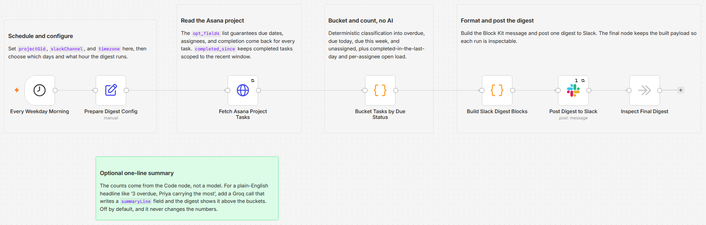

# Post a daily Asana project status digest to Slack

[Published n8n template](https://n8n.io/workflows/17271-post-a-daily-asana-project-status-digest-to-slack/)

Read one Asana project on a weekday schedule and post a status digest to Slack: overdue, due today, due this week, unassigned, and completed since yesterday, plus how much open work each person is carrying. All the classification and counting runs in plain JavaScript inside a Code node, so the numbers are exact and identical from run to run.

Built with n8n, plus Asana and Slack.

## Use it when

- You want one Slack message each morning that says where the project stands, without opening Asana. The digest answers what is slipping and who is loaded before standup.
- Unassigned tasks sit ownerless for days because nobody went looking. The digest lists them as their own bucket every morning.
- One person is quietly carrying half the open work. The per-assignee load count makes that visible daily, including tasks with no due date.

## How it works

A weekday-morning schedule triggers the run. An HTTP Request reads the project's tasks from the Asana REST API with an `opt_fields` list that guarantees name, assignee, due date, completion, and permalink come back. One Code node does all the classification and counting, a second formats the Slack message, and Slack posts it.

| Stage | What happens |
|---|---|
| Every Weekday Morning | Fires Monday to Friday at the hour you set |
| Prepare Digest Config | Holds the project GID, Slack channel, timezone, and completed-task lookback in one place |
| Fetch Asana Project Tasks | Reads the project's tasks with `opt_fields` for name, assignee, due date, completion, and permalink, 100 per page |
| Bucket Tasks by Due Status | Classifies open tasks and tallies per-assignee load, all in plain JavaScript |
| Build Slack Digest Blocks | Formats the buckets into a Block Kit message |
| Post Digest to Slack | Posts one digest to the configured channel |
| Inspect Final Digest | A no-op that keeps the built payload so each run is inspectable |

I run the date math in the timezone you set in the config node, not the server timezone, so "due today" means today where your team is.

## Requirements

- An Asana account with a Personal Access Token that can read the project. One paged read runs per morning, 100 tasks per page and 20 pages at most, which stays well within free rate limits.
- A Slack workspace with permission to post to the target channel.
- n8n (cloud or self-hosted) with Asana and Slack credentials.

## Setup

1. Import `workflow.json` into n8n. It imports inactive; configure before activating.
2. Add an Asana credential (Personal Access Token) and assign it to "Fetch Asana Project Tasks". The same credential authorizes the raw REST call.
3. Add a Slack credential and assign it to "Post Digest to Slack".
4. Open "Prepare Digest Config" and set `projectGid` (the number in your Asana project URL), `slackChannel` (a channel ID, or switch the Slack node to its channel picker), and `timezone` (an IANA name like `America/Toronto`; it ships set to `America/New_York`).
5. In "Every Weekday Morning", set the hour to run before standup. It defaults to weekdays at 08:00.
6. Run it once to check the message, then activate.

## The buckets

Each open task lands in the due bucket that matches its date. "Unassigned" is a separate list because those tasks need an owner, so a task can be both due today and unassigned.

| Bucket | When |
|---|---|
| Overdue | Open, and the due date is before today |
| Due today | Open, and the due date is today |
| Due this week | Open, and the due date is after today through the coming Sunday |
| Unassigned | Open, and no assignee |
| Completed recently | Completed within the last `lookbackHours` (24 by default), which is also the `completed_since` window on the API call |

"Open load by assignee" counts every open task per person, including tasks with no due date, so it reflects real workload rather than just dated work. Completed tasks never count toward load.

## Optional one-line summary

The counts are computed in the Code node, so they never depend on a model. If you want a plain-English headline, add a Groq call that writes a `summaryLine` field before "Build Slack Digest Blocks", and the digest shows it above the buckets. It is off by default and changes none of the numbers.

## Error handling

The Asana read and the Slack post each retry three times, five seconds apart, on a transient error. The Slack post runs once per execution, so a retry never double-posts. For an unattended job like this, also set a workflow-level error workflow in n8n settings so a failure between nodes still reaches you.

## Customize

- Change the run days and hour in "Every Weekday Morning".
- Change the completed-task window with `lookbackHours` in "Prepare Digest Config".
- Change `MAX_LINKS` in "Build Slack Digest Blocks" to show more or fewer than 5 task links per section.
- Move the end of the due-this-week bucket (the coming Sunday by default) in "Bucket Tasks by Due Status".

## What is in this folder

| File | What it is |
|---|---|
| `README.md` | This overview |
| `TEMPLATE-DESCRIPTION.md` | The n8n Creator hub listing text |
| `workflow.json` | The importable n8n workflow |
| `images/workflow.png` | The workflow on the n8n canvas |

---

All sample data is fictional. No real credentials, IDs, or endpoints are included.

Part of the [n8n-exekyute-templates](../../README.md) collection. MIT licensed.
