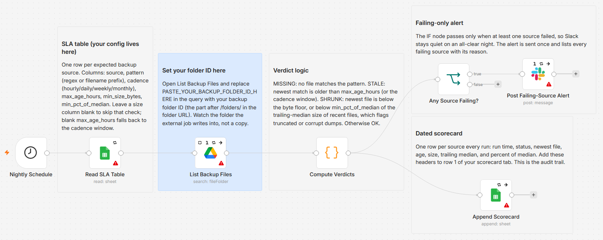

# Audit Google Drive backups for stale, missing, or shrunken files and alert Slack

[Published n8n template](https://n8n.io/workflows/16701-audit-google-drive-backup-freshness-with-google-sheets-and-slack/)

Audit a Google Drive folder that another job already writes backups into (a pg_dump cron, Veeam, or any other tool) against a per-source SLA table in a Google Sheet, log a dated scorecard row for each source, and ping Slack only when something fails. Each source gets one verdict per run, computed from file metadata alone: OK, STALE, MISSING, or SHRUNK. The workflow never makes a backup; it judges the ones your other jobs produce.

Built with n8n, plus Google Drive, Google Sheets, and Slack.

## Use it when

- A backup cron dies quietly, and the first anyone hears of it is during a restore. This flags the missed run the morning after.
- A dump job gets killed partway and leaves a file that is fresh, present, and a third of its normal size. A plain existence check passes it; the SHRUNK verdict does not.
- You own the backups but not the tool that writes them, and you want a dated scorecard showing each source met its SLA, not just an alert when it did not.

## How it works

A nightly schedule fires after the backup jobs should have finished. The workflow reads the SLA table from a Google Sheet and lists the watched Drive folder, then a Code node matches files to sources by filename pattern and assigns one verdict each. Every source is logged to a scorecard sheet, and an IF gate posts a single Slack message only when at least one source failed. A clean night logs and stays quiet.

| Stage | What happens |
|---|---|
| Nightly Schedule | Fires once a night, after the backup jobs should have run; defaults to 03:00 |
| Read SLA Table | Pulls one row per expected source: pattern, cadence, max age, min size |
| List Backup Files | Lists the watched Drive folder with each file's name, modified time, and size |
| Compute Verdicts | Matches files to sources and assigns OK, STALE, MISSING, or SHRUNK |
| Append Scorecard | Logs one dated row per source to the scorecard sheet |
| Any Source Failing? | Ends the run quietly when every verdict is OK |
| Post Failing-Source Alert | Posts one Slack message listing the failing sources |

I judge SHRUNK against the trailing median size of each source's recent files because a truncated dump is fresh, present, and useless, and an existence check waves it through.

## Requirements

- A Google Drive credential (OAuth2) with read access to the backup folder.
- A Google Sheets credential (OAuth2), which can be the same Google account.
- A Slack credential (OAuth2 or bot token) with `chat:write` on the alert channel.
- n8n (cloud or self-hosted). No paid services are required.

## Setup

1. Import `workflow.json` into n8n. It imports inactive; configure before activating.
2. Assign a Google Drive credential to "List Backup Files", a Google Sheets credential to "Read SLA Table" and "Append Scorecard" (the same Google account can back both), and a Slack credential to "Post Failing-Source Alert".
3. Open "List Backup Files" and replace `PASTE_YOUR_BACKUP_FOLDER_ID_HERE` in the query with your backup folder ID, the part after `/folders/` in the folder URL. Watch the folder the external job writes into, not a copy.
4. In "Read SLA Table", pick the spreadsheet and tab that hold the SLA table, and fill it in (columns below).
5. In "Append Scorecard", pick the spreadsheet and tab for the log, and put these headers in row 1: `Run At`, `Source`, `Status`, `Detail`, `Cadence`, `Pattern`, `Newest File`, `Newest Age (h)`, `Max Age (h)`, `Newest Size (bytes)`, `Trailing Median (bytes)`, `Size % of Median`, `Matched Files`. Every run writes one row per source, and `Detail` carries the plain-English reason for the verdict.
6. Pick the channel in "Post Failing-Source Alert", and set the hour in "Nightly Schedule" to run after your backups finish. It defaults to 03:00.
7. Run it once to check the verdicts, then activate.

## The SLA table and verdicts

One row per expected backup source. The Code node reads the columns by name, so use these exact headers in row 1:

| Column | Holds |
|---|---|
| `source` | A name for the source, for example "Postgres prod" |
| `pattern` | A filename pattern that picks this source's files. A regex like `^pg_prod_.*\.sql\.gz$`, or a plain prefix like `bill_` used as a substring match |
| `cadence` | `hourly`, `daily`, `weekly`, or `monthly`. Sets the default age window (2, 26, 170, or 750 hours) when `max_age_hours` is blank |
| `max_age_hours` | STALE threshold. The newest matching file must be younger than this many hours. Blank to fall back to the cadence window |
| `min_size_bytes` | Optional absolute floor, in raw bytes, so `100000000` is a 100 MB floor. The newest file must be at least this large. Blank to skip |
| `min_pct_of_median` | Optional SHRUNK threshold, a whole percent like `60`. The newest file must be at least that percent of the trailing median size of recent files. Blank to skip |

For each source, the workflow finds the files whose names match its pattern, picks the newest by modified time, and assigns a verdict:

| Verdict | When |
|---|---|
| MISSING | No file matches the pattern at all |
| STALE | The newest matching file is older than `max_age_hours` (or the cadence window) |
| SHRUNK | The newest file is below `min_size_bytes`, or below `min_pct_of_median` of the trailing median |
| OK | Fresh and full |

The trailing median is taken over the recent matching files before the newest one (up to five), and the percent check needs at least two of them for history. That is what catches a truncated or corrupt dump: present, fresh, and suddenly a fraction of its normal size.

## Error handling

Each Google Drive, Google Sheets, and Slack step retries a few times on a transient error. The Drive listing and the Slack post continue rather than halt, and the Code node skips files with no size (Google native files) or an unreadable timestamp, so one odd file never stops the audit. If the Drive listing itself fails, every source reads as MISSING, which surfaces the outage rather than hiding it. For an unattended job like this, also set a workflow-level error workflow in n8n settings so a crash between nodes still reaches you.

## Customize

- Change the run time in "Nightly Schedule", or run it more than once a day.
- Tune each source from the SLA sheet alone, with no edits to the workflow.
- Add a real on-call destination: an HTTP Request node on the failing branch that calls a PagerDuty or Opsgenie free-tier event, or a Twilio SMS, so a stale backup pages someone off-hours instead of waiting in Slack.
- Add a plain-English digest: feed the failing list to a cheap model (Groq on the free tier, gpt-4o-mini, or Claude Haiku). The base workflow runs without any model.

## What is in this folder

| File | What it is |
|---|---|
| `README.md` | This overview |
| `TEMPLATE-DESCRIPTION.md` | The n8n Creator hub listing text |
| `workflow.json` | The importable n8n workflow |
| `images/workflow.png` | The workflow on the n8n canvas |

---

All sample data is fictional. No real credentials, IDs, or endpoints are included.

Part of the [n8n-exekyute-templates](../../README.md) collection. MIT licensed.
