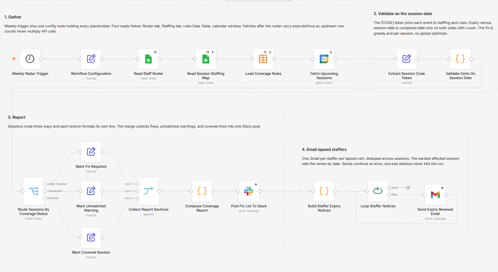

# Validate staff certifications against upcoming session dates using Google Calendar, Sheets, Slack and Gmail

[Published n8n template](https://n8n.io/workflows/17983-validate-staff-certifications-for-upcoming-sessions-with-google-calendar-and-slack/)

Checks whether every staffer assigned to an upcoming session still holds the required certification on the day that session runs, then posts one Slack fix list and emails each lapsed person. Expiry dates are compared against the session date rather than against today, so a card that lapses in six weeks fails a class eight weeks out even though it looks valid this morning. Sessions that fall short get the smallest set of renewals that closes the gap, latest lapse first, with the date each renewal has to land by.

Built with n8n, plus Google Calendar, Google Sheets, n8n Data Tables, Slack, and Gmail.

## Use it when

- A roster filter on expired-as-of-today comes back clean, and the training calendar still has a session nobody is certified to cover. This run compares each expiry to the session date, so the gap shows up while there is time to renew.
- A safety session recurs every second week for a quarter. The calendar holds one master event; expanding it means each occurrence gets its own coverage check instead of only the first date.
- Someone renames an event and drops its code token. The event cannot be joined to staffing or rules, so it lands in a Slack warning section rather than quietly counting as covered.

## How it works

A weekly trigger loads one config node, then four reads happen in sequence: the Roster tab, the Staffing tab, the coverage rules Data Table, and every calendar event inside the lookahead window with recurring events expanded into dated instances. A Set node pulls the bracketed code out of each event title, and a Code node joins that code to the staffing rows and its prefix to a rule, then compares each assigned person's expiry to the session date. Every session comes out as under covered, unmatched, or covered, a Switch sends each verdict to its own line formatter, and a Merge collects all three into a single Slack post. A second Code node rebuilds the same findings by person, deduped across sessions, and a batch loop sends one Gmail per lapsed certification.

| Stage | What happens |
|---|---|
| Weekly Radar Trigger | Fires Monday at 07:00 |
| Workflow Configuration | Holds the spreadsheet id, both tab names, the calendar id, the Slack channel id, and `lookaheadWeeks` (10 by default) |
| Read Staff Roster and Read Session Staffing Map | Read the Roster tab (Person, Email, Certification, Expiry) and the Staffing tab (SessionCode, Person) |
| Load Coverage Rules | Reads the Certification Lapse Radar Rules Data Table: `session_type`, `required_cert`, `min_certified` |
| Fetch Upcoming Sessions | Pulls calendar events from now to now plus `lookaheadWeeks`, with `recurringEventHandling` set to expand |
| Extract Session Code Token | Lifts the `[CODE]` token out of the event title and uppercases it |
| Validate Certs On Session Date | Joins code to staffing and rule, compares every expiry to the session date, counts the shortfall, and builds the minimal renewal plan |
| Route Sessions By Coverage Status | Splits into Under Covered, Unmatched, and Covered, with no fallback output |
| Mark Fix Required, Mark Unmatched Warning, Mark Covered Session | Format one Slack line per session for their branch |
| Collect Report Sections and Compose Coverage Report | Merge the three branches and assemble one message with a fix section, a warning section, and a covered count |
| Post Fix List To Slack | Posts the whole report to the configured channel |
| Build Staffer Expiry Notices | Regroups lapsed people by person and certification, dedupes across sessions, and takes the earliest affected session as the renew by date |
| Loop Staffer Notices and Send Expiry Renewal Email | Send one plain text renewal notice per person per lapsed certification |

I reduce both sides to a bare date with Luxon before comparing, because a timestamp comparison lets a midnight timezone shift flip the verdict on the boundary day.

## Requirements

- A Google account with view access to the roster spreadsheet and the sessions calendar. Every Google node here reads, none write back.
- A Google Sheet with a Roster tab (Person, Email, Certification, Expiry) and a Staffing tab (SessionCode, Person). Person values must be spelled identically on both tabs; the join trims whitespace but is case sensitive.
- A Slack app with `chat:write`, and the channel's ID value rather than its name, since the node resolves in id mode.
- A Gmail account cleared to email staff. One message goes out per person per lapsed certification per run, with no batching or throttling.
- n8n (cloud or self-hosted) new enough to offer Data Tables, with Google Sheets, Google Calendar, Slack, and Gmail credentials.

## Setup

1. Import `workflow.json` into n8n. It imports inactive; configure before activating.
2. Fill in Workflow Configuration with `rosterSheetId`, `calendarId`, `slackChannelId`, and `lookaheadWeeks`, then assign the Google Sheets, Google Calendar, Slack, and Gmail credentials.
3. Build the Roster and Staffing tabs, type Expiry as ISO text (YYYY-MM-DD) in a plain text column, and fill the Certification Lapse Radar Rules Data Table.
4. Put a code token in every session title, for example `First Aid Refresher [FA-101]`. An event without one cannot be validated.
5. Run it once by hand, read the Slack post for unmatched warnings, then activate.

## The rules table

| Column | What it holds |
|---|---|
| `session_type` | The prefix before the first hyphen in a session code, so `FA-101` uses the `FA` rule |
| `required_cert` | The certification name, matched against the Roster Certification text, case insensitively |
| `min_certified` | How many assigned people must hold a valid cert on the session date. Blank or non-numeric reads as zero, and every session of that type reports covered |

## Known limits

- Nothing is written back anywhere and no state carries between runs, so a lapsed staffer gets the same notice every run until their Expiry cell changes.
- Recurring events expand to one line per occurrence, so a long lookahead on a busy calendar can hit Slack's message length limit.
- Post Fix List To Slack and Send Expiry Renewal Email both continue on error, so nothing is retried and no failure is reported.
- Coverage is judged only against people in the Staffing tab, so anyone who turns up on the day without a staffing row is invisible here, and a lapsed staffer with no Email still appears in the Slack fix line but never receives a notice.

## Customize

- `lookaheadWeeks` in Workflow Configuration sets the window. Ten weeks is long enough for most renewals to clear.
- The token is parsed by `/\[([A-Za-z0-9_-]+)\]/` in Extract Session Code Token and the type comes from `sessionCode.split('-')[0]` in Validate Certs On Session Date. Change both together if your codes are shaped differently.
- The pass test in Validate Certs On Session Date is `cert.expiry.toISODate() >= sessionDateIso`. Wrap the right side in `sessionDate.plus({days:30})` to fail anything expiring within a month of the session.
- Slack wording lives in Mark Fix Required, Mark Unmatched Warning, and Mark Covered Session, one line format each.
- Build Staffer Expiry Notices emails people on `under_covered` and `covered` sessions. Drop `covered` to email only those on sessions that are actually short.
- Send Expiry Renewal Email is plain text. Switch `emailType` to HTML for a formatted notice.

## What is in this folder

| File | What it is |
|---|---|
| `README.md` | This overview |
| `TEMPLATE-DESCRIPTION.md` | The n8n Creator hub listing text |
| `workflow.json` | The importable n8n workflow |
| `images/workflow.png` | The workflow on the n8n canvas |

---

All sample data is fictional. No real credentials, IDs, or endpoints are included.

Part of the [n8n-exekyute-templates](../../README.md) collection. MIT licensed.
