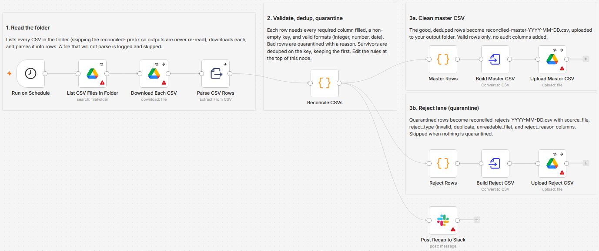

# Reconcile daily CSV exports in Google Drive into a deduped master with a reject lane and Slack recap

[Published n8n template](https://n8n.io/workflows/16700-reconcile-daily-google-drive-csv-exports-into-a-master-file-and-send-a-slack-recap/)

Merge every CSV in a Google Drive folder into one deduplicated master file, quarantine every bad row to a dated reject file with the reason it failed, and post a rows in, merged, quarantined, duplicates recap to Slack. The reconciliation is rule based end to end, driven by an editable block of required columns, a dedup key, and format checks at the top of a single Code node, so the same input always produces the same result.

Built with n8n, plus Google Drive and Slack.



## Use it when

- Every branch or system drops its own daily CSV export into a shared Drive folder, and someone stitches them into one clean file by hand each morning.
- Two exports overlap and the same order lands twice. The dedup key keeps the first occurrence and quarantines the copy, so the totals stop drifting.
- Someone asks why a row disappeared during the merge, and the honest answer today is a shrug. Here the reject file answers with the exact reason.

## How it works

On a schedule, the workflow lists every CSV in the folder, downloads and parses each one, and merges all the rows. A Code node validates each row, deduplicates on the key, and splits the clean rows from the bad ones. Good rows become a dated master CSV and bad rows a dated reject file, both uploaded back to Drive, and a recap posts to Slack. The Drive steps retry a few times on a transient error.

| Stage | What happens |
|---|---|
| Run on Schedule | Fires once a day |
| List CSV Files in Folder, Download Each CSV, Parse CSV Rows | Lists every CSV in the folder, skips the `reconciled-` output prefix, downloads each file, and turns it into rows |
| Reconcile CSVs | Merges all rows, validates each, deduplicates on the key, and splits good from bad |
| Master Rows, Build Master CSV, Upload Master CSV | The deduped good rows become a dated master CSV on Drive |
| Reject Rows, Build Reject CSV, Upload Reject CSV | Every bad row lands in a dated reject file with a reason, back on Drive |
| Post Recap to Slack | Posts the rows in, merged, quarantined, and duplicates counts |

I made the reject lane and the recap the point: every row that does not reach the master is accounted for, so a run is auditable instead of a silent merge.

## Requirements

- A Google Drive account with access to the folder the exports land in (OAuth2 credential).
- A Slack workspace with a channel for the recap (bot token or OAuth2 credential).
- n8n (cloud or self-hosted) with Google Drive and Slack credentials.

## Setup

1. Import `workflow.json` into n8n. It imports inactive; configure before activating.
2. Assign a Google Drive credential to the four Google Drive nodes, and a Slack credential to "Post Recap to Slack".
3. In "List CSV Files in Folder", pick the folder your exports land in; in "Upload Master CSV" and "Upload Reject CSV", pick the folder for the output files; in "Post Recap to Slack", pick the channel.
4. In "Reconcile CSVs", set the required columns, the dedup key, and the format checks in the block at the top of the node.
5. Run it once on a few test files, then activate.

## The reconciliation rules

The rules live in a clearly marked block at the top of the "Reconcile CSVs" node:

```js
const REQUIRED_COLUMNS = ['order_id', 'branch', 'sku', 'qty', 'amount', 'order_date'];
const KEY_COLUMN = 'order_id';
const COLUMN_TYPES = { qty: 'integer', amount: 'number', order_date: 'date' };
const OUTPUT_PREFIX = 'reconciled';
```

A row must have every required column present and non-empty, a non-empty key, and pass the format checks (integer, number, or date as YYYY-MM-DD). A row that fails is quarantined with the reason. Surviving rows are deduplicated on the key column, keeping the first occurrence and quarantining later duplicates.

## The reject lane and the recap

Every row that does not reach the master goes to `reconciled-rejects-YYYY-MM-DD.csv` with three audit columns added:

| Column | Holds |
|---|---|
| source_file | The CSV the row came from |
| reject_type | `invalid`, `duplicate`, or `unreadable_file` |
| reject_reason | The specific reason, for example `column "qty" is not a valid integer (got "abc")` |

A file that cannot be parsed is logged as an `unreadable_file` and the run carries on, so one bad file never halts the reconciliation. The master file, `reconciled-master-YYYY-MM-DD.csv`, holds only the clean deduped rows, with no audit columns. When nothing is quarantined no reject file is written, and when no valid rows survive no master is written.

The Slack recap reconciles the whole run: files read, rows in, merged to master, quarantined, duplicates dropped, unreadable files, and both output filenames with the reject row count. Rows in always equals merged plus quarantined plus duplicates, so the numbers balance. The recap posts either way.

## Customize

- Edit the rules block to change the required columns, the dedup key, the format checks, or the `reconciled` output prefix.
- Change the schedule in "Run on Schedule", or drop the Slack node to run with Google Drive only.
- Point the two upload nodes at a separate output folder. The List node already skips the `reconciled-` prefix, so writing the outputs back to the same folder is safe too.
- Optional paid upgrade: feed only the count summary (never the file contents) to a cheap LLM (Groq free, or gpt-4o-mini / Claude Haiku) for a smoother narrative recap line. The base workflow ships fully free without it.

## What is in this folder

| File | What it is |
|---|---|
| `README.md` | This overview |
| `TEMPLATE-DESCRIPTION.md` | The n8n Creator hub listing text |
| `workflow.json` | The importable n8n workflow |
| `images/workflow.png` | The workflow on the n8n canvas |

---

All sample data is fictional. No real credentials, IDs, or endpoints are included.

Part of the [n8n-exekyute-templates](../../README.md) collection. MIT licensed.
