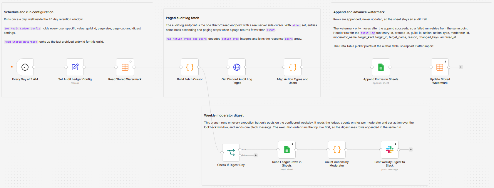

# Archive Discord audit log entries to Google Sheets and roll up weekly in Slack

[Published n8n template](https://n8n.io/workflows/17808-archive-discord-audit-logs-to-google-sheets-and-send-weekly-slack-digests/)

Discord deletes audit log entries after 45 days, so this copies them into a Google Sheets ledger on a daily schedule and posts a per-moderator summary to Slack once a week. A Data Table holds the id of the last entry archived, and each run pages forward from there. The audit log is the one Discord read endpoint with a real server side cursor, so resuming from a stored id is exact rather than a guess based on timestamps.

Built with n8n, plus Discord, Google Sheets, Data Tables, and Slack.

## Use it when

- Someone asks who banned a member three months ago and the answer is already gone, because Discord dropped the entry on day 45.
- Moderation has to survive a handover. The people who made the decisions leave, and the only record is a panel that shows the last six weeks.
- You want a weekly read on who is actually doing the moderating, without opening the audit log and counting by hand.

## How it works

A daily schedule fires and one Set node supplies every user specific value. A Data Table lookup returns the last entry id archived for this guild, which becomes the `after` cursor for the fetch. The HTTP Request node pages forward until a page comes back shorter than the page size, then a Code node decodes the integer `action_type` values and joins the response `users` array so moderator and target have names rather than snowflakes. Rows append to the ledger, the watermark advances, and on the configured weekday a second row reads the ledger back and posts counts to Slack.

| Stage | What happens |
|---|---|
| Every Day at 3 AM | Fires once a day, well inside the 45 day window |
| Set Audit Ledger Config | Guild id, sheet URL, Slack channel, page size, page cap and digest settings in one node |
| Read Stored Watermark | Looks up the last archived entry id for this guild |
| Build Fetch Cursor | Turns the watermark into an `after` cursor and a page budget for this run |
| Get Discord Audit Log Pages | Calls the guild audit log endpoint, paging until a page returns fewer than `limit` |
| Map Action Types and Users | Decodes `action_type` integers and resolves moderator and target names |
| Append Entries in Sheets | Appends one row per entry, never updating an existing one |
| Update Stored Watermark | Advances the watermark, but only after the append succeeded |
| Check If Digest Day | Passes only on the configured weekday |
| Read Ledger Rows in Sheets | Reads the lookback window back out of the ledger |
| Count Actions by Moderator | Counts entries per moderator and per action |
| Post Weekly Digest to Slack | Posts one message with the totals |

I advance the watermark after the append rather than before it because the opposite order loses entries permanently. A failed append with the cursor already moved skips that range on the next run, and once the range is past 45 days old there is nothing left to re-fetch.

## Requirements

- A Discord server where you can add a bot and grant it View Audit Log. No privileged intents are needed, because this reads the audit log rather than messages or members.
- A Google account with a spreadsheet for the ledger.
- A Slack workspace with a channel for the weekly digest.
- n8n (cloud or self-hosted) with Discord Bot API, Google Sheets and Slack credentials, plus Data Tables for the watermark.

## Setup

1. Import `workflow.json` into n8n. It imports inactive; configure before activating.
2. Create a Discord application, add a bot, and invite it to your server with View Audit Log. Paste the token into a Discord Bot API credential and assign it to `Get Discord Audit Log Pages`.
3. Create a Data Table named `discord_audit_watermark` with the columns `guild_id`, `last_entry_id` and `updated_at`, then select it on both `Read Stored Watermark` and `Update Stored Watermark`. Both import pointing at a placeholder, so this step is not optional.
4. Create the ledger spreadsheet with a tab named `audit_log` and the header row below.
5. Fill `Set Audit Ledger Config`: guild id, spreadsheet URL and Slack channel name.
6. Connect your Google Sheets and Slack credentials on their nodes.
7. Run it once by hand, check that rows landed and the watermark moved, then activate.

## The ledger sheet

One row per audit entry, appended and never rewritten, so the tab is the audit trail rather than a view of current state. Give the `audit_log` tab exactly these headers in row 1:

| Column | What it holds |
|---|---|
| `entry_id`, `created_at`, `guild_id` | Identity and timestamp of the entry |
| `action`, `action_type` | The decoded action name and the raw Discord integer |
| `moderator_id`, `moderator_name` | Who performed the action |
| `target_kind`, `target_id`, `target_name` | What it was performed on |
| `reason`, `changed_keys` | The stated reason and which fields changed |
| `archived_at` | When this workflow wrote the row |

## Customize

- **Backfill depth.** `maxPagesPerRun` caps pages per run at five by default. Raise it for the first run on a busy server, since each request returns at most 100 entries.
- **Digest timing.** `digestWeekday` and `digestLookbackDays` move and widen the Slack summary independently of the daily archive.
- **Action names.** `Map Action Types and Users` names the common action type integers. Discord defines more than sixty, so extend the map for the ones your server actually uses.
- **Cadence.** The daily schedule is deliberate. Anything slower than every 45 days loses entries, and a paused workflow leaves a permanent hole.

## What is in this folder

| File | What it is |
|---|---|
| `README.md` | This overview |
| `TEMPLATE-DESCRIPTION.md` | The n8n Creator hub listing text |
| `workflow.json` | The importable n8n workflow |
| `images/workflow.png` | The workflow on the n8n canvas |

---

All sample data is fictional. No real credentials, IDs, or endpoints are included.

Part of the [n8n-exekyute-templates](../../README.md) collection. MIT licensed.
