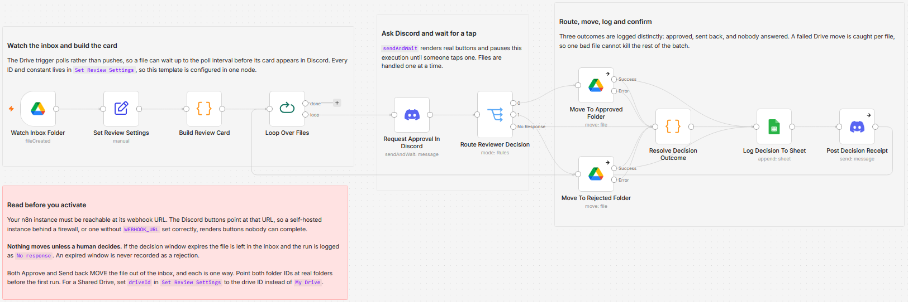

# Approve a new Google Drive file from inside Discord before it moves

[Published n8n template](https://n8n.io/workflows/17614-review-google-drive-inbox-files-with-discord-and-log-decisions-in-sheets/)

Watch a Drive inbox folder and hold every new file there until somebody taps Approve or Send back on a Discord message. The approval message uses n8n's native `sendAndWait`, so the execution parks in a waiting state and resumes the instant a button is pressed rather than polling for an answer. An expired decision window is recorded as `No response` and the file stays where it is.

Built with n8n, plus Discord, Google Drive, and Google Sheets.

## Use it when

- Client deliverables land in a shared folder and somebody senior is supposed to look before they go out, so in practice they go out unlooked-at.
- The person doing the approving is on their phone, and asking them to open a second tool means the file waits until Monday.
- You need a record of who approved what and when, and right now that record is a Slack thread nobody can find two months later.

## How it works

A Drive trigger polls the inbox folder and fires on each new file. A Code node turns the raw metadata into a readable card with name, human size, type and a preview link, then a loop hands the reviewer one file at a time. The Discord node posts the card with real Approve and Send back buttons and pauses the execution. When somebody answers, a Switch routes the file to the shared folder or the rework folder, a resolver names what actually happened, the decision is appended to a sheet, and a one-line receipt goes back to the channel.

| Stage | What happens |
|---|---|
| Watch Inbox Folder | Polls the Drive inbox and fires per new file |
| Set Review Settings | Every ID, folder, sheet and the decision window in one node |
| Build Review Card | Formats Drive metadata into the message body, no AI |
| Loop Over Files | Hands the reviewer one file at a time |
| Request Approval In Discord | Posts the card with buttons and pauses until somebody taps |
| Route Reviewer Decision | Three ways out: approved, sent back, and nobody answered |
| Move To Approved Folder | Moves the file, with its error output caught |
| Move To Rejected Folder | Same, for the rework path |
| Resolve Decision Outcome | Names the real outcome, including a Drive move that failed |
| Log Decision To Sheet | One row per decision, with the execution ID |
| Return Decision Receipt | Posts what happened back to the review channel |

The third route is the one that matters. Without it an expired window resolves as "not approved", so a Friday evening deliverable is physically moved to the rework folder overnight and the sheet records a rejection no human made. I would rather leave the file untouched and log the silence honestly.

## Requirements

- A Discord server where you can add a bot with Send Messages on the review channel. No privileged intents: this never reads message content or the member list.
- A Google account with a Drive inbox folder, an approved folder, a rework folder and a spreadsheet.
- An n8n instance reachable at its webhook URL, because the Discord buttons point back at it.
- n8n (cloud or self-hosted) with Discord Bot API, Google Drive and Google Sheets credentials.

## Setup

1. Import `workflow.json` into n8n. It imports inactive; configure before activating.
2. Create a Discord application, add a bot, and invite it to your server with Send Messages on the review channel. Paste the token into a Discord Bot API credential and assign it to both Discord nodes.
3. Connect your Google Drive and Google Sheets credentials, then point the trigger at your inbox folder ID.
4. Fill `Set Review Settings`: guild ID, review channel ID, approved and rejected folder IDs, log sheet URL, tab name and the decision window in hours.
5. Give the log sheet these headers: `Decided At`, `File Name`, `File ID`, `Size`, `Type`, `Preview Link`, `Decision`, `Destination Folder ID`, `Reviewed In Channel`, `Execution ID`.
6. Drop one test file in the inbox and complete the round trip before you trust the queue.

## The three outcomes

Every run ends in exactly one of these, and the sheet says which.

| Decision | What happened to the file |
|---|---|
| `Approved` | Moved to the shared folder |
| `Sent back` | Moved to the rework folder |
| `No response` | Left in the inbox. The window expired and nobody decided |
| `Approved, move failed` | Drive refused the move. The error is in the row and the file is still in the inbox |

The move nodes are wired to continue on error rather than stop, so one file Drive refuses cannot kill the rest of the batch. Without that, a single 404 on the first file silently strands every file behind it, and the Drive trigger will not re-emit them.

## Customize

- **Decision window.** `decisionWindowHours` sets how long a card waits before the run is logged as `No response`.
- **Poll interval.** Shorten it on the Drive trigger for a busier queue, and accept the extra API calls.
- **Shared Drives.** Set `driveId` in `Set Review Settings` to your shared drive ID. It ships as `My Drive`.
- **More buttons.** The Discord node's approval options carry the button labels. Rename them without touching the routing, which keys on the returned boolean.

## What is in this folder

| File | What it is |
|---|---|
| `README.md` | This overview |
| `TEMPLATE-DESCRIPTION.md` | The n8n Creator hub listing text |
| `workflow.json` | The importable n8n workflow |
| `images/workflow.png` | The workflow on the n8n canvas |

---

All sample data is fictional. No real credentials, IDs, or endpoints are included.

Part of the [n8n-exekyute-templates](../../README.md) collection. MIT licensed.
