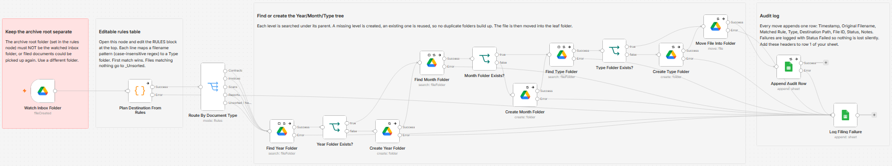
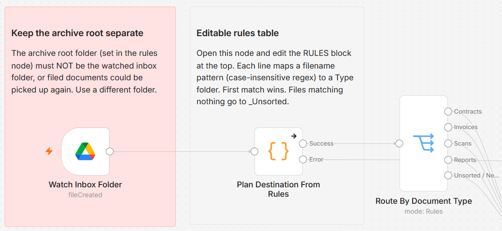
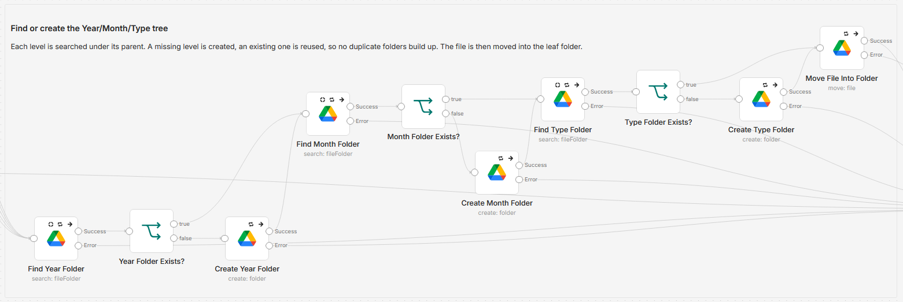
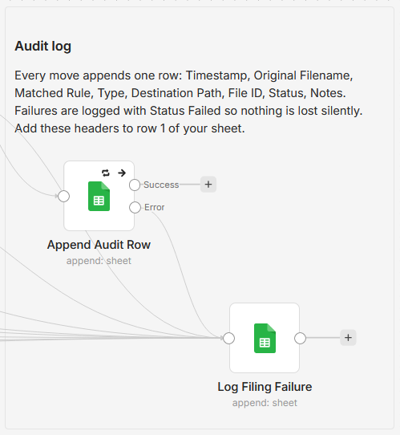

# Auto-file Google Drive inbox files into dated folders by filename rules

[Published n8n template](https://n8n.io/workflows/16812-file-google-drive-inbox-documents-into-dated-folders-with-a-google-sheets-audit-log/)

Drop files into one Google Drive inbox folder and this workflow files each one into a dated Year/Month/Type folder tree, named by a rules table you control, and writes an audit row for every move. No AI, fully rule based, so the same filename always lands in the same place.

Built with n8n, plus Google Drive and Google Sheets.



## How it works

A new file lands in the inbox, the workflow decides where it belongs, files it, and logs the move. Three stages:

### 1. Watch the inbox and classify the file



The Google Drive trigger fires on each new file in the inbox folder. A Code node reads the filename against an editable rules table, picks a document Type (Contracts, Invoices, Scans, Reports), and builds the destination path from the file's created date, for example `2026/06/Contracts`. A Switch then routes the file down its Type branch, and anything that matches no rule takes the catch-all branch and is filed under `_Unsorted`.

### 2. File it into a dated Year/Month/Type tree



For each level (year, then month, then type) the workflow searches under the parent folder and creates the level only if it is missing, so an existing Year or Month folder is reused instead of duplicated. Once the leaf folder exists, the file is moved into it.

### 3. Log every move



Every move appends one row to a Google Sheet: timestamp, original filename, matched rule, Type, destination path, file id, and status. If any Drive or Sheets step fails for a file, that file is logged with a `Failed` status and skipped, so one bad file never stops the run.

## The rules table

The rules live in a clearly marked block at the top of the "Plan Destination From Rules" node. Each rule maps a filename pattern to a Type, and the Type becomes the folder name. Patterns are case-insensitive regular expressions, checked top to bottom, and the first match wins. A file that matches nothing is filed under `_Unsorted`.

```js
const RULES = [
  { pattern: 'contract|agreement', type: 'Contracts' },
  { pattern: 'invoice|inv[ _-]?[0-9]|receipt|bill', type: 'Invoices' },
  { pattern: 'scan|scanned|camscanner|img[ _-]?[0-9]', type: 'Scans' },
  { pattern: 'report|summary|q[1-4]|monthly|weekly|forecast', type: 'Reports' },
];
const FALLBACK_TYPE = '_Unsorted';
```

To add a Type, add a line. To rename a folder, change its `type`. To re-prioritise, move a line up. Nothing else in the node needs to change.

## What gets logged

Every move appends one row to the audit sheet. Create these headers in row 1:

| Column | Holds |
|---|---|
| Timestamp | When the row was written |
| Original Filename | The file's name before the move |
| Matched Rule | The pattern that matched, blank if none did |
| Type | The destination Type folder |
| Destination Path | For example `2026/06/Contracts` |
| File ID | The Google Drive file id |
| Status | `Filed` for a move, `Failed` for an error |
| Notes | The error message on a failed row, blank otherwise |

## Setup

1. Import `workflow.json` into n8n. It imports inactive, so configure it before activating.
2. Assign a Google Drive credential to the trigger and the four Google Drive nodes, and a Google Sheets credential to the two Google Sheets nodes. The same Google account can back both.
3. In the trigger, pick the inbox folder to watch.
4. Open "Plan Destination From Rules" and set `FILED_ROOT_FOLDER_ID` to the folder that should hold the dated tree. Use a different folder than the inbox, so filed documents are not picked up again.
5. In "Append Audit Row" and "Log Filing Failure", pick your audit spreadsheet and tab, and put the column headers above in row 1.
6. Run it once on a test file, then activate.

## Customize

- Add or rename Types by editing the rules table.
- Change the tree shape by editing the `destinationPath` line, for example dropping the month level.
- Point the audit step at a different sheet, or swap it for an n8n Data Table.
- Optional paid upgrade: add a small classifier step (for example gpt-4o-mini) as a fallback for files whose names are too generic for the rules to decide. It only needs the filename, so it runs at a fraction of a cent per file. The base workflow does not use it and ships fully free.

## Requirements

- n8n.
- A Google Drive credential (OAuth2) with access to the inbox folder and the archive folder.
- A Google Sheets credential (OAuth2), which can be the same Google account.

## What is in this folder

| File | What it is |
|---|---|
| `README.md` | This overview |
| `TEMPLATE-DESCRIPTION.md` | The n8n Creator hub listing text |
| `workflow.json` | The importable n8n workflow |
| `images/` | The canvas screenshots used above |

---

All sample data is fictional. No real credentials, IDs, or endpoints are included.

Part of the [n8n-exekyute-templates](../../) collection. MIT licensed.
