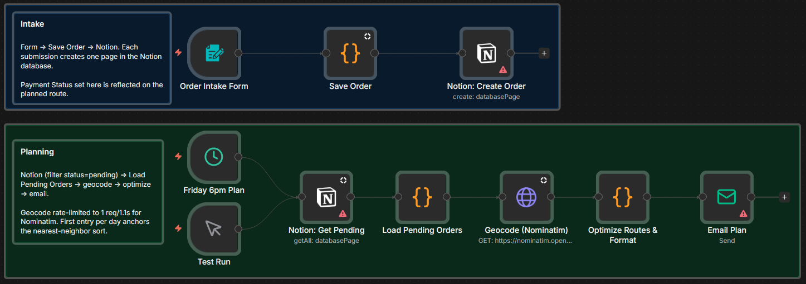

# Plan delivery routes from Notion orders and email the schedule

[Published n8n template](https://n8n.io/workflows/16154-plan-delivery-routes-from-notion-orders-with-nominatim-and-email/)

Collect delivery orders through a public n8n form into a Notion database, then on a schedule (Friday 6pm by default) email a
route plan grouped by delivery day, with a payment tag on every stop. Addresses are geocoded through OpenStreetMap's Nominatim
API, which is free and needs no API key, and each day's stops are ordered by Haversine distance in a nearest-neighbor sweep.

Built with n8n, plus Notion, OpenStreetMap Nominatim, and any SMTP email account.

## Use it when

- You run a small weekend delivery round (lunch boxes, baked goods, meal prep) and plan the driving route by hand on Friday nights from a week of orders.
- Orders arrive wherever you are. The intake form is a public URL you bookmark on your phone, and every submission lands in Notion as a pending row.
- You need to know at each door whether to collect. Every stop carries `[PAID]` or `[COLLECT ON DELIVERY]`, and each day's section totals revenue and cash to collect on the road.

## How it works

Two paths share one Notion database. Intake runs on every form submission: the fields become a normalized order object saved as
a pending row. Planning runs on the Friday 6pm schedule, or on demand from Test Run (open n8n, select it, execute the workflow):
pending rows are read back, geocoded one at a time, sorted per day, and emailed.

| Stage | What happens |
|---|---|
| Order Intake Form | Serves the public form URL; one submission per order |
| Save Order | Shapes the form fields into a normalized order object |
| Notion: Create Order | Writes the order to the database with `Status = pending` |
| Friday 6pm Plan / Test Run | Fires the planning path on schedule, or manually any time |
| Notion: Get Pending | Reads only the rows still marked `pending` |
| Load Pending Orders | Flattens Notion's page response into plain order objects and keeps only the pending ones |
| Geocode (Nominatim) | Looks up each address, batched at 1.1 seconds per request |
| Optimize Routes & Format | Sorts each day's stops with a Haversine nearest-neighbor sweep and renders the markdown plan |
| Email Plan | Sends the plan: name, phone, address, items, total, payment tag, and notes per stop |

I keep the shaping, flattening, and routing in Code nodes, with readable copies in `scripts/`, so the whole algorithm can be read and edited as plain JavaScript.

## Requirements

- A Notion workspace with an internal integration.
- Any SMTP account for the plan email (Gmail with an app password, Sendgrid, your own mail server).
- n8n (cloud or self-hosted) with Notion API and SMTP credentials.

## Setup

1. Import `workflow.json` into n8n. It imports inactive; configure before activating.
2. Create an Internal integration at https://www.notion.so/profile/integrations and copy its secret. Create a database with the schema below,
   connect the integration under the database's `...` menu (Connections), and copy the database ID from the URL `notion.so/<workspace>/<32-character-id>?v=<view-id>`.
3. In n8n, add a Notion API credential with the integration secret, and an SMTP credential.
4. Open "Notion: Create Order" and "Notion: Get Pending", assign the Notion credential, and paste the database ID into each Database field.
5. Open "Email Plan", assign the SMTP credential, and change `fromEmail` and `toEmail` to real addresses.
6. Open "Order Intake Form" and copy the Production URL. That is the link to bookmark on your phone. Activate the workflow.

## The Notion database

Property names and the select option strings are case-sensitive. The planner loads only rows with `Status = pending`, so flipping a
delivered order to `done` retires it from future plans while keeping the history.

| Property | Type | Property | Type |
|---|---|---|---|
| Customer Name | Title | Total | Number |
| Order ID | Text | Day | Select (options: `Saturday`, `Sunday`) |
| Phone | Phone | Paid | Checkbox |
| Address | Text | Status | Select (options: `pending`, `done`) |
| Items | Text | Received At | Date |
| Notes | Text | | |

## Known limits

- Nominatim rate limits at 1 request per second, so the workflow batches at 1.1 seconds per address. Twenty
  orders plan in about 22 seconds; 200 gets slow enough that a paid geocoder (Google, Mapbox, or self-hosted Nominatim) fits better.
- Notion's API has rate limits too, but nothing this workflow hits in normal use.

## Customize

- **HTML email.** The plan sends as plain text by default. Switch Email Plan's Email Format to HTML and wrap the markdown in a `<pre>` block with `white-space: pre-wrap`.
- **Telegram delivery.** Drop a Telegram node after "Optimize Routes & Format" and post `{{ $json.markdown }}` to a private chat.
- **Customer notifications.** A Twilio SMS node can text each customer "your order is stop N on Saturday's route" after the plan generates.
- **Repeat customer flag.** In "Save Order", query Notion before creating the page and set a `Returning customer` checkbox when the phone number has prior orders.
- **Weekly summary.** A Code node after the optimizer can add revenue this week, top customer, and busiest neighborhood to the email.

## What is in this folder

| File | What it is |
|---|---|
| `README.md` | This overview |
| `TEMPLATE-DESCRIPTION.md` | The n8n Creator hub listing text |
| `workflow.json` | The importable n8n workflow |
| `images/workflow.png` | The workflow on the n8n canvas |
| `scripts/save-order.js` | Readable copy of the Code node that normalizes a form submission |
| `scripts/load-pending.js` | Readable copy of the Code node that flattens Notion pages into pending orders |
| `scripts/optimize-routes.js` | Readable copy of the Code node that optimizes routes and renders the markdown plan |
| `LICENSE` | MIT license |

---

All sample data is fictional. No real credentials, IDs, or endpoints are included.

Part of the [n8n-exekyute-templates](../../README.md) collection. MIT licensed.
