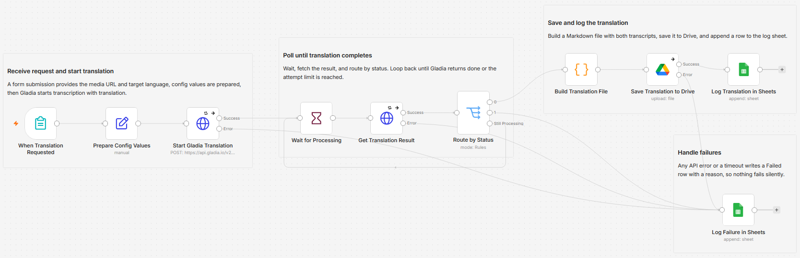

# Translate an audio recording into a target-language transcript using Gladia and Google Drive

[Published n8n template](https://n8n.io/workflows/17139-translate-audio-transcripts-with-gladia-google-drive-and-google-sheets/)

Paste a link to a recording, pick a language, and get back both the original transcript and its translation. I built this so turning a foreign-language clip into something I can read is one form submission, not a chain of tools.

Built with n8n, plus Gladia, Google Drive, and Google Sheets.

## How it works

You submit a form with a public media URL and a target language code. Gladia transcribes the audio and translates it in a single call, then the result is saved to Drive and logged to a sheet.

| Stage | What happens |
|---|---|
| Form trigger | You submit a publicly reachable audio or video URL and a target language code such as `en` or `fr`. |
| Prepare config | A Set node holds the poll interval and attempt limit and normalizes the target language. |
| Start translation | The URL is sent to Gladia with transcription and translation turned on. Source language is auto-detected. |
| Poll | The workflow waits, fetches the job, and routes on status. It loops until Gladia returns done, or stops after a set number of attempts. |
| Save and log | A Code node builds a Markdown file with the original transcript and the translation, saves it to Drive, and appends a row to the log sheet. |
| Failures | Any API error or a timeout writes a Failed row with a reason, so nothing is lost silently. |

The single call is the point. Gladia detects the source language, transcribes, and translates in one pre-recorded job, so the file you get back holds both languages side by side without a separate translation step.

## Setup

1. Import `workflow.json` into n8n. It imports inactive, so configure it before turning it on.
2. Create a Header Auth credential named `Gladia` with header name `x-gladia-key` and your Gladia API key. It is used by both Gladia HTTP nodes.
3. Connect a Google Drive credential and set the destination folder on "Save Translation to Drive".
4. Connect a Google Sheets credential and pick the spreadsheet and tab for the log on both "Log Translation in Sheets" and "Log Failure in Sheets".
5. Open the form URL on "When Translation Requested" and submit a public media URL to test.

## The config node

Everything you tune lives in one Set node, "Prepare Config Values":

| Field | What it controls |
|---|---|
| `wait_seconds` | How long to wait between each poll of the Gladia job. |
| `max_attempts` | How many polls before the run gives up and logs a timeout. The default 10 seconds times 60 attempts is a 10 minute ceiling. |

The media URL and the target language come from the form and are normalized here, so the rest of the workflow reads clean values.

## The log sheet

Both the success and failure paths append to the same sheet, so it doubles as an audit trail. The columns are Timestamp, Media URL, Detected Language, Target Language, Status, Translation Link, and Detail. A successful run writes Translated with a link to the file, and a failed run writes Failed with the reason.

## What is in this folder

| File | What it is |
|---|---|
| `README.md` | This overview |
| `TEMPLATE-DESCRIPTION.md` | The n8n Creator hub listing text |
| `workflow.json` | The importable n8n workflow |
| `images/` | The workflow overview image |

---

All sample data is fictional. No real credentials, IDs, or endpoints are included.

Part of the [n8n-exekyute-templates](../../) collection. MIT licensed.
