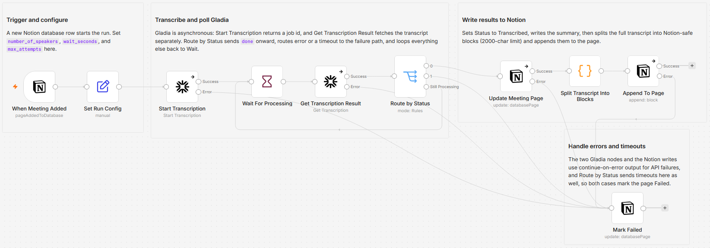

# Transcribe Notion Meeting Recordings with Gladia

[Published n8n template](https://n8n.io/workflows/16957-transcribe-and-summarize-notion-meeting-recordings-with-gladia/)

> **Self-hosted n8n only.** This template uses the [`n8n-nodes-gladia`](https://www.npmjs.com/package/n8n-nodes-gladia) community node, which is not available on n8n Cloud.

When a meeting recording is added to a Notion database, this workflow transcribes and summarizes it with [Gladia](https://www.gladia.io) and writes the summary and full transcript back onto the same page. Notion in, Notion out: the meetings database stays the single source of truth while it quietly turns into a searchable transcript library. Transcription is a background job on Gladia's side, so the workflow polls on a timer instead of blocking.

Built with n8n, plus Gladia and Notion.

## Use it when

- Meeting recordings pile up in a Notion database as links nobody replays. Each new row gets a summary and a full transcript on the same page, automatically.
- You copy transcripts by hand between a transcription tool and Notion. Here the transcript lands where the meeting row already lives, so a plain Notion search finds what was said.
- Someone asks what was decided three meetings ago. Searching the database finds the sentence instead of a recording you would have to replay.

## How it works

A new row in the Notion meetings database starts the run. The recording URL goes to Gladia, which transcribes asynchronously with speaker diarization and summarization, and the workflow checks back on a timer until the job finishes or times out. The results are written straight back onto the page that triggered the run.

| Stage | What happens |
|---|---|
| When Meeting Added | A row added to the Notion meetings database triggers the run |
| Set Run Config | One Set node holds the speaker count, poll interval, and attempt limit |
| Start Transcription | Sends the recording URL to Gladia with diarization and summarization enabled; Gladia returns a job id |
| Wait For Processing, Get Transcription Result, Route by Status | Waits, fetches the job, and routes on status, looping until Gladia returns `done` or the attempt limit runs out |
| Update Meeting Page | On `done`, sets Status to `Transcribed` and writes the Summary |
| Split Transcript Into Blocks, Append To Page | Splits the transcript into chunks under 1900 characters (Notion caps a text block at 2000) and appends one block per chunk, in order, under a Full Transcript heading |
| Mark Failed | Any API error or a timeout sets Status to `Failed` and records the last status, so nothing fails silently |

I keep the poll interval and attempt limit in Set Run Config so tuning for a two-hour recording means editing one node, not opening the loop.

## Requirements

- A Gladia account and API key from [app.gladia.io](https://app.gladia.io). Transcription is a paid feature billed per minute of audio, so check your plan before large batches.
- A Notion integration with read and write access to the meetings database.
- Self-hosted n8n with the `n8n-nodes-gladia` community node.

## Setup

1. Import `workflow.json` into n8n. It imports inactive; configure before activating.
2. Install the community node: **Settings, Community Nodes, Install**, then `n8n-nodes-gladia`.
3. Add a **Gladia API** credential (key from [app.gladia.io](https://app.gladia.io)) and a **Notion API** credential. Credential references in `workflow.json` are placeholders, so n8n prompts you to pick your own on import.
4. Open **When Meeting Added** and select your meetings database. It ships with the `REPLACE_WITH_MEETINGS_DATABASE_ID` placeholder.
5. Share that database with your Notion integration so the API can read and write it.
6. Add a test row with a recording URL, run once, confirm the page, then activate.

## The config node

Everything you tune lives in one Set node, **Set Run Config**:

| Field | Default | Controls |
|---|---|---|
| `number_of_speakers` | 2 | Diarization speaker count |
| `wait_seconds` | 10 | Poll interval between status checks |
| `max_attempts` | 60 | Poll attempts before the run times out as failed. The default 10 seconds times 60 attempts is a 10 minute ceiling; raise it for long meetings |

## The meetings database schema

The workflow assumes these columns; rename them in the nodes if yours differ.

| Property | Type | Used for |
|---|---|---|
| `Recording URL` | URL | Publicly reachable link to the audio file |
| `Status` | Status | Set to `Transcribed` on success, `Failed` otherwise |
| `Summary` | Text | The AI summary (or the failure reason) is written here |

Add both a `Transcribed` and a `Failed` option to the `Status` property. Notion's native AI Meeting Notes audio is not exposed by the public Notion API, so the recording column is one you populate yourself, from a recorder, a Zoom or Meet export, Drive, and so on.

If the recording is an uploaded file rather than a link, change the **Audio URL** field on **Start Transcription** to read the file URL, for example `={{ $json['Recording'].first().url }}`. Notion-hosted file URLs are temporary signed links, valid about an hour, but Gladia downloads them immediately, so this still works.

## Customize

- Tune `number_of_speakers`, `wait_seconds`, and `max_attempts` in **Set Run Config** without opening the loop nodes.
- Turn off diarization or change the summary type in **Start Transcription**.
- Add a Slack or email notification on the **Mark Failed** path to hear about failed jobs.
- Batch **Append To Page** in groups of 100 if a transcript ever exceeds 100 blocks; Notion's API appends at most 100 child blocks per request.

## What is in this folder

| File | What it is |
|---|---|
| `README.md` | This overview |
| `TEMPLATE-DESCRIPTION.md` | The n8n Creator hub listing text |
| `workflow.json` | The importable n8n workflow |
| `images/workflow.png` | The workflow on the n8n canvas |

---

All sample data is fictional. No real credentials, IDs, or endpoints are included.

Part of the [n8n-exekyute-templates](../../README.md) collection. MIT licensed.
