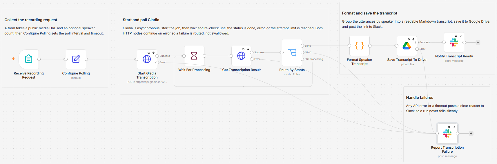

# Transcribe recordings into speaker-labeled notes using Gladia and Google Drive

[Published n8n template](https://n8n.io/workflows/17138-transcribe-speaker-labeled-recordings-with-gladia-google-drive-and-slack/)

Paste a public link to a call, interview, or meeting recording and get back a clean transcript that marks who spoke and when, saved to Google Drive as Markdown with the link posted to Slack. Gladia does the transcription with speaker diarization turned on, and a Code node folds the diarized utterances into readable timestamped blocks. Because it calls the Gladia REST API through the core HTTP Request node, it runs on n8n Cloud as well as self-hosted.

Built with n8n, plus Gladia, Google Drive, and Slack.



## Use it when

- You finish an interview or discovery call and the part you need is who said what. Most transcription output buries the speakers or makes you copy them out by hand; this hands you labeled blocks with timestamps.
- A recording sits at a public URL and you want the transcript in a Drive folder without opening another app. Paste the link into the form and the file arrives with a Slack ping.
- You transcribe recordings occasionally and a full transcription suite is not worth paying for. Gladia billing follows your Gladia plan and the workflow adds nothing on top.

## How it works

You submit a form with a recording URL and an optional speaker count. The workflow hands the recording to Gladia with diarization on, polls the asynchronous job until it finishes, then formats the utterances into a readable transcript and saves it to Drive.

| Stage | What happens |
|---|---|
| Receive Recording Request | The form takes a public audio or video URL and an optional speaker count |
| Configure Polling | Holds the two polling knobs, `wait_seconds` and `max_attempts` |
| Start Gladia Transcription | Sends the recording to the Gladia pre-recorded API with diarization enabled and gets back a job id |
| Wait For Processing / Get Transcription Result | Waits, then re-checks the job until Gladia reports it is done |
| Route By Status | Passes `done` on to formatting and routes `error` or a timeout to the failure path |
| Format Speaker Transcript | Groups consecutive utterances by speaker and writes lines like `Speaker 1 [00:12]: ...` |
| Save Transcript To Drive | Uploads the transcript to Google Drive as a Markdown file |
| Notify Transcript Ready / Report Transcription Failure | Posts the Drive link to Slack, or a clear failure reason instead |

I call the Gladia REST API with the core HTTP Request node rather than a community node so the same workflow runs on n8n Cloud and self-hosted without changes.

## Requirements

- A Gladia account and API key. Billing follows your Gladia plan.
- A Google account with a Drive folder for the transcripts.
- A Slack workspace with a channel for the notifications.
- A recording reachable at a public URL. The speaker count is a hint to Gladia, not a hard limit.
- n8n (cloud or self-hosted) with Header Auth, Google Drive, and Slack credentials.

## Setup

1. Import `workflow.json` into n8n. It imports inactive; configure before using it.
2. Create a Header Auth credential named `Gladia` with header name `x-gladia-key` and your Gladia API key. Select it on both `Start Gladia Transcription` and `Get Transcription Result`.
3. Connect your Google Drive account on `Save Transcript To Drive` and pick the folder that should hold the transcripts.
4. Connect Slack on `Notify Transcript Ready` and `Report Transcription Failure` and pick a channel.
5. Open the form from the trigger node, paste a public recording URL, and submit.

## The transcript format

The readable, diarized output is the point of the workflow. `Format Speaker Transcript` walks Gladia's `result.transcription.utterances`, groups consecutive lines from the same speaker, and stamps each block with its start time:

```
Speaker 1 [00:00]: Thanks for joining today.
Speaker 2 [00:04]: Happy to be here.
```

Speaker indexes from Gladia are zero based, so the node relabels 0/1/2 to Speaker 1/2/3. If a recording comes back without diarized utterances, it falls back to the plain full transcript so nothing is lost.

## Polling and failures

Gladia is asynchronous, so the workflow starts a job and then polls. `Configure Polling` holds the two knobs: `wait_seconds` between checks and `max_attempts` before giving up (default 10 seconds times 60 attempts, about 10 minutes). Both Gladia HTTP nodes and the Drive upload use continue on error, so a transient API error or a timeout routes to Slack with a reason instead of failing silently.

## Customize

- **Polling pace.** Change `wait_seconds` and `max_attempts` in `Configure Polling` to fit how long your recordings run.
- **Transcript layout.** Adjust the block format, the timestamps, or the file name in `Format Speaker Transcript`.
- **Destination.** Point `Save Transcript To Drive` at a different folder, or swap the Slack steps for Gmail.
- **Speaker labels.** The relabeling from zero-based indexes lives in the same Code node; rename speakers there if you want real names.

## What is in this folder

| File | What it is |
|---|---|
| `README.md` | This overview |
| `TEMPLATE-DESCRIPTION.md` | The n8n Creator hub listing text |
| `workflow.json` | The importable n8n workflow |
| `images/workflow.png` | The workflow on the n8n canvas |

---

All sample data is fictional. No real credentials, IDs, or endpoints are included.

Part of the [n8n-exekyute-templates](../../README.md) collection. MIT licensed.
