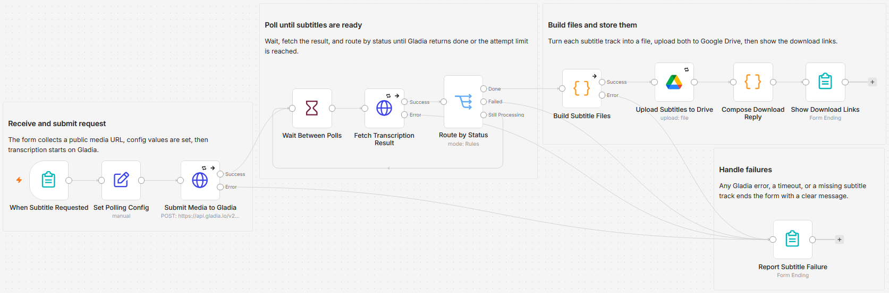

# Generate SRT and VTT subtitle files from a media URL using Gladia and Google Drive

[Published n8n template](https://n8n.io/workflows/16994-generate-srt-and-vtt-subtitles-from-media-urls-with-gladia-and-google-drive/)

Submit a public audio or video URL through a form and get back two subtitle files, an
SRT and a VTT, uploaded to Google Drive with both download links shown on the form.
Gladia's speech-to-text API returns SRT and VTT directly, so no step rebuilds captions
from a raw transcript.

Built with n8n, plus Gladia and Google Drive.

## Use it when

- A video is done and the captions are not. Paste the link, wait for the
  transcription, and pull both files from Drive.
- Different platforms want different formats: YouTube and most editors take SRT, web
  players want VTT. One submission produces both.
- Someone who has never opened n8n needs captions. The form is the whole interface,
  so you can hand them the link.

## How it works

You submit one form. The workflow sends your URL to Gladia, polls until the
transcription finishes, turns each subtitle track into a file, stores both in Google
Drive, and shows you the links. Gladia is asynchronous: the submit call returns a job
id, and the result is fetched separately once processing finishes.

| Stage | What happens |
|---|---|
| When Subtitle Requested | The form takes a public media URL and an optional title for the files |
| Set Polling Config | Holds `wait_seconds` and `max_attempts`, the two polling knobs |
| Submit Media to Gladia | Sends the URL to Gladia and requests SRT and VTT subtitles in one call |
| Wait Between Polls, Fetch Transcription Result, Route by Status | Checks Gladia on a loop until the job is done, has failed, or is out of attempts |
| Build Subtitle Files | A Code node reads the finished result and turns each track into a subtitle file |
| Upload Subtitles to Drive | Stores both files in the Drive folder you pick |
| Compose Download Reply, Show Download Links | Builds the reply and shows the two Drive links on the form |
| Report Subtitle Failure | Sits on the error output of the submit, fetch, and build steps, and shows a plain message when the job fails or polling times out |

I cap the loop with `max_attempts` so a stalled job ends with a clear message instead of spinning forever.

## Requirements

- A Gladia account and API key. Transcription is billed by Gladia under your plan, so
  check your usage before large batches.
- A Google account with a Drive folder for the subtitle files.
- n8n (cloud or self-hosted) with Header Auth and Google Drive credentials.

## Setup

1. Import `workflow.json` into n8n. It imports inactive; configure before using it.
2. Create a Header Auth credential named `Gladia` with header name `x-gladia-key` and
   your Gladia API key. Select it on "Submit Media to Gladia" and "Fetch Transcription Result".
3. Connect your Google Drive account on "Upload Subtitles to Drive" and set the folder.
4. Open the form with the Test URL, and submit a public link to an audio or video file.

## Formats and polling

| Setting | Where | What it does |
|---|---|---|
| `formats` | "Submit Media to Gladia" body | The subtitle formats Gladia returns. Ask for `["srt", "vtt"]`, or just one. |
| `wait_seconds` | "Set Polling Config" | Seconds between each poll of Gladia. Default is 10. |
| `max_attempts` | "Set Polling Config" | How many polls before the run times out. Default is 60, so 10 seconds times 60 gives up to about 10 minutes. |

The Media URL must be publicly reachable, since Gladia fetches it directly. A link
that needs a login or sits on a private network will not work.

## Customize

- Ask for only SRT or only VTT in the "Submit Media to Gladia" body.
- Change the file names in "Build Subtitle Files"; the Drive upload takes its name from there.
- Point "Upload Subtitles to Drive" at a different folder.
- Swap the form trigger for a webhook to run it from another system.
- Raise `wait_seconds` and `max_attempts` for long recordings.

## What is in this folder

| File | What it is |
|---|---|
| `README.md` | This overview |
| `TEMPLATE-DESCRIPTION.md` | The n8n Creator hub listing text |
| `workflow.json` | The importable n8n workflow |
| `images/workflow.png` | The workflow on the n8n canvas |

---

All sample data is fictional. No real credentials, IDs, or endpoints are included.

Part of the [n8n-exekyute-templates](../../README.md) collection. MIT licensed.
