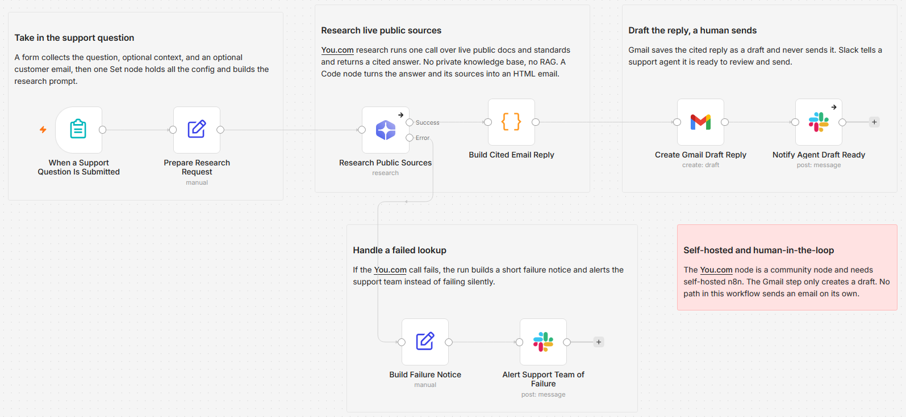

# Draft cited support replies from live public docs using You.com and Gmail

[Published n8n template](https://n8n.io/workflows/17335-draft-cited-support-replies-from-public-docs-with-youcom-gmail-and-slack/)

A support question comes in about a third-party API, a public standard, or a documented tool. You.com researches the live public web, writes an answer with real citations, and saves it as a Gmail draft. A human reads the sources and hits send. I built this for the support questions whose answer lives in someone else's public docs, not in your own knowledge base.

Built with n8n, plus You.com and Gmail, with an optional Slack ping.

> Self-hosted n8n only. This template uses the You.com community node `@youdotcom-oss/n8n-nodes-youdotcom`, which can only be installed on a self-hosted instance. The Cloud path is covered under Tweaks and constraints below.

## What it is for

Most cited-reply support workflows ground on your own private docs with retrieval-augmented generation. That is the right tool when the answer is inside your knowledge base, and it is a crowded lane. This one covers the other half: questions whose answer lives in a public source you do not own.

- Third-party API and SaaS reseller support, where the truth is the vendor's own documentation and changelog.
- Regulatory and compliance questions, where the answer is a public standard or a government page.
- IT support for public tools, where a help center or status page has the current behavior.

Because You.com reads the live web on every run, the draft reflects what the docs say today, not what a stale index captured months ago. The human-in-the-loop is the point: nothing is sent until an agent reads the cited sources and presses send.

## How it works

A question is submitted through a form. You.com researches public sources in one call and returns a cited answer. The answer is formatted into an email and saved as a Gmail draft for a human to review.

| Stage | What happens |
|---|---|
| Ask | A form takes the question, optional context, and an optional customer email, and a Set node holds the config and builds the research prompt |
| Research | You.com's research operation runs one call over live public sources and returns an answer with inline citations and a list of source URLs |
| Format | A Code node turns the answer and its sources into an HTML email body, with each citation linked to the source it came from |
| Draft | Gmail saves the reply as a draft. The operation is create draft, so nothing is ever sent automatically |
| Notify | Slack pings a support agent that a cited draft is ready to review and send |

The You.com call has its own error branch, so a failed lookup builds a short failure notice and alerts the support team instead of taking down the run or leaving a question unanswered.

## Setup

1. Import `workflow.json` into n8n. It imports inactive, so configure it before activating.
2. Install the You.com community node `@youdotcom-oss/n8n-nodes-youdotcom` under Settings, Community Nodes. This only works on self-hosted n8n.
3. Add credentials for You.com and Gmail, and a Slack credential if you want the ready-to-review ping. Select them on their nodes.
4. Open "Prepare Research Request" to set the research effort and the Slack member ID to mention.
5. In "Notify Agent Draft Ready" and "Alert Support Team of Failure" pick the Slack channel for your support team.
6. Activate the workflow, open the form URL on the trigger, and submit a question to test.

## Configuration

Everything you tune lives in the "Prepare Research Request" node:

| Field | What it controls |
|---|---|
| `researchInput` | The prompt sent to You.com. It scopes the research to public, authoritative sources and asks for a citation on every claim. Edit it to name your own public docs. |
| `researchEffort` | How hard You.com works: `lite`, `standard`, `deep`, or `exhaustive`. Higher effort means more sources and more time. |
| `agentSlackId` | The Slack member ID that gets `@mentioned` when a draft is ready or a lookup fails. |

The question, optional context, and optional customer email come from the form and are normalized here, so the rest of the workflow reads clean values.

## Customize

- Scope `researchInput` to your product's public docs, a vendor's API reference, or a specific standard, so answers stay on the sources you trust.
- Raise `researchEffort` to `deep` or `exhaustive` for gnarly questions, or drop to `lite` for quick lookups.
- Set the draft's recipient by filling the customer email on the form, or leave it blank and let the agent add it.
- Turn the Slack ping off by deleting "Notify Agent Draft Ready" if your team watches the Gmail drafts folder directly.
- Swap the form trigger for a Gmail trigger on a support alias to draft replies straight from inbound email (see Tweaks and constraints).

## Tweaks and constraints

- **Run it on n8n Cloud with a core HTTP Request node.** The You.com node is community-only, but the API is a plain REST call. Replace "Research Public Sources" with an HTTP Request node: `POST https://api.you.com/v1/research`, a Header Auth credential that sends `X-API-Key: your-key`, and a JSON body of `{ "input": "{{ your prompt }}", "research_effort": "standard" }`. The response arrives as `output.content` with `output.sources`, which is exactly what the Code node already reads, so nothing downstream changes. This variant runs anywhere.
- **No source_control in this node version.** You.com's node at v0.2.9 exposes only the research question and the effort level, so there is no parameter to force official domains or a recency window on the research operation. This template steers toward official and public sources through the prompt wording instead. If you need hard domain control, use the You.com search operation, which accepts `site:` query operators and a freshness filter, as a cheaper single-doc path.
- **Gmail trigger variant.** Swap the form trigger for a Gmail trigger watching a support alias, map the email subject and body into "Prepare Research Request", and the rest of the flow drafts a cited reply for every inbound message. Keep the Gmail node on create draft so replies still wait for a human.
- **Cost and latency follow the effort level.** `deep` and `exhaustive` read more sources and take longer per run. Start at `standard` and raise it only for the questions that need it.

## Requirements

- Self-hosted n8n with the `@youdotcom-oss/n8n-nodes-youdotcom` community node (or a core HTTP Request node for the Cloud variant)
- A You.com API key (you.com/platform)
- A Gmail account connected with OAuth2
- Optional: a Slack app with `chat:write` for the ready-to-review ping

## What is in this folder

| File | What it is |
|---|---|
| `README.md` | This overview |
| `TEMPLATE-DESCRIPTION.md` | The n8n Creator hub listing text |
| `workflow.json` | The importable n8n workflow |
| `images/` | The workflow canvas screenshot |

---

All sample data is fictional. No real credentials, IDs, or endpoints are included.

Part of the [n8n-exekyute-templates](../../) collection. MIT licensed.
