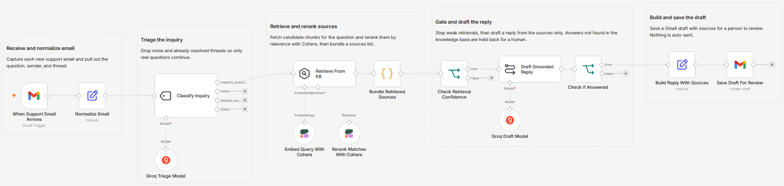
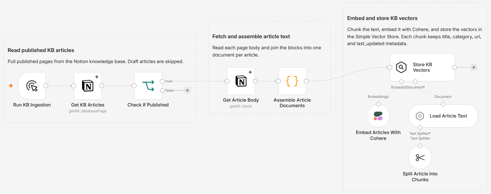

# Draft grounded support replies from a Notion knowledge base using Groq and Gmail

[Published n8n template](https://n8n.io/workflows/16813-draft-grounded-gmail-support-replies-from-a-notion-kb-with-groq-and-cohere/)

Turn inbound support email into sourced, ready-to-review replies grounded in your own Notion knowledge base. This is a retrieval-augmented generation (RAG) assistant: every answer is drafted from articles retrieved for that specific question, and saved as a Gmail draft for a person to approve. Nothing is auto-sent.

Built with n8n, plus Notion, Groq, Cohere, and Gmail.

The worked example is built around "Cadence", a fictional team time-tracking and invoicing SaaS with a 12-article knowledge base. Swap in your own product, articles, and inbox.

## The RAG pipeline

Instead of answering from the model's own training, the workflow retrieves the passages relevant to each question and makes the model answer from those passages only. The five RAG stages map to the workflow like this:

| RAG stage | In this workflow |
|---|---|
| Index | Notion articles are chunked and embedded with Cohere `embed-english-v3.0`, then stored as vectors in the built-in Simple Vector Store with title, category, url, and last_updated metadata |
| Retrieve | The incoming question is embedded with the same model and matched against the store by vector similarity, returning the `topK` candidates |
| Rerank | Cohere `rerank-v3.5` reorders those candidates by true relevance and keeps the top `topN`, which sharpens precision beyond raw vector distance |
| Augment | The retained chunks are assembled into one numbered source block that is injected into the model prompt |
| Generate | Groq answers from that source block only, and returns `NEEDS_HUMAN` when the sources do not support an answer |

Using the same embedding model on both the index and the query side keeps every vector in one space. The reranker and the confidence gate are what separate this from naive embed-and-hope retrieval, and the `NEEDS_HUMAN` check keeps generation honest when retrieval comes up short.

## How it works

The template runs two flows on one canvas: a one-time ingestion that indexes your Notion articles, and the live assistant that answers email.

| Stage | What happens |
|---|---|
| Ingest the KB | `Get KB Articles` reads the Notion database, `Check If Published` keeps only published pages, and `Assemble Article Documents` joins each page's blocks into one document |
| Embed and store | `Split Article Into Chunks` and `Embed Articles With Cohere` chunk and embed each article, and `Store KB Vectors` loads them into the built-in Simple Vector Store with title, category, url, and last_updated metadata |
| Triage the email | A Gmail trigger captures each new message, `Normalize Email` pulls out the question, and a Groq classifier drops noise and already-resolved threads |
| Retrieve and rerank | `Retrieve From KB` fetches candidate chunks, `Rerank Matches With Cohere` reorders them by relevance, and a confidence gate stops weak matches before any model call |
| Draft and hold | Groq drafts a reply from the retrieved sources only, and returns `NEEDS_HUMAN` when the sources fall short so unanswerable questions are held back |
| Save for review | `Build Reply With Sources` appends a sources list and `Save Draft For Review` saves it as a Gmail draft. Nothing is sent automatically |

Two guardrails keep the assistant from guessing: a relevance gate before the model, and a `NEEDS_HUMAN` check after it. Together they mean a question the knowledge base cannot support never gets an invented answer.

*Ingestion reads published Notion articles, chunks and embeds them with Cohere, and loads the Simple Vector Store.*

## Setup

1. Import `workflow.json` into n8n. It imports inactive, so configure it before activating.
2. Connect the Notion, Groq, Cohere, and Gmail credentials in the credential store.
3. In `Get KB Articles`, select your knowledge base database in place of the `YOUR_NOTION_DATABASE_ID` placeholder. The database needs Status, Title, Category, and Last Updated properties.
4. In `When Support Email Arrives`, set the search query (for example `to:support@yourcompany.com`).
5. Run `Run KB Ingestion` once to build the vector store.
6. Activate the workflow.

## Configuration

| Field | Where | What it controls |
|---|---|---|
| `minRelevance` | `Normalize Email` | How strict the confidence gate is before the model runs |
| `topK` | `Retrieve From KB` | How many candidate chunks are retrieved |
| `topN` | `Rerank Matches With Cohere` | How many reranked chunks reach the model |
| categories | `Classify Inquiry` | The triage buckets that decide which emails continue |

## How the grounding works

The assistant answers from retrieved sources only, with two independent guardrails:

1. **Relevance gate.** `Bundle Retrieved Sources` scores the retrieval, and `Check Retrieval Confidence` stops anything below `minRelevance` before the model is ever called.
2. **NEEDS_HUMAN check.** The draft prompt is told to answer only from the numbered sources and to reply with exactly `NEEDS_HUMAN` when they fall short. `Check If Answered` routes those cases away from the customer and leaves them for a person.

A question the knowledge base cannot support does not get a drafted answer, and no draft is ever sent on its own.

## Customize

- Swap the Groq model in the two model nodes.
- Tune `topK` in `Retrieve From KB` and `topN` in `Rerank Matches With Cohere`.
- Adjust `minRelevance` in `Normalize Email` to make the confidence gate stricter or looser.
- Edit the categories in `Classify Inquiry` to match your inbox.

## Requirements

- n8n (self-hosted or cloud) with the LangChain nodes
- Notion account with an internal integration and a knowledge base database (Status, Title, Category, Last Updated properties)
- Groq API key
- Cohere API key
- Gmail account connected over OAuth2

All four services use the n8n credential store. No keys are stored in the workflow.

## Scaling notes

The Simple Vector Store is in-memory: it runs on a single instance, clears on restart, and does no metadata filtering. Re-run ingestion after a restart. For larger or multi-tenant knowledge bases, swap in Qdrant, Pinecone, or Weaviate for persistence, metadata and permission filters, and hybrid keyword plus vector search. The embedding model and the store are coupled, so changing the embedding model means re-running ingestion.

## What is in this folder

| File | What it is |
|---|---|
| `README.md` | This overview |
| `TEMPLATE-DESCRIPTION.md` | The n8n Creator hub listing text |
| `workflow.json` | The importable n8n workflow |
| `images/workflow.png` | The support assistant flow on the n8n canvas |
| `images/workflow-ingestion.png` | The knowledge base ingestion flow |

---

All sample data is fictional. No real credentials, IDs, or endpoints are included.

Part of the [n8n-exekyute-templates](../../README.md) collection. MIT licensed.
