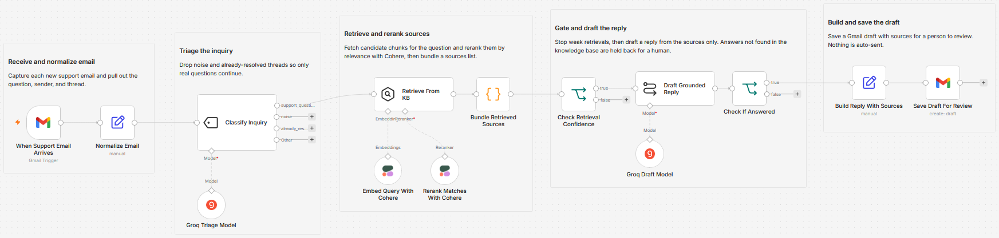
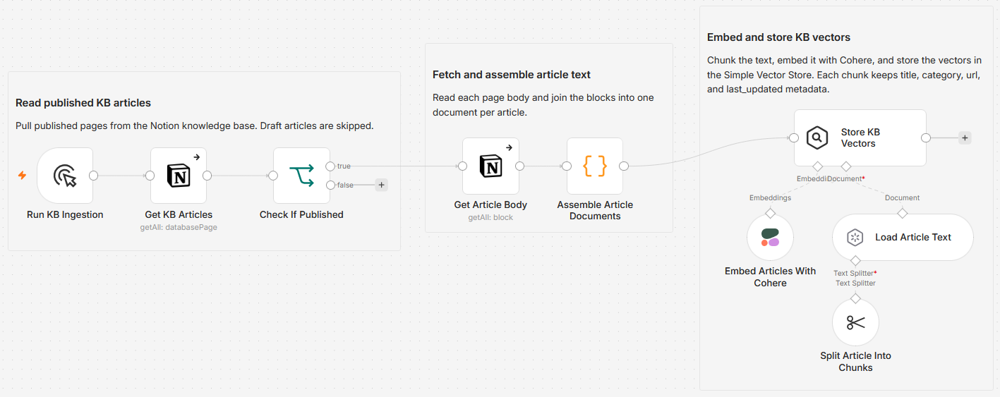

# Draft grounded support replies from a Notion knowledge base using Groq and Gmail

[Published n8n template](https://n8n.io/workflows/16813-draft-grounded-gmail-support-replies-from-a-notion-kb-with-groq-and-cohere/)

Turn inbound support email into sourced, ready-to-review replies grounded in your own Notion knowledge base. Two independent gates keep the model from guessing: a relevance threshold stops weak retrievals before the model runs, and a draft the sources cannot support comes back as `NEEDS_HUMAN` and never reaches the reply. Nothing is auto-sent; every reply waits as a Gmail draft for a person to approve.

Built with n8n, plus Notion, Groq, Cohere, and Gmail.

## Use it when

- Support questions land in Gmail and the answers already live in Notion, but every reply means hunting through pages and pasting by hand. Each question instead comes back as a Gmail draft citing the articles it drew from.
- A generic chatbot invents answers your docs never gave. Here the model answers from retrieved articles only, and anything the knowledge base cannot support is held back for a human.

## How it works

The template runs two flows on one canvas: a one-time ingestion that indexes your Notion articles, and the live assistant that answers email.

| Stage | What happens |
|---|---|
| Run KB Ingestion | A manual trigger starts the one-time indexing pass |
| Get KB Articles and Check If Published | Reads the Notion database and keeps only published pages |
| Assemble Article Documents and Split Article Into Chunks | Joins each page's blocks into one document, then chunks it |
| Embed Articles With Cohere and Store KB Vectors | Embeds the chunks and loads the Simple Vector Store with title, category, url, and last_updated metadata |
| When Support Email Arrives and Normalize Email | Captures each new message and pulls out the question |
| Classify Inquiry | A Groq classifier drops noise and already-resolved threads |
| Retrieve From KB and Rerank Matches With Cohere | Fetches candidate chunks, then reorders them by true relevance |
| Bundle Retrieved Sources and Check Retrieval Confidence | Scores the retrieval and stops anything below `minRelevance` before the model is called |
| Draft Grounded Reply and Check If Answered | Groq drafts from the retrieved sources only, and `NEEDS_HUMAN` replies are held back |
| Build Reply With Sources and Save Draft For Review | Appends the sources list and saves a Gmail draft. Nothing is sent automatically |

I embed the query with the same Cohere model as the articles so every vector lives in one space. Both gates fail closed rather than falling back to the model's own knowledge, and I will take a blocked draft over a confident wrong answer in a customer's inbox.

## Requirements

- A Notion account with an internal integration and a knowledge base database with Status, Title, Category, and Last Updated properties.
- Groq and Cohere API keys.
- A Gmail account connected over OAuth2.
- n8n (cloud or self-hosted) with the LangChain nodes. All four services use the n8n credential store; no keys are stored in the workflow.

## Setup

1. Import `workflow.json` into n8n. It imports inactive; configure before activating.
2. Connect the Notion, Groq, Cohere, and Gmail credentials.
3. In "Get KB Articles", select your knowledge base database in place of the `YOUR_NOTION_DATABASE_ID` placeholder.
4. In "When Support Email Arrives", set the search query (for example `to:support@yourcompany.com`).
5. Run "Run KB Ingestion" once to build the vector store, then activate the workflow.

## The RAG pipeline

The worked example is built around "Cadence", a fictional team time-tracking and invoicing SaaS; swap in your own product, articles, and inbox. The five RAG stages map to the workflow like this:

| RAG stage | In this workflow |
|---|---|
| Index | Notion articles are chunked and embedded with Cohere `embed-english-v3.0`, then stored in the built-in Simple Vector Store |
| Retrieve | The incoming question is embedded with the same model and matched by vector similarity, returning the `topK` candidates |
| Rerank | Cohere `rerank-v3.5` reorders those candidates by true relevance and keeps the top `topN` |
| Augment | The retained chunks are assembled into one numbered source block injected into the model prompt |
| Generate | Groq answers from that source block only, and returns `NEEDS_HUMAN` when the sources do not support an answer |

*Ingestion reads published articles, chunks and embeds them, and loads the store. The store is in-memory: it runs on a single instance, clears on restart, and does no metadata filtering, so re-run ingestion after a restart.*

## The two gates

Retrieval confidence is checked first: when the best reranked match scores below `minRelevance` (default 0.3, set in "Normalize Email"), the draft model is never called and no draft is written. The draft prompt is the second gate: it answers from the numbered sources only and replies with exactly `NEEDS_HUMAN` when they fall short, which `Check If Answered` holds back from the customer. Upstream, `topK` in "Retrieve From KB" (default 8) and `topN` in "Rerank Matches With Cohere" (default 4) set how many chunks are retrieved and how many survive the rerank. Tightening any of the three trades coverage for trust; the price is more questions a person answers by hand.

## Customize

- Swap the model in "Groq Triage Model" and "Groq Draft Model" (both on `llama-3.3-70b-versatile`), and edit the categories in "Classify Inquiry" to match your inbox.
- Swap the Simple Vector Store for Qdrant, Pinecone, or Weaviate to get persistence, metadata and permission filters, and hybrid keyword plus vector search on larger or multi-tenant knowledge bases.
- Changing the embedding model means re-running ingestion; the model and the store are coupled.

## What is in this folder

| File | What it is |
|---|---|
| `README.md` | This overview |
| `TEMPLATE-DESCRIPTION.md` | The n8n Creator hub listing text |
| `workflow.json` | The importable n8n workflow |
| `images/workflow.png` | The support assistant flow on the n8n canvas |
| `images/workflow-ingestion.png` | The knowledge base ingestion flow |

---

All sample data is fictional. No real credentials, IDs, or endpoints are included.

Part of the [n8n-exekyute-templates](../../README.md) collection. MIT licensed.
