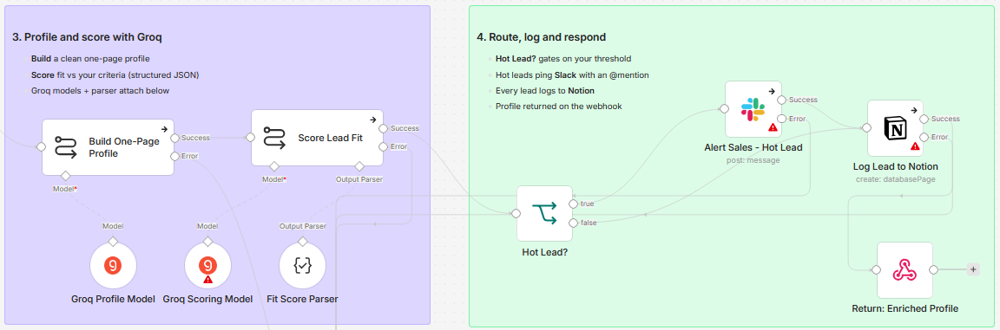
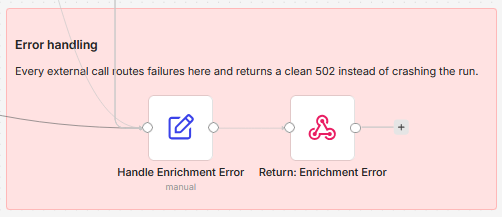

# Enrich and route inbound leads with You.com, Groq, Notion and Slack

[Published n8n template](https://n8n.io/workflows/16504-enrich-and-route-inbound-leads-using-youcom-groq-notion-and-slack/)

> Self-hosted n8n only. This template uses the You.com community node `@youdotcom-oss/n8n-nodes-youdotcom`, which can only be installed on a self-hosted instance.

Turn a raw company name or domain into a qualified, one-page lead profile before a human ever opens it. You.com gathers recent signals and reads the company site, Groq writes the profile and scores fit against your criteria, and hot leads page Slack while every lead lands in Notion.

Built with n8n, plus You.com, Groq, Notion, and Slack.

## Use it when

- A form submission lands with nothing but a company name, and whoever picks it up spends twenty minutes searching before they can tell whether the lead matters.
- Hot leads cool off in a shared inbox while everything gets equal attention. Scoring at intake pages the channel for the one signup worth a same-day call, and every lead still lands in Notion with a score, tier, and summary.

## How it works

A lead is POSTed to the webhook, normalized, and checked. You.com gathers signals and site content, and Groq turns that into a profile and a score. The score decides the route.

| Stage | What happens |
|---|---|
| Lead Intake Webhook | Takes a company name or domain, and "Set Config & Normalize Input" normalizes it and holds all the config in one place |
| Has Valid Lead Input? | Rejects empty input with a clean `400` through "Return: Missing Input" before any API call is spent |
| Web Search - Company Signals | You.com pulls recent signals: funding, news, leadership |
| Resolve Company URL | Picks the best company URL, "Content Extraction - Company Site" reads the site, and "Assemble Enrichment Context" merges it all into one context blob |
| Build One-Page Profile | A Groq chain writes the one-page profile |
| Score Lead Fit | A second Groq chain scores fit against your criteria and returns structured JSON: score, tier, reasons, action |
| Hot Lead? | At or above your threshold, "Alert Sales - Hot Lead" pings Slack with an `@mention`; every lead then flows to "Log Lead to Notion" and "Return: Enriched Profile" answers the webhook |
| Handle Enrichment Error | Failed search, Groq, Slack, or Notion calls land here, and "Return: Enrichment Error" answers with a standardized `502` |

I give every external call its own error branch so one failure returns a clean `502` instead of taking down the run, except content extraction, which falls through and lets the profile run on the search signals alone.

## Requirements

- Self-hosted n8n with the `@youdotcom-oss/n8n-nodes-youdotcom` community node
- A You.com API key (you.com/platform) and a Groq API key (console.groq.com)
- A Notion integration with a target database, and a Slack app with `chat:write`

## Setup

1. Import `workflow.json` into n8n. It imports inactive; configure before activating.
2. Install the You.com community node `@youdotcom-oss/n8n-nodes-youdotcom` under Settings, Community Nodes (self-hosted only), then add credentials for You.com, Groq, Notion, and Slack and select them on their nodes.
3. Open "Set Config & Normalize Input" to set your fit criteria, the hot-score threshold, and the Slack member ID to mention.
4. In "Alert Sales - Hot Lead" pick the Slack channel, and in "Log Lead to Notion" select a database with Fit Score (number), Tier (select), and Summary (rich text) properties.
5. Activate the workflow and POST a lead to the webhook.

## The config node

| Field | What it controls |
|---|---|
| `hotScoreThreshold` | The score at or above which a lead is hot and pages Slack, `70` by default |
| `slackMentionId` | The Slack member ID that gets `@mentioned` on a hot lead |
| `fitCriteria` | The ideal customer profile text the scoring model judges against |
| `searchFreshness` | The recency window for the You.com search (for example `month`) |

## The routing and error lanes

*Groq builds the profile and scores fit, then the score gates the Slack alert, the Notion log, and the webhook response.*

*Failed search, Groq, Slack, and Notion calls land here and return a standardized `502`.*

## Customize

- Edit the scoring prompt and `fitCriteria` to match your ICP.
- Raise or lower `hotScoreThreshold` to control how many leads page the team, route Warm and Cold tiers to different Slack channels, or skip the alert below a tier.
- Extend the Notion mapping to store the key reasons and recommended action.
- Swap the Groq model on the two model nodes without touching the rest of the flow.

## What is in this folder

| File | What it is |
|---|---|
| `README.md` | This overview |
| `TEMPLATE-DESCRIPTION.md` | The n8n Creator hub listing text |
| `workflow.json` | The importable n8n workflow |
| `images/workflow.png` | Intake and enrichment on the canvas |
| `images/workflow-profile-routing.png` | Profile, score, and routing on the canvas |
| `images/workflow-error-handling.png` | The error handling lane |

---

All sample data is fictional. No real credentials, IDs, or endpoints are included.

Part of the [n8n-exekyute-templates](../../README.md) collection. MIT licensed.
