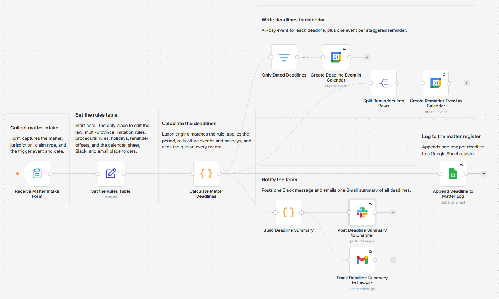

# Calculate litigation limitation deadlines and reminders in Google Calendar

[Published n8n template](https://n8n.io/workflows/16993-calculate-litigation-deadlines-from-intake-forms-with-google-calendar-sheets-slack-and-gmail/)

> **Not legal advice.** This template is a scheduling aid. Limitation and procedural rules change and have many exceptions (discoverability, notice periods, suspensions, parties under disability, and more). Verify every date against the current statute and rules of court before relying on it.

Calculate the applicable limitation period and downstream procedural deadlines for a litigation matter from a single intake form, then write them to a calendar, log them, and post staggered reminders. The dates are computed from an editable, jurisdiction-aware rules table with Luxon, and every deadline records the exact rule that produced it.

Built with n8n, plus Google Calendar, Google Sheets, Slack, and Gmail.

## Use it when

- A new matter lands and its key dates need to exist somewhere real before anyone forgets. One form submission produces the calendar events, the register rows, and a summary in Slack and the inbox.
- A date gets questioned months later. Every deadline carries its rule citation plus both the raw statutory date and the adjusted one, so the register shows how each date was computed, not just what it is.
- Reminders set by hand land on weekends, or after the date they warn about. These roll back to the prior working day, and filing deadlines roll forward.

## How it works

The engine emits one record per deadline: the matter details, the deadline type, the computed date, the raw statutory date, whether it was rolled, the days remaining, the rule citation, and the reminder dates. Where no date can be produced (a service or filing anchor for the limitation, or a served date with no procedural rule for the jurisdiction), a dateless "review needed" note is logged and summarized but kept out of the calendar. A deadline landing past the last year the holiday list covers still rolls off weekends and carries a warning naming the year to extend the list to.

| Stage | What happens |
|---|---|
| Receive Matter Intake Form | Collects the matter, the trigger event (date of loss or act, discovery, service, or filing), the jurisdiction, and the claim type |
| Set the Rules Table | One config node holding the limitation rules, procedural rules, holidays, reminder offsets, and output targets |
| Calculate Matter Deadlines | Matches the rule and computes the basic limitation from a discovery or loss/act anchor, the ultimate limitation where the rule defines one and the trigger is the act or omission date, and service-driven procedural deadlines; rolls filing deadlines forward off weekends and listed holidays, drops reminders already in the past, and cites the rule on every record |
| Append Deadline to Matter Log | Appends one row per deadline to the Google Sheets register, dated rows and review notes alike |
| Only Dated Deadlines, Create Deadline Event in Calendar | Filters out the dateless review notes, then creates one all-day event per deadline |
| Split Reminders Into Rows, Create Reminder Event in Calendar | Creates one all-day event per surviving reminder, 90, 30, and 7 days out by default |
| Build Deadline Summary, Post Deadline Summary to Channel, Email Deadline Summary to Lawyer | Assembles one plain-language summary citing each rule applied, posts it to Slack, and emails it through Gmail |

I made the engine refuse to anchor a limitation on a service or filing date, because a date that overstates the time remaining is worse than none: the review note names the correct anchor, and the procedural deadlines still compute from the service date.

## Requirements

- n8n (cloud or self-hosted) with Google Calendar, Google Sheets, Gmail, and Slack credentials. No AI keys and no paid APIs.
- A Google Sheet for the deadline log, with a header row matching the columns the log node writes: Matter, Client, Jurisdiction, Claim type, Deadline type, Deadline, Due date, Statutory date, Rolled, Days until, Rule cited, Basis, Calculated from.

## Setup

1. Import `workflow.json` into n8n. It imports inactive; configure before activating.
2. Open each Google Calendar, Google Sheets, Gmail, and Slack node and select your credentials.
3. Open "Set the Rules Table" and replace the placeholders: `calendarId`, `logSpreadsheetId`, `logSheetName`, `slackChannel`, `fallbackNotifyEmail`.
4. Review `limitationRules`, `proceduralRules`, and `holidays`, and adjust them for the jurisdictions you practise in.
5. Open the form trigger to get its URL, submit a test matter, and confirm the calendar, sheet, Slack, and email outputs, then activate.
6. Recommended: set a workflow-level error workflow in n8n so a failure is surfaced rather than missed.

## The default rules table

Illustrative defaults ship for Ontario, British Columbia, Alberta, Saskatchewan, Manitoba, Nova Scotia, New Brunswick, the federal Crown, and Quebec, across general civil, personal injury and motor vehicle, contract, property damage, defamation, municipal slip and fall, and professional negligence claims. Ontario includes a worked procedural example (statement of defence due 20 days after service). These are starting points to confirm and extend, not a substitute for checking the source.

## Date logic and verification

Year-based periods use the anniversary convention, the same calendar date N years later, which caps February 29 to February 28 in non-leap years. Procedural deadlines count the day after the anchor date as day one, and the business-day roll uses the editable holiday list. The `verification/` folder holds a harness that runs the engine's exact date logic against hand-computed expected dates, covering anniversary roll, leap year, procedural counting, reminder roll-back, past-reminder drop, and validation errors. Run `npm install` then `npm run verify`; [verification/RESULTS.md](verification/RESULTS.md) holds the cases and the latest output.

## Customize

Everything a user changes lives in the "Set the Rules Table" node, so a new jurisdiction or claim type is a table row, not a code change.

- `limitationRules`: jurisdiction to claim type to `{ years, ultimateYears, basis, citation, note }`.
- `proceduralRules`: jurisdiction to a list of `{ name, fromEvent, days, citation }`.
- `holidays`: ISO dates used by the business-day roll.
- `reminderOffsets`: days before each deadline to place a reminder (default `90,30,7`).
- `rollDeadlinesToBusinessDay`, `rollRemindersBackToBusinessDay`: toggle the roll behaviour.
- `timezone`: the zone used for all date math (default `America/Toronto`).

## What is in this folder

| File | What it is |
|---|---|
| `README.md` | This overview |
| `TEMPLATE-DESCRIPTION.md` | The n8n Creator hub listing text |
| `workflow.json` | The importable n8n workflow |
| `package.json` | Runs the verification harness (`npm run verify`); Luxon is the only dependency |
| `verification/` | The date-math harness: `engine-core.mjs`, `date-math-check.mjs`, and `RESULTS.md` |
| `images/workflow.png` | The workflow on the n8n canvas |

---

All sample data is fictional. No real credentials, IDs, or endpoints are included.

Part of the [n8n-exekyute-templates](../../README.md) collection. MIT licensed.
