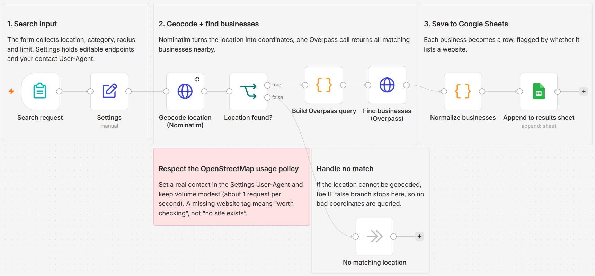

# Find nearby businesses by proximity using OpenStreetMap and save to Google Sheets

[Published n8n template](https://n8n.io/workflows/16997-log-nearby-businesses-from-openstreetmap-to-google-sheets-by-proximity/)

Submit a location and a business category, and the workflow pulls every matching
business within your chosen radius from OpenStreetMap and appends the results to a
Google Sheet, each row flagged by whether the business lists a website. It runs on
Nominatim and Overpass, both free public OpenStreetMap services, so there is no places
API and no API key. A run costs exactly one Nominatim call and one Overpass call no
matter how many businesses come back, well inside OpenStreetMap's free usage policy.

Built with n8n, plus OpenStreetMap (Nominatim and Overpass) and Google Sheets.

## Use it when

- You need a quick list of local businesses in a spreadsheet, with names, addresses,
  and phone numbers, and a paid places API is overkill for the job.
- You are scouting a neighborhood before opening a location and want every business
  in a category within a set radius, with coordinates and hours where OpenStreetMap has them.
- You want the businesses in an area that still lack a website. A `no` in the sheet's
  `website_on_file` column means OpenStreetMap has no record of one, not proof that none exists.

## How it works

Nominatim turns the submitted location into coordinates with a single request; when it
finds nothing, the run ends cleanly instead of querying Overpass with bad coordinates.
A Code node maps the chosen category to OpenStreetMap tags and writes an Overpass
query, and one call returns every match in the radius. Each result becomes one sheet row.

| Stage | What happens |
|---|---|
| Search request | The form collects a location, a category, a radius (500 to 5,000 meters, default 2,000), and a result cap (default 50) |
| Settings | Holds the Nominatim and Overpass URLs plus the `userAgent` contact string in one editable node |
| Geocode location (Nominatim) | Turns the location into coordinates with one request |
| Location found? | Routes an ungeocodable location to "No matching location" and ends the run |
| Build Overpass query | A Code node maps the category to OpenStreetMap tags and writes the Overpass query |
| Find businesses (Overpass) | One call returns every matching node and way in the radius, tags included |
| Normalize businesses | Flattens each result into a row, flags `website_on_file` yes or no, and applies the result cap |
| Append to results sheet | Appends one row per business to Google Sheets |

I keep the endpoints and the User-Agent in one Settings node so the contact address
OpenStreetMap requires is not buried in two HTTP nodes.

## Requirements

- A Google account with a spreadsheet the workflow can append to.
- No paid API key. Nominatim and Overpass are free and public.
- n8n (cloud or self-hosted) with a Google Sheets OAuth2 credential.

## Setup

1. Import `workflow.json` into n8n. It imports inactive; configure before activating.
2. Add a Google Sheets credential and pick a destination sheet on "Append to results sheet".
3. Open "Settings" and put a real contact address in the `userAgent` value; OpenStreetMap's usage policy requires an identifiable User-Agent on every request.
4. Run it once with a small radius to check the output, then activate.

## The category map

"Build Overpass query" maps the form's category dropdown to an OpenStreetMap tag:

| Business category | OpenStreetMap tag |
|---|---|
| Restaurants | `amenity=restaurant` |
| Cafes & coffee shops | `amenity=cafe` |
| Bars & pubs | `amenity~bar\|pub` |
| Hair & beauty salons | `shop~hairdresser\|beauty` |
| Gyms & fitness | `leisure=fitness_centre` |
| Auto repair shops | `shop=car_repair` |
| Dentists | `amenity=dentist` |
| Florists | `shop=florist` |
| Real estate agents | `office=estate_agent` |
| Retail shops (any) | `shop` |

## Customize

- Add a category by adding a line to the `tagMap` object in "Build Overpass query",
  using any OpenStreetMap tag.
- Add or drop columns in "Normalize businesses". Each row already carries coordinates,
  an `osm_link`, the search parameters, and a `retrieved_at` timestamp.
- Change the radius choices on the "Search radius" dropdown in the form; values are meters.
- Raise the "Max results" default of 50 on the form; the cap trims rows after normalizing.

## What is in this folder

| File | What it is |
|---|---|
| `README.md` | This overview |
| `TEMPLATE-DESCRIPTION.md` | The n8n Creator hub listing text |
| `workflow.json` | The importable n8n workflow |
| `images/workflow.png` | The workflow on the n8n canvas |

---

All sample data is fictional. No real credentials, IDs, or endpoints are included.

Part of the [n8n-exekyute-templates](../../README.md) collection. MIT licensed.
