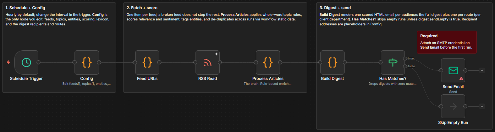

# Monitor RSS feeds for brand and regulatory mentions with rule-based scoring and email digests

[Published n8n template](https://n8n.io/workflows/16296-send-scored-media-monitoring-digests-from-rss-feeds-via-smtp-email/)

Scan RSS and Atom feeds on a schedule, score every matching article for relevance, sentiment, and entity tags, and email an HTML digest grouped by topic, with optional routes that send each department only its own coverage. All the matching and scoring is plain JavaScript in Code nodes, so the same input always produces the same output, and the whole thing runs on one SMTP credential: no database, no API keys.

Built with n8n, plus any SMTP email service.



## Use it when

- The morning news scan is a manual routine: someone reads the same feeds and forwards links to each department by hand. The routes here send every team a digest filtered to just its own topics.
- You track brand, competitor, or regulatory mentions and a paid listening tool is not in the budget. This runs on the feeds you already read.
- A busy feed buries the two articles that matter. Relevance scoring sorts each digest, and a minimum-relevance floor hides the rest.

## How it works

One linear pipeline runs on the schedule and on demand from Execute Workflow. Feed URLs fans out one item per feed and RSS Read fetches each one independently, so a single broken feed does not stop the rest.

| Stage | What happens |
|---|---|
| Schedule Trigger | Fires hourly by default; change the interval in the node |
| Config | Returns one object holding every setting: feeds, topics, scoring weights, lexicon, entities, recipients, routes |
| Feed URLs / RSS Read | Fan out one item per feed, then fetch each feed independently |
| Process Articles | Matches topics (whole-word, all `include` terms must appear, any `exclude` term suppresses), scores relevance 0 to 100 from term frequency, source weight, and recency, scores sentiment with an AFINN-style lexicon normalized by article length, tags entities by alias, and de-duplicates with a hashed seen-list in workflow static data |
| Build Digest | Renders one HTML email per audience: the full digest to `digest.to` plus one filtered digest per entry in `digest.routes` |
| Has Matches? / Skip Empty Run | Drops any digest with zero matches, so quiet runs end at a no-op instead of emailing |
| Send Email | Sends every surviving digest through the one SMTP credential |

I keep every setting in the one object Config returns because tuning feeds, topics, and scoring weights in a single node beats hunting through the pipeline.

## Requirements

- A self-hosted n8n instance. The enrichment lives in Code nodes and the de-duplication memory uses workflow static data; both are restricted on some n8n Cloud plans.
- Any SMTP account (Gmail app password, Postmark, SES, Mailgun, and similar all work). It is the only credential the workflow needs.

## Setup

1. Import `workflows/media-monitor.workflow.json` into n8n. It imports inactive; configure before activating. Every node is pinned to an exact version (the IF node at 2.2), so an older instance flags a mismatch on import; take the one-click fix n8n offers and carry on.
2. Open Config and edit the returned object: `feeds` (your RSS or Atom URLs), `topics` (whole-word and case-insensitive, so `include: ["mac"]` does not match inside `macro`), `entities` (label to alias list), and `digest.to` / `digest.from`. Set `digest.to` to `""` to send routed digests only.
3. Open Send Email and assign the SMTP credential.
4. Click Execute Workflow. With matches you get a digest email; with none, the run ends at Skip Empty Run.
5. Activate. The Schedule Trigger then runs hourly until you change the interval.

## The digest and its routes

Each article lists under its topic with a relevance badge, a sentiment badge, source, timestamp, a short summary, and entity tags, sorted by relevance. To send a department its own coverage, add an entry to `digest.routes` such as `{ name: "Environment Dept", to: "env-comms@example.gov", topics: ["RegulatoryNews"] }`. That department gets an email with only those topics while the full digest still goes to `digest.to`; an article matching two routed topics appears in both. Quiet runs send nothing unless you set `digest.sendEmpty` to `true`, which sends a "No new matches" email instead.

## The seen-list

De-duplication is a hashed seen-list held in this one workflow's static data, and it has two habits worth knowing. A freshly imported copy starts with an empty memory, so its first run treats everything currently in your feeds as new and can send one large digest; run it manually at a quiet time, or temporarily raise `digest.minRelevance` so the opening batch is smaller. The list also persists only on scheduled runs of the active workflow, never on manual Execute Workflow clicks, so repeated articles during testing are normal. Real de-duplication begins once the workflow is active and settles from the second scheduled run onward.

## Verifying locally

The folder is a small Node project around the workflow: `src/lib.mjs` holds readable copies of every pure function the Code nodes embed, and the build script regenerates the workflow JSON from the lib and the example config.

```sh
npm test        # self-test (15 assertions) + smoke test, no n8n needed
npm run check   # confirms the workflow JSON is in sync with the lib and config
npm run build   # regenerates the workflow JSON after editing the lib
```

## Customize

- **Per-source trust.** Drop a host into `scoring.sources` with a multiplier, e.g. `"yourindustryrag.example": 1.8`.
- **Cadence.** Edit the Schedule Trigger (minutes, hours, days, or cron). For weekly digests, raise `recencyHalfLifeHours` toward 168.
- **Sentiment words.** Add entries to `lexicon` with an integer score, conventionally -5 to +5.
- **Noise floor.** Raise `digest.minRelevance` to hide low-scoring items, or adjust the scoring weights in Config.
- **Sheets archive.** The email already groups, scores, and timestamps every match, so no second store is required; for a spreadsheet copy, add a Google Sheets node after Process Articles with `operation: append` and `mappingMode: autoMapInputData`, and the enriched fields (title, link, source, topics, relevance, sentiment, entities) map straight to columns.

## What is in this folder

| Item | What it is |
|---|---|
| `README.md` | This overview |
| `TEMPLATE-DESCRIPTION.md` | The n8n Creator hub listing text |
| `workflows/` | `media-monitor.workflow.json`, the importable workflow with every Code-node body embedded and no external requires at runtime |
| `src/` | `lib.mjs`: `normalizeArticle`, `hashLink`, `matchTopics`, `scoreRelevance`, `scoreSentiment`, `tagEntities` |
| `examples/` | `config.example.js`, a realistic Config body with three named topics, scoring weights, a starter lexicon, and an entity dictionary |
| `scripts/` | `build-workflow.mjs`, regenerates the workflow JSON from the lib and example config |
| `tests/` | A Node-only self-test plus a smoke test that executes the embedded Code-node bodies |
| `docs/` | `workflow.png`, the workflow on the n8n canvas |
| `package.json` | The npm scripts for test, check, and build |
| `LICENSE` | MIT license |

---

All sample data is fictional. No real credentials, IDs, or endpoints are included.

Part of the [n8n-exekyute-templates](../../README.md) collection. MIT licensed.
