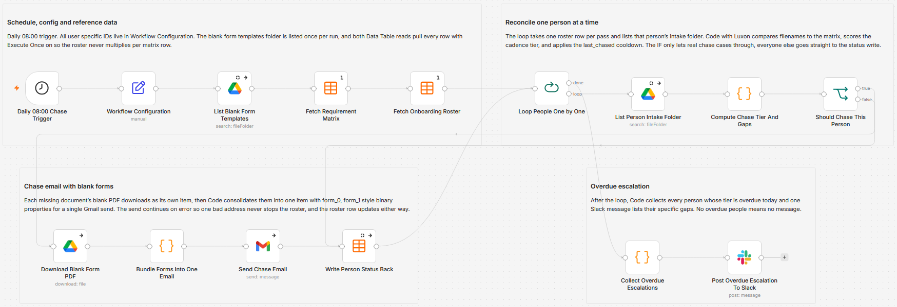

# Chase missing onboarding documents daily with Google Drive, Gmail and Slack

[Published n8n template](https://n8n.io/workflows/17984-chase-missing-onboarding-documents-daily-with-google-drive-gmail-slack-and-data-tables/)

Chase the onboarding documents each new hire still owes, once a day, without anyone writing the reminder. Two n8n Data Tables hold the rules and the people: a role based requirement matrix with due offsets, and a roster carrying each person's Google Drive intake folder. A document counts as received when a filename in that folder contains its slug, so nothing here reads file contents.

Built with n8n, plus Google Drive, Gmail, Slack, and n8n Data Tables.

## Use it when

- Five people start next month and every role owes a different stack of forms. The matrix says what each role needs, and the run emails one person only the items actually missing from their folder.
- Someone uploaded two of four documents last week and has already had two reminders. The `last_chased` date holds the next email back for the length of that tier's cooldown, so a chase never turns into daily mail.
- A start date has passed with paperwork still outstanding. Those people land in one Slack message with their specific gaps listed, instead of an alert per person per day.

## How it works

A schedule fires at 08:00, Workflow Configuration carries the three IDs you fill in, and the blank form folder plus both Data Tables load once. Loop People One by One then takes one roster row per pass: that person's intake folder is listed, and Compute Chase Tier And Gaps compares the filenames against the matrix rows for their role, dates each gap from `start_date` plus the due offset, and picks a tier. Real chase cases go down the email branch, where each matching blank form downloads on its own and then gets folded into one item with `form_0`, `form_1` style binary properties for a single Gmail send. The roster row is written back on both branches, and once the loop drains, everyone whose tier came out overdue is collected into one Slack post.

| Stage | What happens |
|---|---|
| Daily 08:00 Chase Trigger | Fires once a day at 08:00 |
| Workflow Configuration | Holds the templates folder ID, the Slack channel ID, and the reply-to address |
| List Blank Form Templates | Lists the blank form folder once per run, with Return All on |
| Fetch Requirement Matrix | Reads every row of the Paperwork Requirement Matrix table |
| Fetch Onboarding Roster | Reads only roster rows where `docs_complete` is false or empty |
| Loop People One by One | Hands one person per pass to the reconcile branch |
| List Person Intake Folder | Lists the direct children of that person's `drive_folder_id` |
| Compute Chase Tier And Gaps | Matches filenames to required slugs, dates each gap, picks gentle, firm, overdue or complete, applies the cooldown, and writes the subject and body |
| Should Chase This Person | Routes real chases to the email branch, everyone else straight to the write back |
| Download Blank Form PDF | Downloads one blank form per missing document |
| Bundle Forms Into One Email | Merges those downloads into a single item, or a plain text checklist when nothing matched |
| Send Chase Email | Sends the plain text chase from Gmail with the forms attached, continuing on error so one bad address cannot stall the loop |
| Write Person Status Back | Updates `last_chased`, `chase_stage`, `missing_now`, and `docs_complete` on both branches, so a failed send still marks the person chased |
| Collect Overdue Escalations | Gathers every loop pass, keeps the overdue people, builds one message |
| Post Overdue Escalation To Slack | Posts that message to the escalation channel |

I match on filename substrings rather than anything stricter because the person uploading will not name the file the way I would, and a slug that still survives `waiver_janedoe_signed.pdf` beats an exact match that fails on every real upload.

## Requirements

- A Google account with Drive access to the blank templates folder and to every person's intake folder. In practice this is read only: the workflow lists and downloads, and never writes to Drive.
- A Gmail mailbox for the chases. That mailbox is the visible sender, and only the reply-to address is configurable.
- A Slack workspace, with the app already a member of the escalation channel. The node posts to a channel ID and there is no join step.
- Data Tables enabled, with both tables in the same project as the workflow. They are referenced by name, not by ID.
- n8n (cloud or self-hosted) with Google Drive, Gmail, and Slack credentials.

## Setup

1. Import `workflow.json` into n8n. It imports inactive; configure before activating.
2. Fill in Workflow Configuration with the templates folder ID, the Slack escalation channel ID, and the reply-to address, then assign the three credentials.
3. Build the two Data Tables described below, give each person a Drive intake folder, and put its ID in `drive_folder_id`.
4. Run it once by hand, read who got an email and what the roster rows now say, then activate.

## The two tables

| Table | Columns you fill | What one row is |
|---|---|---|
| Paperwork Requirement Matrix | `role`, `doc_slug`, `doc_label`, `due_offset_days` | One document one role owes, due that many days after their start date. A negative offset is due before day one |
| Paperwork Chase Roster | `name`, `email`, `role`, `start_date`, `drive_folder_id` | One person. Leave `last_chased`, `docs_complete`, `chase_stage`, and `missing_now` for the workflow to write |

Role values have to match between the two tables once lowercased. There is no trimming and no fuzzy matching, so a stray space parks that person forever: no matrix rows means nothing is required, which never counts as complete. `start_date` must be ISO parseable and `docs_complete` must be a boolean column. Completion is one way, so once `docs_complete` flips to true the row is skipped on every later run and has to be re-opened by hand.

## The slug match

A document counts as received when some file in the intake folder has the slug anywhere in its name, lowercased, extension ignored. The same test picks the blank form to attach, so every slug also needs one file in the templates folder carrying that slug. Two things to know before you trust it: nothing opens the file, so an empty or unsigned upload passes, and a short slug like `id` will match an unrelated filename. Both Drive listings also continue on error, which means a wrong folder ID reads as an empty folder and makes every document look missing, so check the first run against someone you know is complete.

## Customize

- Change `triggerAtHour` on Daily 08:00 Chase Trigger. Running more often than daily is safe, because the cooldown compares calendar days.
- Move the tier thresholds and the cooldown object `{ gentle: 3, firm: 2, overdue: 1 }` near the top of Compute Chase Tier And Gaps to change how early chasing starts and how often it repeats.
- Rewrite the tone in the three subject and body blocks at the bottom of that same Code node. Send Chase Email is plain text, so HTML there arrives as visible markup.
- Tighten either slug matcher in that node. Both are a lowercase `includes` test, so a regex or an exact stem match drops into the same two places.
- Drop the `is_overdue` filter in Collect Overdue Escalations to make the Slack roll up cover everyone still outstanding. Post Overdue Escalation To Slack consumes one prebuilt `escalation_text` string, so all the shaping happens upstream.
- Disable Download Blank Form PDF if you do not keep blank forms in Drive. Bundle Forms Into One Email then falls through to a plain text checklist attachment.

## What is in this folder

| File | What it is |
|---|---|
| `README.md` | This overview |
| `TEMPLATE-DESCRIPTION.md` | The n8n Creator hub listing text |
| `workflow.json` | The importable n8n workflow |
| `images/workflow.png` | The workflow on the n8n canvas |

---

All sample data is fictional. No real credentials, IDs, or endpoints are included.

Part of the [n8n-exekyute-templates](../../README.md) collection. MIT licensed.
