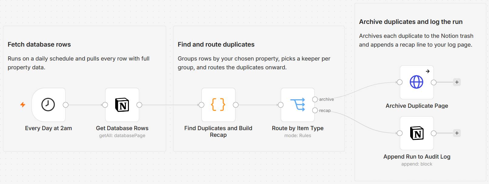

# Deduplicate a Notion database by keeping the newest row and archiving the rest

[Published n8n template](https://n8n.io/workflows/16801-deduplicate-and-archive-notion-database-rows-daily-with-an-audit-log/)

Scan one Notion database on a daily schedule, group rows that share a value in a property you choose, keep the best record in each duplicate set, and archive the rest to the Notion trash with a one-line recap on a log page. Matching and keeping are rule based, so the same data always resolves the same way. Archived rows stay recoverable in the trash for 30 days.

Built with n8n, plus Notion.



## Use it when

- A CSV import or a web clipper fills your Notion CRM with the same company three times, and cleaning it up by hand means eyeballing hundreds of rows.
- Your reading list or tracker collects repeats, and deleting the wrong copy loses the version with the notes on it. The `mostFilled` keep rule holds onto the row with the most filled properties.
- You want an audit trail of what was removed, not a silent cleanup. Every run appends a recap line to a log page, clean runs included.

## How it works

A Schedule trigger fires each day, a Notion node reads every row from the target database with full property data, and a Code node groups the rows by your chosen property, ignoring case and surrounding spaces so `Acme Corp` and `  acme corp ` match. Any group with two or more rows is a duplicate set: one row survives by your keep rule and the others are marked. A Switch then routes the marked duplicates to the archive step and the run recap to the log. Nothing is hard deleted; losers go to the Notion trash.

| Stage | What happens |
|---|---|
| Every Day at 2am | Fires the run on a daily schedule |
| Get Database Rows | Pulls every row from the target database with full property data |
| Find Duplicates and Build Recap | Groups rows by the match property, picks a keeper per group, marks the rest, and builds the recap line |
| Route by Item Type | Sends duplicates to the archive step and the run recap to the log |
| Archive Duplicate Page | Archives each losing duplicate to the Notion trash through the Notion API |
| Append Run to Audit Log | Appends the one-line recap to your log page, on every run |

I archive losers to the trash instead of deleting them because a bad match rule should cost you a 30-day undo, not your data.

## Requirements

- A Notion internal integration with access to the target database and the log page. No paid services and no AI are required.
- n8n (cloud or self-hosted) with a Notion credential.

## Setup

1. Import `workflow.json` into n8n. It imports inactive; configure before activating.
2. Assign a Notion credential to the three Notion steps (Get Database Rows, Archive Duplicate Page, Append Run to Audit Log), and share the target database and the log page with the integration.
3. In "Get Database Rows", select the database to deduplicate.
4. Open "Find Duplicates and Build Recap" and set `MATCH_PROPERTY` and `KEEP_RULE` at the top of the code.
5. In "Append Run to Audit Log", paste the URL of the page that should receive the recap.
6. Run it once on a copy or a test database, then activate.

## The match and keep rules

Both settings live in a clearly marked block at the top of the "Find Duplicates and Build Recap" node:

```js
const MATCH_PROPERTY = 'Name';   // property used to detect duplicates
const KEEP_RULE = 'newest';      // 'newest' | 'oldest' | 'mostFilled'
```

`MATCH_PROPERTY` accepts a title, text, URL, email, number, or select property. `KEEP_RULE` decides which row survives each duplicate set: `newest` keeps the most recently edited, `oldest` keeps the earliest, `mostFilled` keeps the row with the most filled properties. Rows with an empty value in the match property are never touched.

## The log line

Every run appends one line to the log page, for example:

```
Dedup run 2026-07-01 02:00: scanned 240 rows, 3 without a key, 4 duplicate groups, archived 6 duplicates. Match property: Name. Keep rule: newest.
```

Clean runs are logged too, so the page holds a full history.

## Customize

- Change `KEEP_RULE` to `newest`, `oldest`, or `mostFilled`.
- Point `MATCH_PROPERTY` at any title, text, URL, email, number, or select property.
- Adjust the cadence on the "Every Day at 2am" trigger.
- Reword the recap in the text field of "Append Run to Audit Log"; the Code node supplies the counts it references.

## What is in this folder

| File | What it is |
|---|---|
| `README.md` | This overview |
| `TEMPLATE-DESCRIPTION.md` | The n8n Creator hub listing text |
| `workflow.json` | The importable n8n workflow |
| `images/workflow.png` | The workflow on the n8n canvas |

---

All sample data is fictional. No real credentials, IDs, or endpoints are included.

Part of the [n8n-exekyute-templates](../../README.md) collection. MIT licensed.
