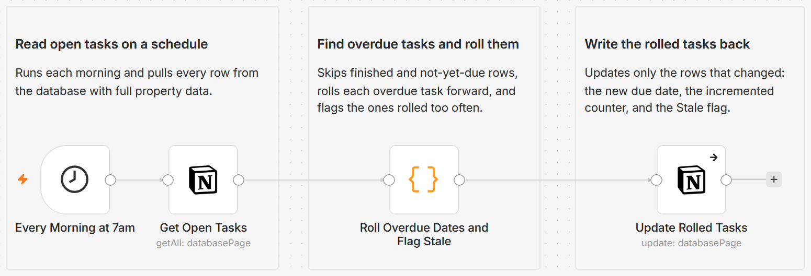

# Roll overdue Notion tasks forward and flag ones rolled too often

[Published n8n template](https://n8n.io/workflows/16802-roll-overdue-notion-tasks-forward-and-flag-stale-ones-on-a-schedule/)

Point this workflow at one Notion task database and it rewrites overdue tasks in place on a schedule: every past-due date rolls forward to today, a counter records how many times each task has been rolled, and a Stale checkbox flips once a task has been pushed too many times. The logic is plain rule-based JavaScript, so the same board always resolves the same way, and it edits the dates themselves instead of sending reminders, so there is nothing to ignore.

Built with n8n, plus Notion.



## Use it when

- Your Notion task list, content calendar, or sprint board fills up with red overdue dates that no longer mean anything, and cleanup means dragging each date forward by hand.
- You want to know which tasks you keep pushing instead of doing. The roll counter turns every deferral into a number, and the Stale flag marks the tasks that crossed the line.

## How it works

A Schedule trigger fires each morning. A Notion node reads every row from the target database with full property data, and a Code node keeps only the rows whose due date is in the past and whose status is not one of your done values. For each of those it computes a new due date, the next roll count, and the stale flag, and a native Notion update writes those three values back in place. Finished tasks and tasks that are not yet due are never touched.

| Stage | What happens |
|---|---|
| Every Morning at 7am | Fires the run on a daily schedule, 7am by default |
| Get Open Tasks | Pulls every row from the target database with full property data |
| Roll Overdue Dates and Flag Stale | Keeps rows that are past due and not done, then computes the new date, counter, and flag |
| Update Rolled Tasks | Writes the new due date, the incremented counter, and the Stale flag on each changed row |

I write back only the rows that actually change, which makes reruns safe: an overdue task rolled to today reads as due today on the second pass, so running the workflow twice in a row produces no extra edits.

## Requirements

- n8n (cloud or self-hosted) with a Notion internal integration credential that has access to the target database. No paid services and no AI are required.

## Setup

1. Import `workflow.json` into n8n. It imports inactive; configure before activating.
2. Assign a Notion credential to both Notion steps ("Get Open Tasks" and "Update Rolled Tasks"), and share the target database with the integration.
3. In "Get Open Tasks", select the database that holds your tasks.
4. Open "Roll Overdue Dates and Flag Stale" and set the property names, done values, threshold, and roll target at the top of the code.
5. In "Update Rolled Tasks", map the Due, Rolled, and Stale property values to your own property names.
6. Run it once on a copy or a test database, then activate.

## The Notion properties you need

The database this runs against must have these four properties. The names are yours to choose, as long as they match the config at the top of the Code node. A row with no Due date, or with a status in `DONE_VALUES`, is left alone, and a row with no Status value is treated as not done, so it is eligible to roll.

| Property | Notion type | What it is for |
|---|---|---|
| Due | Date | The deadline the workflow reads and rolls forward |
| Status | Status or Select | The task state; any value listed in `DONE_VALUES` is treated as finished and skipped |
| Rolled | Number | A counter the workflow increments by one every time it rolls the task |
| Stale | Checkbox | A flag the workflow sets to true once the roll count passes `STALE_THRESHOLD` |

## The rolling rules

The settings live in a clearly marked block at the top of the "Roll Overdue Dates and Flag Stale" node:

```js
const DUE_PROPERTY    = 'Due';      // Date property that holds the deadline
const STATUS_PROPERTY = 'Status';   // Status or Select property that holds task state
const DONE_VALUES     = ['Done', 'Complete', 'Completed', 'Cancelled', 'Archived'];
const ROLLED_PROPERTY = 'Rolled';   // Number property: how many times this task has been rolled
const STALE_PROPERTY  = 'Stale';    // Checkbox property: set true once rolled past the threshold
const STALE_THRESHOLD = 3;          // flag Stale once a task has been rolled MORE than this many times
const ROLL_TO         = 'today';    // 'today' | 'nextBusinessDay'
```

Overdue is judged by calendar date: a task counts as overdue when its due date is before today, so a task due earlier today is left as is. Each overdue, unfinished task gets its due date set to today, or to the next business day when `ROLL_TO` is `nextBusinessDay` and today is a weekend. The roll counter goes up by one, and Stale is set to true once the new count is greater than `STALE_THRESHOLD`.

## Customize

- Set `ROLL_TO` to `today` or `nextBusinessDay`.
- Change `STALE_THRESHOLD` to control how many rolls make a task stale.
- Add or remove entries in `DONE_VALUES` to match your own status names.
- Point the four property names at whatever your database calls them.
- Adjust the schedule on the "Every Morning at 7am" trigger.

## What is in this folder

| File | What it is |
|---|---|
| `README.md` | This overview |
| `TEMPLATE-DESCRIPTION.md` | The n8n Creator hub listing text |
| `workflow.json` | The importable n8n workflow |
| `images/workflow.png` | The workflow on the n8n canvas |

---

All sample data is fictional. No real credentials, IDs, or endpoints are included.

Part of the [n8n-exekyute-templates](../../README.md) collection. MIT licensed.
