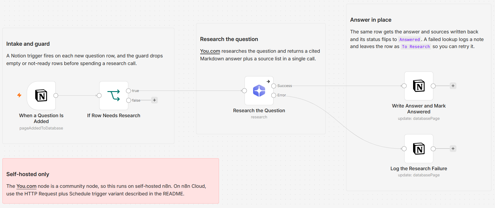

# Answer a Notion questions queue in place using You.com research

[Published n8n template](https://n8n.io/workflows/17270-answer-notion-knowledge-base-questions-with-youcom-research/)

> Self-hosted n8n only. This template uses the You.com community node `@youdotcom-oss/n8n-nodes-youdotcom`, which can only be installed on a self-hosted instance. A cloud-safe HTTP variant is described under Customize.

Turn a Notion database of open questions into a queue that drains itself: each new row is researched with You.com and answered in place, with the cited Markdown answer and its sources written back into the same row as the status flips to `Answered`. The list you already keep becomes the interface, so there is no report doc to open and no second tool to check.

Built with n8n, plus You.com and Notion.

## Use it when

- Questions you mean to look up pile up in a Notion database and sit there for weeks. Each new row now comes back researched, with sources, in the row itself.
- An answer needs sources, not just a confident paragraph. Every write-back pairs the cited Markdown answer with a numbered list of source titles and links.
- You want the queue honest. A failed lookup logs a note and leaves the row at `To Research`, so nothing is marked done that was never answered.

## How it works

A Notion trigger watches the questions database. When a new row shows up, a guard checks it is worth a lookup, You.com researches the question, and the answer plus its sources land back in the same row while the status flips to `Answered`. Failures take their own branch.

| Stage | What happens |
|---|---|
| When a Question Is Added | A Notion trigger fires on each new page added to the questions database |
| If Row Needs Research | Skips rows with an empty `Question` or a `Status` that is not `To Research`, so no research call is wasted |
| Research the Question | The You.com research operation answers the question and returns a cited Markdown write-up plus a source list in one call |
| Write Answer and Mark Answered | A Notion update writes the answer and sources into the same row and sets `Status` to `Answered` |
| Log the Research Failure | On a failed lookup, writes a short note into `Answer` and leaves the row at `To Research` |

I route failures to their own Notion update because a question silently marked `Answered` is worse than one that visibly stays in the queue.

## Requirements

- Self-hosted n8n with the `@youdotcom-oss/n8n-nodes-youdotcom` community node
- A You.com API key (you.com/platform)
- A Notion integration and a questions database shared with it

## Setup

1. Import `workflow.json` into n8n. It imports inactive; configure before activating.
2. Install the You.com community node `@youdotcom-oss/n8n-nodes-youdotcom` under Settings, Community Nodes. This only works on self-hosted n8n.
3. Add You.com and Notion credentials: You.com on "Research the Question", Notion on the trigger and both update nodes.
4. In "When a Question Is Added", pick your questions database.
5. Confirm the property names match the schema below, then activate and drop a question into the database.

## The Notion database

The template expects a simple database. Create these four properties, named exactly:

| Property | Type | Role |
|---|---|---|
| `Question` | Title | The thing to look up. This is the research input |
| `Status` | Select | Add options `To Research` and `Answered`. New rows start at `To Research` |
| `Answer` | Text | The cited Markdown answer is written here |
| `Sources` | Text | A numbered list of the source titles and links |

To use the queue, add a row, type your question in `Question`, and set `Status` to `To Research`. The workflow does the rest.

## Customize

- **Research depth.** `Research the Question` runs at `standard` effort. Raise it to `deep` or `exhaustive` on hard questions for more cross-referencing, or drop to `lite` for quick factual lookups.
- **Cloud-safe variant.** To run this on n8n Cloud, replace the trigger with a Schedule trigger, add a Notion node that queries the database for `Status = To Research`, and swap `Research the Question` for an HTTP Request node: `POST https://api.you.com/v1/research`, an `X-API-Key` header credential, and a JSON body of `{ "input": "<the question>", "research_effort": "standard" }`. The response carries the same `output.content` and `output.sources` fields the rest of the flow already reads.
- **Answer length.** Notion text properties cap at 2000 characters, so the answer and sources are each trimmed to 1900. For a long write-up, point `Answer` at a page body block instead of a property.
- **Retries.** Because the trigger fires on new rows, a failed lookup is not retried automatically. The failure note in `Answer` tells you which rows to re-drop.

## What is in this folder

| File | What it is |
|---|---|
| `README.md` | This overview |
| `TEMPLATE-DESCRIPTION.md` | The n8n Creator hub listing text |
| `workflow.json` | The importable n8n workflow |
| `images/workflow.png` | The workflow on the n8n canvas |

---

All sample data is fictional. No real credentials, IDs, or endpoints are included.

Part of the [n8n-exekyute-templates](../../README.md) collection. MIT licensed.
