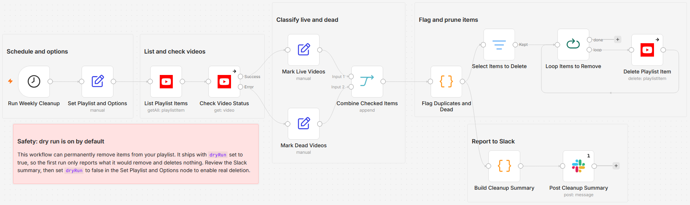

# Clean duplicate and dead videos from a playlist using YouTube and Slack

[Published n8n template](https://n8n.io/workflows/17092-clean-duplicate-and-dead-youtube-playlist-videos-with-slack-reports/)

Scan a YouTube playlist on a weekly schedule, flag duplicate entries and dead videos
(deleted, unavailable, or gone private), post the findings to Slack, and prune the
flagged items. It ships with `dryRun` set to `true`, so nothing is deleted until you
flip that switch.

Built with n8n, plus YouTube and Slack.

## Use it when

- A playlist you have curated for years is dotted with "Video unavailable" entries,
  and finding the deleted or private videos means clicking through every item by hand.
- The same video got added twice, months apart, and the duplicates sit too deep in
  the list to spot by scrolling.
- You want to see exactly what would be removed before anything is deleted. The
  dry-run report lists every flagged item with its title and ID first.

## How it works

The run lists the whole playlist across all pages, looks up every video, and splits
the results into live and dead branches before a Code node flags duplicates. Only
deleted, unavailable, and private videos count as dead; unlisted videos are treated
as valid and kept. Reads and deletes count against your daily YouTube Data API
quota, roughly one lookup per playlist item per run.

| Stage | What happens |
|---|---|
| Run Weekly Cleanup | Fires on a weekly schedule |
| Set Playlist and Options | Holds `playlistId`, `slackChannelId`, and the `dryRun` switch |
| List Playlist Items | Pulls every item in the target playlist, all pages |
| Check Video Status | Looks up each video; a missing one routes to the error output instead of stopping the run |
| Mark Dead Videos / Mark Live Videos | Tags each entry from the error and success branches |
| Combine Checked Items | Merges both branches back into one list |
| Flag Duplicates and Dead | Keeps the first copy of each video, marks later copies as duplicates, and marks dead entries |
| Build Cleanup Summary / Post Cleanup Summary | Posts the Slack summary: counts of duplicates and dead videos with titles and IDs, or a note that the playlist is clean |
| Select Items to Delete / Loop Items to Remove / Delete Playlist Item | When `dryRun` is `false`, removes each flagged item one at a time |

I key the deletion on the playlist item ID rather than the video ID, so only the
playlist entry is removed and the video itself is untouched.

## Requirements

- A Google account with a YouTube (Google) OAuth2 credential that can read and edit
  the target playlist.
- A Slack workspace with permission to post to your channel.
- n8n (cloud or self-hosted) with YouTube and Slack credentials.

## Setup

1. Import `workflow.json` into n8n. It imports inactive; configure before activating.
2. Connect a YouTube (Google) OAuth2 credential on the three YouTube nodes: "List
   Playlist Items", "Check Video Status", and "Delete Playlist Item".
3. Open "Set Playlist and Options" and set `playlistId` to your playlist ID and
   `slackChannelId` to your Slack channel ID.
4. Connect a Slack credential on "Post Cleanup Summary".
5. Keep `dryRun` set to `true`, run once, review the Slack report, then set it to
   `false` and activate.

## Dry run by default

Removing a playlist item is permanent, so the workflow ships with `dryRun` set to
`true` and the first run only reports what it would remove. Review the Slack
summary, then set `dryRun` to `false` in "Set Playlist and Options" to delete for real.

## Customize

- **Cadence.** Change the interval in "Run Weekly Cleanup" to daily or monthly.
- **Duplicate rule.** Adjust "Flag Duplicates and Dead" to keep the last copy of a duplicate instead of the first.
- **Unlisted handling.** The same Code node can treat unlisted videos as dead too.
- **Notification channel.** The message is assembled in "Build Cleanup Summary"; reword it there, or swap the Slack node for another notifier.

## What is in this folder

| File | What it is |
|---|---|
| `README.md` | This overview |
| `TEMPLATE-DESCRIPTION.md` | The n8n Creator hub listing text |
| `workflow.json` | The importable n8n workflow |
| `images/workflow.png` | The workflow on the n8n canvas |

---

All sample data is fictional. No real credentials, IDs, or endpoints are included.

Part of the [n8n-exekyute-templates](../../README.md) collection. MIT licensed.
