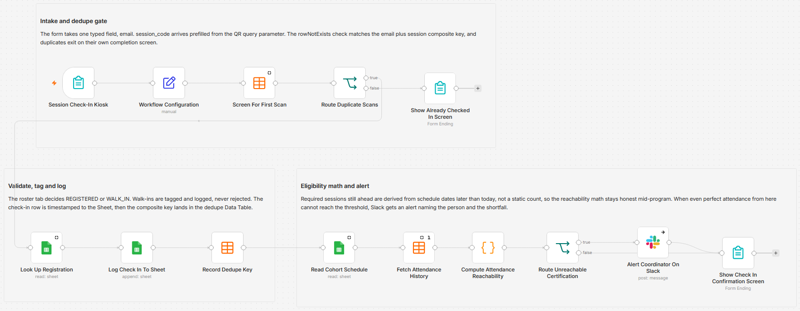

# Check in participants by QR code with Google Sheets and Slack

[Published n8n template](https://n8n.io/workflows/17985-check-in-participants-via-qr-code-with-google-sheets-and-slack-alerts/)

Turn a printed QR code into a check-in kiosk: participants scan, type only their email, and get a confirmation screen telling them where their attendance stands. Every scan writes a timestamped row to Google Sheets, records a dedupe key in an n8n Data Table so a second scan cannot double-count, and recomputes the running attendance fraction against the required sessions the cohort still has ahead. When even perfect attendance from here cannot reach the certification threshold, Slack gets an alert naming the person and the shortfall.

Built with n8n, plus Google Sheets, Slack, n8n Forms, and Data Tables.

## Use it when

- A cohort program certifies on attendance and nobody finds out someone missed the bar until the certificate list gets assembled. Here the math runs on every scan and Slack hears about it the day it stops being recoverable.
- Thirty people are queued at the door and a clipboard is the bottleneck. Each person scans the code taped to the wall, types an email on their own phone, and clears the doorway.
- Someone taps Check In twice because the first screen was slow. The dedupe key catches the repeat, no second row is written, and they get an already checked in screen instead of a silent failure.

## How it works

The QR code opens the form with `session_code` prefilled as a query parameter, so the only thing anyone types is their email. Workflow Configuration normalizes that email, builds a composite key from email plus session code, and holds the Sheet ID, tab names, Slack channel, and threshold in one node. A Data Table lookup screens that key: repeats route to their own completion screen, while first scans go on to the roster, get tagged REGISTERED or WALK_IN, and land as a timestamped row in the Check-Ins tab. The key is then recorded, the cohort schedule is read, this participant's whole check-in history is pulled back, and a Code node works out what is attended, what is still ahead, and whether the threshold is still reachable.

| Stage | What happens |
|---|---|
| Session Check-In Kiosk | Form trigger with one typed field, email. The session code arrives prefilled and hidden |
| Workflow Configuration | Sheet ID, tab names, Slack channel, and `certification_threshold` in one node. Trims and lowercases the email, then builds `checkin_key` |
| Screen For First Scan | Data Table `rowNotExists` check on `checkin_key` |
| Route Duplicate Scans | Repeat scans go to the already checked in screen, first scans continue |
| Look Up Registration | Reads the roster tab for a row matching the email |
| Log Check In To Sheet | Appends the check-in to the Check-Ins tab with status REGISTERED or WALK_IN |
| Record Dedupe Key | Writes the key, email, session code, and timestamp to the Data Table |
| Read Cohort Schedule | Pulls the schedule rows for this participant's cohort |
| Fetch Attendance History | Returns every dedupe row for this email, once per execution |
| Compute Attendance Reachability | Counts required, attended, and still ahead, then derives current percent, best case percent, shortfall, and the kiosk message |
| Route Unreachable Certification | Splits on the `unreachable` flag |
| Alert Coordinator On Slack | Posts name, cohort, counts, best case against the threshold, and how many sessions short |
| Show Check In Confirmation Screen | Renders the message the Code node built |
| Show Already Checked In Screen | Confirms the earlier scan and that nothing was recorded twice |

I count the sessions still ahead from the schedule dates rather than from a fixed remaining total, because a static count keeps reporting certification as reachable long after the sessions that could have saved it have already run.

## Requirements

- A Google account and one spreadsheet holding a roster tab, a schedule tab, and a check-in log tab. The credential needs write access, since the workflow appends rows.
- A Slack workspace, an app with `chat:write`, and the bot invited to the coordinator channel.
- An n8n version with the Data Table node, plus a Data Table named `session_checkin_dedupe` with columns `checkin_key`, `email`, `session_code`, and `checked_in_at`.
- n8n (cloud or self-hosted) with Google Sheets and Slack credentials, reachable from participants' phones on the venue network, since the form opens in their own browser.

## Setup

1. Import `workflow.json` into n8n. It imports inactive; configure before activating.
2. Create the `session_checkin_dedupe` Data Table with those four columns, and give the spreadsheet the three tabs and header rows below.
3. In Workflow Configuration set `registration_sheet_id`, `slack_channel_id`, the three tab names, and `certification_threshold`. Assign the Google Sheets credential to the three Sheets nodes and the Slack credential to Alert Coordinator On Slack.
4. Activate the workflow so the production form URL is live, then build QR codes on that URL with `?session_code=YOUR_CODE` appended. Query parameter prefill is ignored on the test URL, so a walkthrough staged there records blank session codes.
5. Scan one code yourself and check the Sheet row, the Data Table entry, and the confirmation screen before the doors open.

## The three tabs

| Tab | Columns | What the workflow does with it |
|---|---|---|
| Cohort Roster | `email`, `name`, `cohort` | Decides REGISTERED against WALK_IN and supplies the cohort |
| Cohort Schedule | `cohort`, `session_code`, `session_date`, `required` | Defines which sessions count and which are still ahead |
| Check-Ins | `checked_in_at`, `email`, `name`, `cohort`, `session_code`, `status` | The append-only attendance log |

One roster row per email, because the lookup takes the first match. Cohort values have to match between the roster and the schedule, and every session code printed on a QR has to appear in the schedule tab. Store `session_date` as plain `yyyy-MM-dd` text, since sessions ahead are found by string comparison. A `required` cell counts as required when it reads `true`, `yes`, or `1`, and a blank counts as required too.

## The attendance math

Attendance history comes from the `session_checkin_dedupe` Data Table, not the Check-Ins tab, so clearing that table resets everyone's math while the Sheet log stays intact. History is filtered by email alone, which means a session code has to be unique across every cohort or attendance bleeds between them. Sessions ahead are strictly later than today, so the session someone is scanning into right now is not counted as reachable. The alert fires on every scan while a participant is unreachable rather than once per participant, and walk-ins never alert at all, since the check needs a roster match. Only the Slack node continues on error, so a Sheets failure ends the run with no completion screen.

## Customize

- `certification_threshold` is a fraction, so 75 percent is `0.75` and not `75`. Anything zero, negative, or not a number falls back to `0.8`.
- Route Unreachable Certification can switch from the boolean `unreachable` to a number condition on `current_pct`, `best_case_pct`, or `remaining_required` if you want a warning before the point of no return.
- Add a date segment to `checkin_key` in Workflow Configuration if a session code repeats across dates, otherwise the second date reads as a duplicate scan.
- Kiosk wording lives in the `kiosk_message` strings inside Compute Attendance Reachability and in the two completion screens.
- Swap Alert Coordinator On Slack for email or a webhook. Keep its `onError` continue setting and its connection into Show Check In Confirmation Screen, or a failed post strands the kiosk.

## What is in this folder

| File | What it is |
|---|---|
| `README.md` | This overview |
| `TEMPLATE-DESCRIPTION.md` | The n8n Creator hub listing text |
| `workflow.json` | The importable n8n workflow |
| `images/workflow.png` | The workflow on the n8n canvas |

---

All sample data is fictional. No real credentials, IDs, or endpoints are included.

Part of the [n8n-exekyute-templates](../../README.md) collection. MIT licensed.
